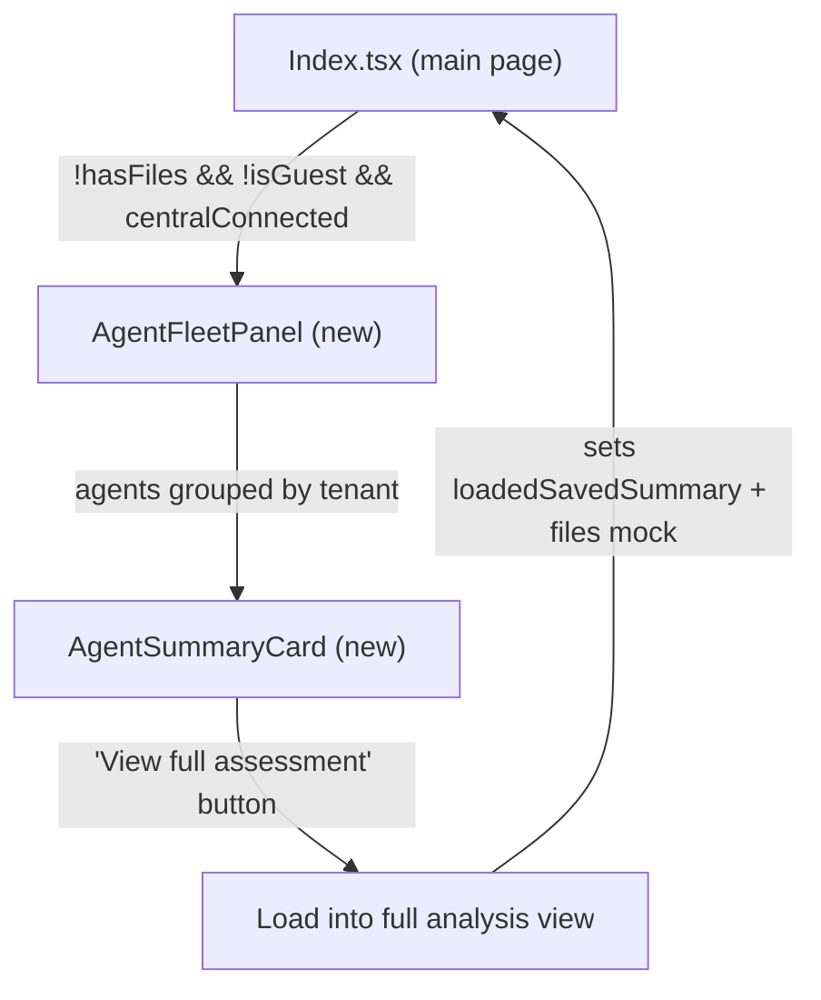

# Agent Fleet Panel on Main Page

## Context

Currently the main page only shows a file upload area when no configs are loaded. MSP users with connected agents must navigate to the Management Drawer to see agent status. The goal is to surface connected agents front-and-centre, grouped by Central tenant, so users can view the latest assessment without uploading a file.

## Architecture




## Data Flow

- **Tenants**: From `central.tenants` (already available via `useCentral()`)
- **Agents**: Fetched from `supabase.from("agents")`, grouped by `tenant_name`
- **Latest submission**: Fetched on expand from `supabase.from("agent_submissions")` for the clicked agent
- **Full analysis loading**: Requires extending `agent_submissions` with a `full_analysis` JSONB column

## Implementation

### Phase 1: Agent Fleet Panel with Summary Cards

**New component: `src/components/AgentFleetPanel.tsx`**

A section shown on the main page when `!hasFiles && !isGuest && central.isConnected`. It:

- Fetches all agents for the org from `agents` table
- Groups them by `tenant_name` (with an "Unassigned" fallback)
- Each tenant is a collapsible section showing its agents
- Each agent row shows: status dot, name, firewall host, firmware version, last score/grade, last seen
- Clicking an agent expands a summary card below it

**Summary card contents** (from latest `agent_submission`):

- Score gauge + grade
- Findings list (title + severity from `findings_summary`)
- Threat status badges (from `threat_status`)
- Drift indicator (new/fixed findings from `drift`)
- Timestamp of last submission
- "Load Full Assessment" button (disabled until Phase 2)

**Wire into `src/pages/Index.tsx`**:

- Import `AgentFleetPanel`
- Render it in the `!hasFiles` block, between the hero text and the `FileUpload` section
- Add a visual separator or "or upload manually" label between the fleet panel and upload area

### Phase 2: Full Assessment Loading

**Schema change: `agent_submissions.full_analysis`**

Add a `full_analysis JSONB` column to `agent_submissions` that stores the complete `AnalysisResult` (stats, findings with detail/remediation/evidence, inspection posture, rule columns, hostname).

- New migration file in `supabase/migrations/`
- Update `src/integrations/supabase/types.ts` with the new column

**Agent-side: extend submission payload**

In `firecomply-connector/src/api/submit.ts`, include the full `AnalysisResult` in the payload sent to the API (under a `fullAnalysis` key).

**Edge Function: store full analysis**

In `supabase/functions/api/index.ts` `handleSubmit`, save `body.fullAnalysis` into the new `full_analysis` column.

**Web app: load full assessment**

In `AgentFleetPanel`, the "Load Full Assessment" button:

1. Fetches the latest `agent_submission` with `full_analysis` populated
2. Converts the JSON back into `AnalysisResult` + a synthetic `ParsedFile` (using hostname as label)
3. Calls a new callback prop (e.g. `onLoadAgentAssessment`) that sets `files` and `analysisResults` in Index.tsx, similar to how `handleFilesChange` works but from stored data instead of uploaded HTML

**In `src/pages/Index.tsx`**, add handler:

```typescript
const handleLoadAgentAssessment = useCallback((label: string, analysis: AnalysisResult, customerName: string) => {
  // Create synthetic file entry
  setFiles([{ id: label, fileName: label, label, content: "", extractedData: {} as ExtractedSections }]);
  // Override analysis results directly
  setAnalysisOverride({ [label]: analysis });
  setBranding(prev => ({ ...prev, customerName }));
}, []);
```

This requires a small refactor: `analysisResults` currently comes from `useFirewallAnalysis(files)`. Add an override state that takes precedence when set, so agent-loaded data bypasses the parser.

## UI Layout (main page, no files loaded)

```
[Hero: "Turn Sophos Firewall Exports into..."]

[Connected Firewalls]                    <- new AgentFleetPanel
  [v] Acme Corp (3 firewalls)
      * HQ Primary    XGS128  v22.0  82/B  2h ago   [>]
      * Branch Office  XGS136  v21.5  58/D  6h ago   [>]
      * DR Site        SFVUNL  v22.0  91/A  12h ago  [>]
  [>] Global Bank (2 firewalls)
  [>] MediHealth (1 firewall)

--- or upload configs manually ---

[Step 1 - Upload Firewall Exports]
  [FileUpload drop zone]
```

## Files Changed


| File                                                 | Change                                   |
| ---------------------------------------------------- | ---------------------------------------- |
| `src/components/AgentFleetPanel.tsx`                 | **New** — fleet panel + summary card     |
| `src/pages/Index.tsx`                                | Render AgentFleetPanel, add load handler |
| `supabase/migrations/XXXXXX_agent_full_analysis.sql` | Add `full_analysis` column               |
| `src/integrations/supabase/types.ts`                 | Update agent_submissions type            |
| `supabase/functions/api/index.ts`                    | Store `fullAnalysis` in submit handler   |
| `firecomply-connector/src/api/submit.ts`             | Include full analysis in payload         |


