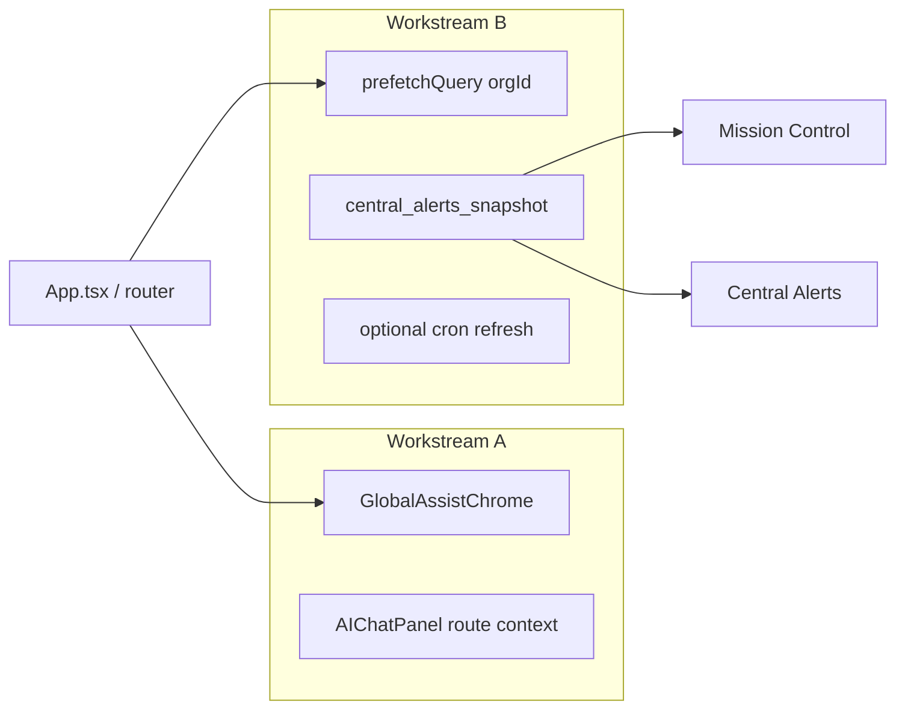
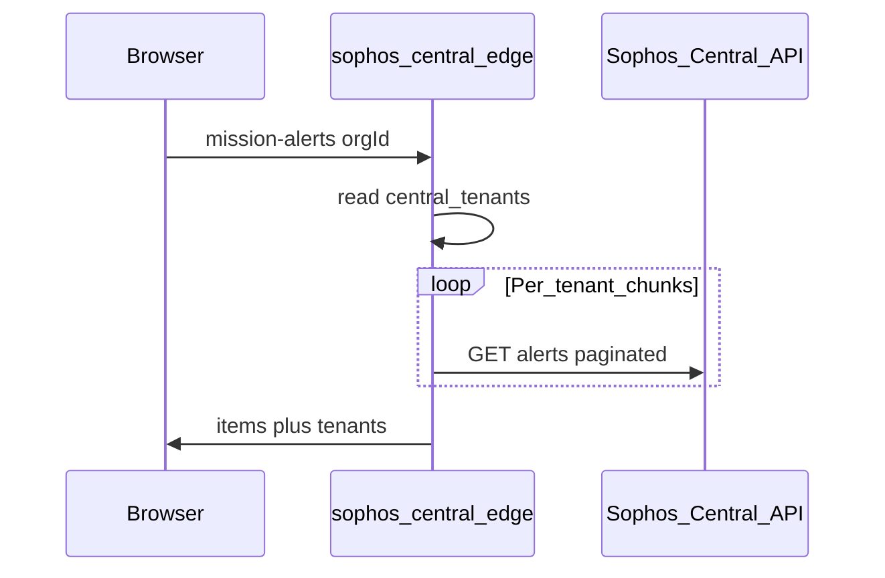

# Global assist chrome + faster Central alerts

## Implementation status (2026-04)

- **Workstream A (assist chrome):** Shipped — `AssistChromeProvider` + `GlobalAssistChrome` in `App.tsx`; bottom Tours/Shortcuts on all routes; AI chat on all routes with pathname-based suggestions/context (`assist-route-context.ts`); Assess registers tours + full AI via `useRegisterAssessAssistChrome`; assess-only actions use `StickyActionBar` stacked above the global strip (`slotAboveGlobalAssist`).
- **Workstream B — Phase A:** Shipped — background prefetch of `mission_alerts_bundle`, cached tenants, and cached firewalls after sign-in (`OrgCentralPrefetch`) and when opening Central hub (`CentralHub`); `mission_alerts_bundle` query `staleTime` increased to 60s.
- **Workstream B — Phases B/C:** Not implemented — `central_alerts_snapshot` table, edge upsert, and optional cron remain future work.

---

Single plan covering **two workstreams**: (A) **bottom Tours/Shortcuts + global AI chat** everywhere, and (B) **preload / snapshot** for Mission Control and Central Alerts (plus Central hub prefetch). They are independent but may both touch [`src/App.tsx`](src/App.tsx) and [`src/pages/ChangelogPage.tsx`](src/pages/ChangelogPage.tsx).

---

## Workstream A — Global bottom utility bar + route-aware AI chat

### Placement

- **Tours + Shortcuts** in a **bottom** bar (viewport-fixed or sticky footer). Reuse styling from [`src/components/StickyActionBar.tsx`](src/components/StickyActionBar.tsx) (navy strip, teal/cyan pills). **Not** under the main menu.
- **AI chat** as a **floating launcher** (e.g. bottom corner) so it does not compete with the Tours/Shortcuts row.

### Route scope

- **Everywhere**, including public/shared routes. Where there is no assessment DOM, tours may **no-op** or explain unavailability; shortcuts = **global** keys + **pathname-based** extras.

### Implementation

1. **`GlobalAssistChrome`** — Mount from [`src/App.tsx`](src/App.tsx) (or outermost outlet) so every route gets the bar + chat without per-page copy.
2. **Assess deduplication** — Prefer moving Tours/Shortcuts **only** into the global bar and **removing** them from [`src/pages/Index.tsx`](src/pages/Index.tsx) / [`StickyActionBar`](src/components/StickyActionBar.tsx) for assess-specific actions only (upload, export, etc.).
3. **`GuidedTourButton`** — Safe defaults on hub/public (`hasFiles`/`hasReports` false, no-op callbacks); filter unavailable tours.
4. **`KeyboardShortcutsModal`** — One global open state; base shortcuts + route-specific sections.
5. **`AIChatPanel`** — Suggested questions + page context from `useLocation().pathname`; on Assess keep analysis-deep behavior when data exists. **Persist** with storage key including **route** (and org/user if applicable).

### Files (A)

- [`src/App.tsx`](src/App.tsx), new `src/components/GlobalAssistChrome.tsx`
- [`src/components/StickyActionBar.tsx`](src/components/StickyActionBar.tsx), [`src/pages/Index.tsx`](src/pages/Index.tsx)
- [`src/components/AIChatPanel.tsx`](src/components/AIChatPanel.tsx)
- [`src/components/GuidedTourButton.tsx`](src/components/GuidedTourButton.tsx), [`src/components/KeyboardShortcuts.tsx`](src/components/KeyboardShortcuts.tsx)

### Out of scope (A)

- Top nav utility strip (explicitly not desired).

---

## Workstream B — Pre-loading / faster Central alerts

### Problem

Mission Control and Central Alerts wait on live Sophos merge (`mission-alerts` + per-tenant alerts). Other Central sub-tabs are mostly Postgres cache reads.

### Scope: `/central/*` (`CentralHub`)

| Sub-tab                                      | Primary data                                                 | Same alerts merge slowness?        |
| -------------------------------------------- | ------------------------------------------------------------ | ---------------------------------- |
| CentralOverview                              | `getCentralStatus`, `getCachedTenants`, `getCachedFirewalls` | No                                 |
| CentralTenants / Firewalls / firewall detail | cached tenants + firewalls                                   | No                                 |
| **CentralAlertsPage**                        | tenants + **`fetchAlertsBatched`**                           | **Yes**                            |
| MDR / Groups / Licensing / Sync              | various                                                      | Lower priority for alerts snapshot |

**Snapshot / SWR / cron** targets **Mission Control + `/central/alerts`** (one stored payload or one edge merge). **Prefetch** `getCachedTenants` + `getCachedFirewalls` (+ optional `getCentralStatus`) when entering `/central` or when `orgId` is known.

### How it works today (summary)

- [`useMissionControlLiveQuery`](src/hooks/queries/use-mission-control-live-query.ts) → `getMissionAlertsBundle` → Edge [`sophos-central`](supabase/functions/sophos-central/index.ts) `mode: "mission-alerts"`: tenants from DB, then Sophos alerts per tenant (chunks), merge, sort, cap ~300. Legacy browser fallback is worse.
- TanStack Query: `staleTime` ~20s, `refetchInterval` ~45s — repeat visits can be fast; **cold miss is not**.
- No Postgres table for alert payloads today.

### Phase A — Client-only

- `prefetchQuery` for `mission_alerts_bundle` when `orgId` is known (e.g. after auth / router-level effect).
- Central hub: prefetch `cachedTenants` + `cachedFirewalls` on [`CentralHub`](src/pages/central/CentralHub.tsx) or `orgId` ready.
- Optionally raise `staleTime` (e.g. 60–120s); keep refetch/refresh for freshness.
- Prefer Edge `mission-alerts` in production (avoid legacy browser fan-out).

### Phase B — DB snapshot + stale-while-revalidate

1. Migration: `central_alerts_snapshot` (`org_id` PK, `items jsonb`, `tenants jsonb`, `fetched_at`, optional `error`). RLS: members read; writes service role in Edge.
2. Read path: query snapshot first for fast first paint.
3. Refresh: background `getMissionAlertsBundle`; on success upsert snapshot (new internal mode or end of `mission-alerts`). UI: snapshot immediately, reconcile when live completes.
4. Wire [`CentralAlertsPage`](src/pages/central/CentralAlertsPage.tsx) to same snapshot / aligned query keys as Mission Control.

### Phase C — Scheduled refresh (optional)

- Cron (e.g. `CRON_SECRET`) to refresh snapshots per org; cadence 15–30 min typical tradeoff vs quotas.

### Recommendation (B)

- Ship **Phase B** for first-load UX; add **Phase A** as cheap extra; **Phase C** only if cold-start warming is required.

### Files (B)

- [`src/hooks/queries/use-mission-control-live-query.ts`](src/hooks/queries/use-mission-control-live-query.ts)
- [`src/lib/sophos-central.ts`](src/lib/sophos-central.ts), [`supabase/functions/sophos-central/index.ts`](supabase/functions/sophos-central/index.ts)
- [`src/pages/central/CentralAlertsPage.tsx`](src/pages/central/CentralAlertsPage.tsx), [`src/pages/central/CentralHub.tsx`](src/pages/central/CentralHub.tsx)
- New migration; optional cron doc / function

### Decisions before coding (B)

- Freshness SLA for snapshot vs live-first paint.
- MDR/groups: out of scope for first ship unless separate snapshots added later.

---

## Sync with Cursor Plans UI

- **Canonical (git):** `docs/plans/assist-chrome-and-central-alerts-preload.md` (this file)
- **Workspace copy (local, gitignored):** `.cursor/plans/assist_chrome_and_central_alerts_preload.plan.md` — use **Quick Open** (`Cmd+P`) and type `assist_chrome` so Cursor finds it inside this project.
- **Home copy:** `~/.cursor/plans/assist_chrome_and_central_alerts_preload.plan.md` (same content; lives next to your other global `.plan.md` files).

After editing this file in git, run:

`cp docs/plans/assist-chrome-and-central-alerts-preload.md .cursor/plans/assist_chrome_and_central_alerts_preload.plan.md`

and optionally the same to `~/.cursor/plans/` to keep all copies aligned.

Supersedes standalone copies: [`preload-central-alerts.md`](preload-central-alerts.md) (stub), prior `global_bottom_bar_ai` Cursor plan (stub).
