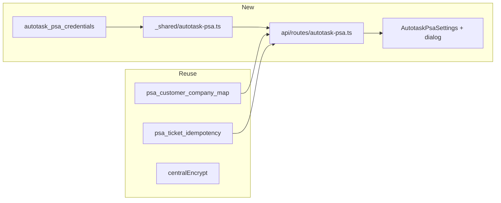

# G3.1 — Autotask (Datto) PSA MVP

**Goal:** Same class of value as ConnectWise Manage: **credentials in org settings**, **FireComply customer ↔ Autotask company/account ID mapping**, **create ticket from finding** with **idempotency + audit**, without touching ConnectWise code paths beyond shared patterns.

**Prerequisites (ops/product):** Autotask **API-only user** with **tracking identifier** (Vendor or Custom), Username + Secret + **API integration code** per [REST API security and authentication](https://autotask.net/help/developerhelp/Content/APIs/REST/General_Topics/REST_Security_Auth.htm). Legal/subprocessor list update if required (Trust page / DATA-PRIVACY) — small follow-up.

---

## ConnectWise Manage — mapping UI (same doc as Autotask mapping)

Spec and sequencing: **[docs/plans/psa-mapping-dropdowns.md](docs/plans/psa-mapping-dropdowns.md)** (repo).

- **ConnectWise (plan requirement):** In [ConnectWiseManageSettings.tsx](src/components/ConnectWiseManageSettings.tsx), the mapping **left box (“FireComply customer name”) must be a dropdown or searchable combobox** (org customer list + optional “Custom…”), not a plain text field. The **right box (“Manage company ID”)** becomes a combobox once `GET /api/connectwise-manage/companies` exists; until then, numeric entry + fallback stays as today.
- **Autotask:** Reuse the **same FireComply customer control** (shared hook/component). PSA-side company/account = combobox from Autotask list API + manual fallback — **no raw-only text mapping rows** for the customer side.

Track ConnectWise work with todo **cw-psa-mapping-dropdowns** above (can ship before or in parallel with Autotask spike; customer combobox is reusable for both).

---

## 1. Spike (short, blocking implementation detail)

- **Zone / base URL:** Autotask REST is **per-database**; confirm how your target tenant resolves `https://webservicesXX.autotask.net/...` (or current Datto doc pattern) — often via a **zone information** call or fixed URL from the customer’s Autotask instance doc.
- **Ticket create:** Identify the REST entity for **Tickets** (POST body): required fields typically include **company/account**, **queue**, **status/priority**, **title**, **description** (exact names differ from ConnectWise — pull from official **Tickets** entity doc for your API version).
- **Idempotency key:** Same idea as today: hash or string key from `org + finding identity` stored in `[psa_ticket_idempotency](supabase/migrations/20260329210000_connectwise_manage_psa.sql)` with `**provider = 'autotask'`\*\*.

Deliverable: a **one-page spike note** (optional `docs/plans/` or comment in `_shared/autotask-psa.ts`) with sample request/response and required field list.

---

## 2. Data model

- **New table** `autotask_psa_credentials` (mirror `[connectwise_manage_credentials](supabase/migrations/20260329210000_connectwise_manage_psa.sql)`):
  - `org_id` PK → `organisations`
  - **Encrypted at rest:** store API **secret** via existing `[centralEncrypt` / `centralDecrypt](supabase/functions/_shared/crypto.ts)` (same as Central / ConnectWise); **username** (email) and **integration code** can be encrypted or plaintext — prefer **encrypt both secret and integration code**, keep username plaintext or encrypt for consistency.
  - **Defaults for tickets:** `default_queue_id`, `default_priority` / `status` fields as integers (whatever the API requires — spike defines columns).
  - `api_zone_base_url` or `webservices_base_url` text (trimmed, validated HTTPS).
- **Reuse** `[psa_customer_company_map](supabase/migrations/20260329220000_psa_customer_company_map.sql)`: upsert/list/delete with `**provider = 'autotask'`** and `**company_id`** = Autotask **company (account) ID** (integer). No schema change if `customer_key`+`company_id`+`provider` already fit (they do).
- **Reuse** `psa_ticket_idempotency`: `provider = 'autotask'`, `external_ticket_id` = returned ticket id string.

**RLS:** Org **admins** only, same policy shape as Manage credentials / mapping.

---

## 3. Edge API (JWT + org admin)

New route module, e.g. `[supabase/functions/api/routes/autotask-psa.ts](supabase/functions/api/routes/)` (name TBD), registered in `[api/index.ts](supabase/functions/api/index.ts)` after ConnectWise routes:

| Method | Path                                 | Purpose                                                                                                                                           |
| ------ | ------------------------------------ | ------------------------------------------------------------------------------------------------------------------------------------------------- |
| POST   | `/api/autotask-psa/credentials`      | Upsert credentials + defaults (partial update without re-pasting secret, same pattern as Manage)                                                  |
| DELETE | `/api/autotask-psa/credentials`      | Disconnect; optionally delete `psa_customer_company_map` rows for `provider = 'autotask'`                                                         |
| GET    | `/api/autotask-psa/company-mappings` | List mappings (or rely on Supabase client + RLS — **prefer Edge for parity** with Manage)                                                         |
| PUT    | `/api/autotask-psa/company-mappings` | Upsert `{ customerKey, companyId }`                                                                                                               |
| DELETE | `/api/autotask-psa/company-mappings` | Body `{ customerKey }`                                                                                                                            |
| POST   | `/api/autotask-psa/tickets`          | Create ticket: resolve `**firecomplyCustomerKey`** or explicit **company id**; idempotency; **audit\*\* action e.g. `psa.autotask_ticket_created` |

Shared helper: `[supabase/functions/_shared/autotask-psa.ts](supabase/functions/_shared/autotask-psa.ts)` — `autotaskCreateTicket(baseUrl, headers, payload)` with clear errors.

**Auth headers** to Autotask (per docs): `Username`, `Secret`, `APIIntegrationcode`, `Content-Type: application/json` (and optional `ImpersonationResourceId` later).

---

## 4. Frontend

- **Mapping UX:** Follow [docs/plans/psa-mapping-dropdowns.md](docs/plans/psa-mapping-dropdowns.md) in the repo: **FireComply customer** from org data (combobox + optional custom); **Autotask company/account** from a new **GET** list endpoint (combobox + manual fallback)—do **not** ship Autotask mapping as raw text fields only.
- **Settings:** New block **Autotask PSA** under the same drawer section as ConnectWise (`[ManagementDrawer.tsx](src/components/ManagementDrawer.tsx)` + new `[AutotaskPsaSettings.tsx](src/components/AutotaskPsaSettings.tsx)`): connection form, disconnect, **customer ↔ company mapping** UI (same dropdown pattern as ConnectWise once that plan is implemented).
- **Findings → ticket:** Extend `[FindingsBulkView.tsx](src/components/FindingsBulkView.tsx)` / dialog pattern:
  - Either a **generic** “Create PSA ticket” chooser (ConnectWise vs Autotask if both configured), or **two buttons** when both linked — start with **Autotask button** when `autotask` credentials exist (and optionally hide if only ConnectWise).
  - New `[AutotaskTicketFromFindingDialog.tsx](src/components/AutotaskTicketFromFindingDialog.tsx)` mirroring `[ConnectWiseTicketFromFindingDialog.tsx](src/components/ConnectWiseTicketFromFindingDialog.tsx)`: mapping prefetch via `psa_customer_company_map` + `provider = 'autotask'`.
- **Copy:** Distinguish **ConnectWise** vs **Autotask (Datto)** everywhere in settings and changelog.

---

## 5. Audit and types

- `[src/lib/audit.ts](src/lib/audit.ts)` + `[AuditLog.tsx](src/components/AuditLog.tsx)`: label for `psa.autotask_ticket_created`.
- `[src/integrations/supabase/types.ts](src/integrations/supabase/types.ts)`: new credentials table types.

---

## 6. Docs

- Update **[Next engineering focus** and G3.1 anchors](docs/plans/sophos-firewall-master-execution.md) and [gaps roadmap](docs/plans/sophos-firewall-gaps-and-improvements-roadmap.md) when MVP ships.
- [Changelog](src/pages/ChangelogPage.tsx) bullet for Autotask ticket + mapping.

---

## 7. Explicitly later (not this MVP)

- **Auto-ticket on assessment complete** (org flag + rules) — same feature can call either provider once both exist.
- **Halo** — third provider using the same `provider` column pattern.
- **Rate limits:** Autotask documents **per-database hourly limits** — log 429 and surface a clear toast/message in UI on ticket failure.

---

## Suggested implementation order

1. **ConnectWise mapping UX:** [psa-mapping-dropdowns.md](docs/plans/psa-mapping-dropdowns.md) — customer **dropdown/combobox** first; then Manage **companies** Edge + right-side combobox (extract shared **customer picker** for reuse).
2. Autotask: spike + migration + `_shared` ticket POST.
3. Autotask Edge: credentials + mappings + tickets + audit.
4. Autotask settings + mapping UI (reuse customer picker; Autotask company combobox) + CORS if needed.
5. Finding dialog + bulk view wiring + types + docs.
