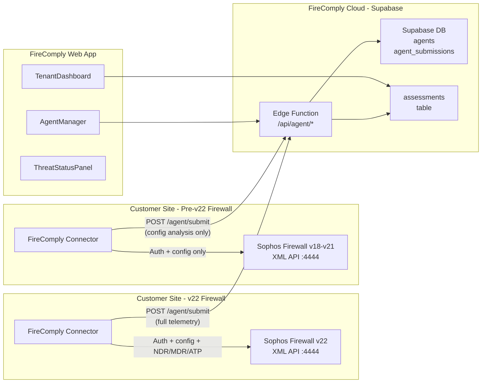

# FireComply Connector Agent — Full Implementation Plan

## Architecture




---

## Phase 1 — Supabase Backend

### 1A — Database Tables

Create two new tables via SQL migration in the Supabase dashboard.

`**agents` table:**

- `id` UUID PK, `org_id` FK to organisations, `name` TEXT, `api_key_hash` TEXT (bcrypt), `api_key_prefix` TEXT (first 8 chars for display), `tenant_id` TEXT nullable (Central tenant ID — locked after setup), `tenant_name` TEXT nullable (Central tenant/customer name), `firewall_host` TEXT, `firewall_port` INT default 4444, `customer_name` TEXT, `environment` TEXT, `schedule_cron` TEXT default '0 2 * * *', `firmware_version` TEXT nullable (auto-detected on first connect via APIVersion trick), `firmware_version_override` TEXT nullable (manual override from MSP), `serial_number` TEXT nullable (auto-matched from Central or manually entered), `hardware_model` TEXT nullable (e.g. "XGS 2300", "XGS 136" — manual entry or Central match. Determines NDR eligibility: XGS only), `last_seen_at` TIMESTAMPTZ, `last_score` INT, `last_grade` TEXT, `status` TEXT (registered/online/offline/error), `error_message` TEXT nullable, `created_at` TIMESTAMPTZ

`**agent_submissions` table:**

- `id` UUID PK, `agent_id` FK to agents, `org_id` FK to organisations, `customer_name` TEXT, `overall_score` INT, `overall_grade` TEXT, `firewalls` JSONB (same shape as `assessments.firewalls`), `findings_summary` JSONB (title + severity + confidence per finding), `finding_titles` TEXT[], `threat_status` JSONB (NDR/MDR/ATP telemetry blob), `drift` JSONB nullable (new/fixed/regressed arrays — computed on insert), `created_at` TIMESTAMPTZ

RLS policies: org members can manage their own agents and view their submissions.

**Add `submission_retention_days` column to `organisations` table** (INT, default 90). This controls how long agent submissions are kept per-org. A Supabase scheduled function (pg_cron or Edge Function on a schedule) deletes submissions older than this threshold.

**Update** [src/integrations/supabase/types.ts](src/integrations/supabase/types.ts) with both new table types.

### 1B — Agent REST API Endpoints

**File:** [supabase/functions/api/index.ts](supabase/functions/api/index.ts) — extend the existing scaffold.

Auth: All `/agent/`* routes authenticate via `X-API-Key` header. The function bcrypt-compares against `agents.api_key_hash`. This is separate from the existing Supabase auth used by the web app.


| Method | Path                   | Purpose                                                                                                                                                                                                                                                                                                                   |
| ------ | ---------------------- | ------------------------------------------------------------------------------------------------------------------------------------------------------------------------------------------------------------------------------------------------------------------------------------------------------------------------- |
| POST   | `/api/agent/register`  | Called from the web app (Supabase auth). Creates agent row, generates API key, returns it once.                                                                                                                                                                                                                           |
| GET    | `/api/agent/firewalls` | Agent calls during setup. Uses org's linked Central credentials to fetch the firewall list. If partner-level Central: returns tenants (customers) grouped, then firewalls per tenant. Response shape: `{ tenants: [{ id, name, firewalls: CentralFirewall[] }] }`. Falls back to `{ tenants: [] }` if Central not linked. |
| POST   | `/api/agent/heartbeat` | Agent calls every 5 min. Updates `last_seen_at`, `status`, `firmware_version` (auto-detected). Returns agent config (schedule, customer name, version override).                                                                                                                                                          |
| POST   | `/api/agent/submit`    | Agent submits assessment + threat telemetry. Core endpoint — see details below.                                                                                                                                                                                                                                           |
| GET    | `/api/agent/config`    | Agent calls on startup. Returns its config (schedule_cron, customer_name, environment).                                                                                                                                                                                                                                   |
| DELETE | `/api/agent/:id`       | Called from web app. Deletes agent and its submissions.                                                                                                                                                                                                                                                                   |


`**POST /agent/submit` logic:**

1. Validate API key, look up agent + org
2. Insert into `agent_submissions` with the payload
3. Query the previous submission for this agent (`ORDER BY created_at DESC LIMIT 1`)
4. Diff `finding_titles` arrays to compute `drift` (new, fixed, regressed) — same logic as [src/lib/finding-snapshots.ts](src/lib/finding-snapshots.ts) `diffFindings()`
5. Store the drift result in the submission row
6. Insert into existing `assessments` table (so TenantDashboard picks it up with zero changes)
7. Update `agents` row: `last_seen_at`, `last_score`, `last_grade`, `status = 'online'`
8. Return `{ ok: true, drift: { new: [...], fixed: [...], regressed: [...] } }`

---

## Phase 2 — Agent Management UI (FireComply Web App)

### 2A — AgentManager Component

**New file:** `src/components/AgentManager.tsx`

A panel rendered in the Management Drawer. Contains:

- **Agent list** — each row shows: name, customer, firewall host, firmware version badge (e.g. "v22.0" / "v19.5"), status dot (green if `last_seen_at` within 2x schedule interval, amber if stale, red if error), last score/grade, last sync time. Firmware version badge colour-codes: green for v21.5+ (full telemetry incl. NDR), blue for v21 (MDR + ATP), amber for v19-v20 (ATP only), grey for v18 (config only)
- **Register Agent** button — opens a dialog. If Central is linked, shows a dropdown of firewalls from Central (serial, model, hostname pre-populated). If not, shows manual fields: agent name, customer name, firewall IP/hostname, port (default 4444). Schedule dropdown (hourly/6h/12h/daily/weekly). Advanced section (collapsible): serial number, hardware model, firmware version override. On submit, calls `POST /api/agent/register`. Shows the generated API key in a one-time copyable field with instructions: "Paste this key into the FireComply Connector app during setup. This key will not be shown again."
- **Per-agent actions** — expand/click to see: recent submission history (last 10), regenerate API key, edit config, delete agent
- **Data retention setting** — dropdown to set submission retention period (30 / 60 / 90 / 180 / 365 days). Updates `organisations.submission_retention_days`. Shows current storage usage estimate.
- **Download Agent** section — links to download the agent binary (placeholder URLs initially, point to GitHub Releases when ready). Shows installation instructions per OS (Linux/Windows/macOS tabs).

### 2B — Wire Into Management Drawer

**File:** [src/components/ManagementDrawer.tsx](src/components/ManagementDrawer.tsx)

- Add a new `SettingsSection` block titled "FireComply Connector Agents" with a plug/connection icon, rendering `<AgentManager />`
- Position it in the Settings tab, between "Sophos Central API" and "Team Management"
- Only visible for non-guest, non-local-mode users

### 2C — Extend Existing Features

**File:** [src/components/TenantDashboard.tsx](src/components/TenantDashboard.tsx)

- No data changes needed — agent submissions write to the same `assessments` table
- Add a small badge/icon next to customers that have an agent linked (query `agents` table to get customer names with active agents)
- Show "Agent synced 2h ago" subtitle for agent-backed customers

**File:** [src/lib/alert-rules.ts](src/lib/alert-rules.ts)

- Add new event types: `agent_drift_detected`, `agent_offline`
- Update `checkAlertConditions` to support these

**File:** [src/components/AlertSettings.tsx](src/components/AlertSettings.tsx)

- Add the new event types to the dropdown

---

## Phase 3 — Standalone Agent App (Electron Desktop GUI)

### 3A — Project Structure

**New directory:** `firecomply-connector/` at the workspace root (sibling to `src/`, not inside the web app).

The agent is a full Electron desktop application with a React + Tailwind UI (matching the FireComply web app's tech stack). It runs as a native app, minimises to the system tray, and handles all setup, monitoring, and scheduling through a graphical interface — no CLI needed.

```
firecomply-connector/
  src/
    main/                         # Electron main process
      index.ts                    # App entry point, creates BrowserWindow, auto-launch
      tray.ts                     # System tray icon + context menu
      ipc-handlers.ts             # IPC bridge between main and renderer
      service.ts                  # Background scheduling + heartbeat loop
    renderer/                     # Electron renderer (React UI)
      index.html                  # HTML shell
      main.tsx                    # React entry point
      App.tsx                     # Root component with router
      pages/
        SetupWizard.tsx           # Step-by-step graphical setup wizard
        Dashboard.tsx             # Live status dashboard (per-firewall cards)
        LogViewer.tsx             # Real-time scrolling log with severity filters
        Settings.tsx              # Config editor (firewalls, schedule, proxy)
      components/
        FirewallCard.tsx          # Status card: score, version badge, last sync, status dot
        ConnectionTest.tsx        # Live connection test with progress indicator
        ScoreBadge.tsx            # Risk score + grade display
        StatusDot.tsx             # Green/amber/red connection indicator
      styles/
        globals.css               # Tailwind base styles
    firewall/                     # Core firewall modules (same as before)
      auth.ts                     # XML API auth to port 4444
      version.ts                  # Firmware version detection + capability profile
      export-config.ts            # GET all entity types (version-gated)
      parse-entities.ts           # XML responses to ExtractedSections
      threat-status.ts            # NDR/MDR/ATP telemetry collection
    analysis/                     # Analysis logic (ported from web app)
      analyse-config.ts
      risk-score.ts
      types.ts
    api/                          # FireComply API client
      client.ts                   # HTTP client with proxy support
      submit.ts                   # POST /agent/submit
      heartbeat.ts                # POST /agent/heartbeat
      queue.ts                    # Local offline submission queue
    scheduler.ts                  # node-cron scheduling (multi-firewall sequential)
    logger.ts                     # File + in-memory log buffer (feeds LogViewer)
    config.ts                     # Reads/validates config.json
  assets/
    icon.png                      # App icon (Sophos FireComply branding)
    tray-icon.png                 # System tray icon (16x16/22x22)
  electron-builder.yml            # Packaging config (Windows .exe, macOS .dmg, Linux .AppImage)
  package.json
  tsconfig.json
  tailwind.config.js
  postcss.config.js
  vite.config.ts                  # Vite for renderer bundling
  README.md
```

### 3B — Firewall Connection and Version Detection

**File:** `firecomply-connector/src/firewall/auth.ts`

```typescript
// POST to https://<host>:<port>/webconsole/APIController
// Body: reqxml=<Request><Login>...</Login></Request>
// Parse XML response, check for "Authentication Successful"
// Extract APIVersion from response (e.g. "2200.1" = v22, "2100.1" = v21, "2000.1" = v20, "1905.2" = v19)
// Handle self-signed certs via Node https agent with rejectUnauthorized: false
```

Uses `node:https` with a custom agent for self-signed certificate handling. No external HTTP library needed.

**File:** `firecomply-connector/src/firewall/version.ts`

**Firmware version detection:** The agent sends the login request *without* the `APIVersion` attribute in the `<Request>` tag. The Sophos API then returns the firewall's *actual* firmware API version in the response:

```xml
<!-- Request (no APIVersion) -->
<Request><Login><Username>...</Username><Password>...</Password></Login></Request>

<!-- Response reveals true version -->
<Response APIVersion="2200.1">
  <Login><status>Authentication Successful</status></Login>
</Response>
```

Mapping: `2200.x` → v22, `2150.x` → v21.5, `2100.x` → v21, `2000.x` → v20, `1905.x` → v19, `1800.x` → v18.

The detected version can be overridden via `config.json` if the MSP needs to force a specific version (e.g. beta firmware with a non-standard API version string).

**Serial number:** Not available via the XML API (Sophos limitation — only visible in web admin console). The agent uses a two-step approach:

1. **Auto-match from Sophos Central** — if the MSP's org has Central integration linked in FireComply, the registration endpoint queries `central_firewalls` by firewall IP/hostname to retrieve the serial number automatically
2. **Manual fallback** — if no Central match is found, the registration dialog includes an optional "Serial Number" field for the MSP to fill in (they can get it from the web console or Central)

The serial is stored on the `agents` table and reported in heartbeats/submissions. It's optional — the agent functions without it.

```typescript
interface FirewallCapabilities {
  firmwareVersion: string;     // e.g. "v22.0", "v21.5", "v20.0"
  apiVersion: string;          // e.g. "2200.1"
  serialNumber?: string;       // From Central auto-match or manual entry
  hardwareModel?: string;      // e.g. "XGS 2300", "XG 135" — from Central or manual entry
  isXgs: boolean;              // Derived from hardwareModel (starts with "XGS"). Determines NDR eligibility.
  hasNdr: boolean;             // v21.5+ AND isXgs only (Xstream Protection licence)
  hasMdr: boolean;             // v21+ (Active Threat Response)
  hasAtp: boolean;             // v19+ (Sophos X-Ops threat feeds)
  hasThirdPartyFeeds: boolean; // v21+
  hasSslTlsInspection: boolean; // v18+
}

function detectCapabilities(apiVersion: string): FirewallCapabilities;
```

The agent uses this to decide which GET requests to make. Core config entities (FirewallRule, NATRule, Zone, IPHost, etc.) work on all supported versions. NDR is only attempted when `isXgs && hasNdr` (v21.5+ on XGS hardware). MDR/ATP/third-party feeds are attempted based on firmware version alone. If a GET returns "Zero records" or an error for an unsupported entity, the agent logs a warning and continues rather than failing.

### 3C — Config Entity Retrieval

**File:** `firecomply-connector/src/firewall/export-config.ts`

Instead of downloading a .tar backup, use the XML API `<Get>` tag to retrieve each entity type directly. This is simpler and doesn't require file extraction. This approach works on all firmware versions (v18-v22) that have API access enabled.

**Core entities (all versions v18+):**


| XML Tag           | Maps To Section      | Min Version |
| ----------------- | -------------------- | ----------- |
| `FirewallRule`    | Firewall Rules       | v18         |
| `NATRule`         | NAT Rules            | v18         |
| `Zone`            | Zones                | v18         |
| `IPHost`          | Networks (IP Hosts)  | v18         |
| `Interface`       | Interfaces & Ports   | v18         |
| `WebFilterPolicy` | Web Filters          | v18         |
| `IPSPolicy`       | Intrusion Prevention | v18         |
| `LocalServiceACL` | Local Service ACL    | v18         |
| `SecurityGroup`   | Groups               | v18         |
| `AVPolicy`        | Virus Scanning       | v18         |


**Version-gated entities (only attempted when capabilities allow):**


| XML Tag                 | Maps To Section    | Min Version |
| ----------------------- | ------------------ | ----------- |
| `SSLTLSInspectionRule`  | SSL/TLS Inspection | v18         |
| `SophosXOpsThreatFeeds` | ATP Status         | v19         |
| `MDRThreatFeed`         | MDR Status         | v21         |
| `NDREssentials`         | NDR Status         | v21.5 (XGS) |
| `ThirdPartyThreatFeed`  | Third-party Feeds  | v21         |


Each call: `<Get><FirewallRule></FirewallRule></Get>` — returns all rules as XML. For version-gated entities, the agent checks `FirewallCapabilities` before attempting the GET and gracefully skips with a log message if unsupported.

### 3D — XML Response Parser

**File:** `firecomply-connector/src/firewall/parse-entities.ts`

Converts XML API responses into the `ExtractedSections` shape that `analyseConfig()` expects.

Uses `fast-xml-parser` (npm) to parse XML to JSON. Then maps each entity's fields into the `{ tables: [{ headers, rows }], text, details }` format.

Key mapping for `FirewallRule`:

- `Name` → "Rule Name"
- `Status` → "Status" (Enable/Disable)
- `NetworkPolicy.Action` → "Action"
- `NetworkPolicy.SourceZones.Zone` → "Source Zone"
- `NetworkPolicy.DestinationZones.Zone` → "Destination Zone"
- `NetworkPolicy.Services.Service` → "Service"
- `SecurityPolicy.WebFilter` → "Web Filter"
- `SecurityPolicy.IPSPolicy` → "IPS Policy"
- `NetworkPolicy.LogTraffic` → "Log"

This must produce output identical to what `extract-sections.ts` produces from Config Viewer HTML so that `analyseConfig()` works unchanged.

### 3E — NDR/MDR/ATP Telemetry (Version-Gated)

**File:** `firecomply-connector/src/firewall/threat-status.ts`

Collects threat protection telemetry based on the detected firmware version. Each section is individually try/caught so a failure in one does not block the others.

**1. Sophos X-Ops ATP status (v19+):**

```xml
<Get><SophosXOpsThreatFeeds></SophosXOpsThreatFeeds></Get>
```

Extracts: `ThreatProtectionStatus` (Enable/Disable), `Policy` (Log Only / Log and Drop), `InspectContent` (all/untrusted)

**2. MDR Threat Feed status (v21+):**

```xml
<Get><MDRThreatFeed></MDRThreatFeed></Get>
```

Extracts: enabled/disabled, policy, connection status

**3. NDR Essentials status (v21.5+ on XGS hardware only):**

```xml
<Get><NDREssentials></NDREssentials></Get>
```

Extracts: enabled/disabled, monitored interfaces list, data center location, minimum threat score threshold, IoC count (if available in response)

**4. Third-party threat feeds (v21+):**

```xml
<Get><ThirdPartyThreatFeed></ThirdPartyThreatFeed></Get>
```

Extracts: feed names, sync status (Success/Failed/etc.), last sync time

All telemetry is bundled into a `ThreatStatus` object where each section is nullable:

```typescript
interface ThreatStatus {
  firmwareVersion: string;
  atp: { enabled: boolean; policy: string; inspectContent: string } | null;
  mdr: { enabled: boolean; policy: string; connected: boolean } | null;   // v21+
  ndr: {
    enabled: boolean;
    interfaces: string[];
    dataCenter: string;
    minThreatScore: string;
    iocCount?: number;
  } | null;
  thirdPartyFeeds: Array<{
    name: string;
    syncStatus: string;
    lastSync?: string;
  }> | null;
  collectedAt: string;
}
```

For pre-v19 firewalls, `threat_status` will contain only `firmwareVersion` and `collectedAt` with all other fields null. The FireComply UI renders "Not available on this firmware version" for null sections.

This is submitted alongside the assessment in `POST /agent/submit` as the `threat_status` field.

### 3F — Analysis Module

**Files:** `firecomply-connector/src/analysis/`

Port the following from the FireComply web app (copy + adapt imports):

- `analyse-config.ts` — the core `analyseConfig()` function and all helpers
- `risk-score.ts` — `computeRiskScore()` and category definitions
- `types.ts` — `Finding`, `AnalysisResult`, `InspectionPosture`, `ExtractedSections`, etc.

These run identically on the agent. The agent produces the same scores/findings as the web app.

### 3G — API Client

**File:** `firecomply-connector/src/api/client.ts`

Simple HTTP client that:

- Reads API key and FireComply URL from config
- Sets `X-API-Key` header on all requests
- Handles retries with exponential backoff for 429/5xx
- Timeout of 30s per request

**File:** `firecomply-connector/src/api/submit.ts`

Builds the submission payload (one per firewall when multi-firewall is configured):

```typescript
{
  customer_name: agentConfig.customerName,
  firewall_label: fw.label,
  firmware_version: capabilities.firmwareVersion,
  agent_version: AGENT_VERSION,
  overall_score: riskScore.overall,
  overall_grade: grade,
  firewalls: [{ label: fw.label, riskScore, totalRules, totalFindings }],
  findings_summary: findings.map(f => ({ title: f.title, severity: f.severity, confidence: f.confidence })),
  finding_titles: findings.map(f => f.title),
  threat_status: threatStatus,
}
```

### 3H — Electron App Shell, Tray, and Background Service

**File:** `firecomply-connector/src/main/index.ts`

Electron main process entry point:

- Creates the main `BrowserWindow` loading the React renderer
- Registers IPC handlers for renderer-to-main communication
- On window close: minimises to system tray instead of quitting (tray tooltip shows "FireComply Connector — Running")
- Auto-launch on OS startup using `electron-auto-launch` (configurable in Settings)
- Stores config in the OS user data directory (`app.getPath('userData')/config.json`)

**File:** `firecomply-connector/src/main/tray.ts`

System tray integration:

- Tray icon with context menu: "Open Dashboard", "Run Now", "Pause / Resume", separator, "Quit"
- Icon changes colour based on status: green (all healthy), amber (stale/warning), red (error)
- Tray tooltip shows: "FireComply Connector — 3 firewalls monitored — Last sync: 2h ago"

**File:** `firecomply-connector/src/main/service.ts`

Background service running in the main process:

- Uses `node-cron` for scheduling
- On each scheduled run, loops through each configured firewall sequentially: auth → detect version → get entities → parse → analyse → submit
- Sends heartbeat every 5 minutes between runs (includes agent version and per-firewall status summary)
- Emits events via IPC so the renderer Dashboard updates in real-time
- If FireComply API is unreachable, queues submissions to a local directory and retries on next heartbeat cycle

**File:** `firecomply-connector/src/main/ipc-handlers.ts`

IPC bridge between renderer and main process:

- `firewall:test` — tests connection to a firewall, returns version + rule count
- `firewall:run-now` — triggers an immediate assessment run
- `config:save` — writes config changes to disk
- `config:load` — reads current config
- `service:status` — returns per-firewall status, next run time, queue size
- `service:toggle` — pause/resume the scheduler
- `logs:stream` — streams log entries to the LogViewer in real-time

The agent reports its own version (from `package.json`) in every heartbeat and submission so FireComply can track agent versions across the fleet.

### 3I — Configuration

**File:** `firecomply-connector/config.example.json`

```json
{
  "firecomplyApiUrl": "https://xxxx.supabase.co/functions/v1",
  "agentApiKey": "ck_xxxxxxxxxxxxxxxxxxxxxxxx",
  "firewalls": [
    {
      "label": "HQ Primary",
      "host": "192.168.1.1",
      "port": 4444,
      "username": "api-reader",
      "password": "securepassword",
      "skipSslVerify": true,
      "versionOverride": null
    },
    {
      "label": "Branch Office",
      "host": "10.0.0.1",
      "port": 4444,
      "username": "api-reader",
      "password": "securepassword",
      "skipSslVerify": true,
      "versionOverride": null
    }
  ],
  "schedule": "0 2 * * *",
  "proxy": null,
  "logFile": "./firecomply-connector.log",
  "logLevel": "info"
}
```

- `firewalls`: Array of firewall targets. Each gets its own auth, entity pull, analysis, and submission. A single agent can monitor 1-N firewalls at one customer site. Each firewall's `label` is used in submissions and the FireComply UI. Minimum 1 entry required.
- `firewalls[].versionOverride`: Optional. Set to e.g. `"2200.1"` to force a specific API version instead of auto-detection. Useful for beta firmware or non-standard version strings. Default `null` = auto-detect.
- `proxy`: Optional. HTTP(S) proxy URL for outbound connections to the FireComply API (e.g. `"http://proxy.corp:8080"`). Does not apply to local firewall connections.
- Firewall credentials stay on the local machine. Only scores, findings (titles + severity), and threat feed status are transmitted to FireComply. No raw firewall rules, IP addresses, or passwords are sent.

### 3J — Packaging (Electron)

- `electron-builder.yml` config for cross-platform packaging:
  - **Windows**: `.exe` installer (NSIS) — installs to Program Files, creates Start Menu shortcut, auto-launch option
  - **macOS**: `.dmg` disk image — drag to Applications, auto-launch via Login Items
  - **Linux**: `.AppImage` (portable) and `.deb` package — auto-launch via XDG autostart
- Vite bundles the renderer (React + Tailwind); `tsc` compiles the main process
- App icon and tray icon in `assets/`
- Code signing considerations documented in README (required for macOS notarisation and Windows SmartScreen)
- README with download links, screenshots, and setup walkthrough

### 3K — Setup Wizard (GUI)

**File:** `firecomply-connector/src/renderer/pages/SetupWizard.tsx`

Shown on first launch (when no `config.json` exists). A step-by-step graphical wizard:

**Step 1 — Connect to FireComply**

- Text input: "Paste your FireComply API key"
- "Verify" button → calls `GET /api/agent/config` via IPC → shows org name confirmation with a green checkmark
- Error state: red banner with "Invalid API key" or "Cannot reach FireComply API"

**Step 2 — Select Tenant (partner accounts only)**

- On entering this step, agent calls `GET /api/agent/firewalls` via IPC
- **If partner-level Central:** Displays a list of all tenant (customer) names the MSP manages. Search bar at the top to filter tenants by name. MSP selects the tenant this agent belongs to. Once selected and confirmed, the tenant choice is **locked** — it cannot be changed from the agent without the MSP re-running setup (which requires the FireComply API key).
- **If single-tenant Central:** Skips this step automatically (only one tenant).
- **If Central not linked:** Skips to Step 3 (manual mode).

**Step 3 — Select Firewalls**

- Shows the selected tenant's firewalls from Central. Search bar to filter by hostname, serial, IP, or model.
- Each firewall card shows: hostname, serial number, model badge (XGS/XG/Virtual), firmware version, IP address, connection status dot.
- MSP ticks the firewalls they want this agent to monitor. Serial, model, firmware, and hostname are permanently linked from Central data — no manual entry needed.
- **If Central is not linked:** Falls back to manual entry mode. "Add Firewall" button with fields for: label, IP/hostname, port, serial (optional), model (optional dropdown: XGS / XG / Virtual). Shows a banner: "Link Sophos Central in the FireComply web app to auto-populate firewall details."
- For each selected/added firewall: enter local XML API credentials (username + password for port 4444)
- "Test Connection" button per firewall → progress spinner → on success: firmware version badge (auto-detected via APIVersion), rule count, capability summary (e.g. "v21.5 XGS — Full telemetry: ATP, MDR, NDR" or "v19 XG — Config analysis + ATP only")

**Locking:** Once setup is complete, the tenant and firewall selections are locked in the agent. The Settings page shows them as read-only with a lock icon. To change the linked tenant or firewalls, the MSP must either:

1. Re-run the setup wizard from Settings (requires re-entering the FireComply API key to prove MSP identity), or
2. Update the agent config from the FireComply web app (AgentManager) which pushes the change via the next heartbeat

**Step 4 — Schedule**

- Visual schedule picker: radio buttons for hourly / every 6h / every 12h / daily / weekly
- Shows "Next run: Tomorrow at 02:00" preview
- Optional: proxy URL field (collapsed under "Advanced" toggle)

**Step 5 — Confirmation**

- Summary card showing: org name, tenant name (if partner), firewall count (with serial + model per firewall), firmware versions detected, schedule
- "Start Monitoring" button → saves config (with locked tenant/firewall selections), starts the background service, transitions to Dashboard

### 3L — Dashboard, Log Viewer, and Settings (GUI)

**File:** `firecomply-connector/src/renderer/pages/Dashboard.tsx`

The main view after setup. Shows at-a-glance status of all monitored firewalls:

- **Header bar**: agent version, org name, next scheduled run countdown, "Run Now" button, "Pause" toggle
- **Firewall cards** (one per configured firewall): each shows:
  - Firewall label and IP
  - Status dot (green/amber/red) with status text
  - Firmware version badge (colour-coded: green v22+, amber v19-v21, grey v18)
  - Last risk score + grade (e.g. "72 / C")
  - Last sync timestamp ("2 hours ago")
  - Findings summary (e.g. "3 high, 5 medium, 2 low")
  - Drift indicator (if last run detected changes: "+2 new, -1 fixed")
  - "Run Now" and "Test Connection" buttons per firewall
- **Submission queue indicator**: shows count of queued submissions if FireComply API was unreachable
- **Mini log panel** at the bottom: last 5 log entries, expandable to full LogViewer

**File:** `firecomply-connector/src/renderer/pages/LogViewer.tsx`

Full-screen log viewer:

- Real-time scrolling log fed via IPC from the main process logger
- Severity filter toggles (DEBUG / INFO / WARN / ERROR)
- Per-firewall filter dropdown
- Search within logs
- "Export Logs" button (saves to .txt)

**File:** `firecomply-connector/src/renderer/pages/Settings.tsx`

Config editor:

- **Firewalls tab**: shows linked firewalls as read-only cards (locked icon) with serial, model, firmware, last test result. "Re-run Setup" button (requires re-entering FireComply API key) to change linked tenant/firewalls. XML API credentials can be updated without re-running setup.
- **Schedule tab**: change schedule, toggle auto-launch on startup
- **Network tab**: proxy URL, FireComply API URL
- **About tab**: agent version, OS info, linked tenant name, config file location, "Check for Updates" button (checks GitHub releases)

---

## Phase 4 — Threat Telemetry Display (FireComply Web App)

### 4A — Threat Status Panel

**New file:** `src/components/ThreatStatusPanel.tsx`

Renders the `threat_status` JSONB from `agent_submissions` as a visual panel with version-aware display:

- **Firmware version badge** at the top (e.g. "SFOS v22.0 GA" / "SFOS v19.5 MR3")
- **ATP (X-Ops):** Status dot + policy (Log Only vs Log and Drop) — shown for v19+, else "Not available on v18"
- **MDR:** Status dot + connection indicator — shown for v21+, else "Requires v21+"
- **NDR Essentials:** Status dot + monitored interface count + IoC count + minimum threat score threshold — shown for v21.5+ XGS, else "Requires v21.5+ on XGS hardware"
- **Third-party feeds:** List with sync status per feed (green/red dot) — shown for v21+

Sections for features unavailable on the detected firmware render a subtle muted card with an upgrade prompt.

This component is shown:

- In the TenantDashboard per-customer expanded view
- In the AgentManager per-agent detail view

### 4B — Extend AnalysisResult for Threat Data

**File:** [src/lib/analyse-config.ts](src/lib/analyse-config.ts)

Extend the `AtpStatus` interface (or create a new `ThreatStatus` interface) to include MDR and NDR fields. When agent submissions include `threat_status`, display it alongside the existing deterministic analysis.

### 4C — New Findings from Threat Status (Version-Aware)

Add deterministic findings based on threat telemetry. Each finding is only generated when the feature is available on the detected firmware version:

**v19+ (ATP available):**

- ATP disabled → High finding: "Sophos X-Ops Active Threat Response is disabled"
- ATP policy is "Log Only" → Low finding: "ATP is in log-only mode — threats are not being dropped"

**v21+ (MDR/Third-party feeds available):**

- MDR threat feed disabled → Medium finding: "MDR threat feed is not active"
- Third-party feed sync failed → Info finding: "Third-party threat feed sync failure detected"

**v21.5+ (NDR available, XGS hardware only):**

- NDR Essentials disabled → Medium finding: "NDR Essentials is not enabled"
- NDR minimum threat score set too low → Info finding: "NDR threat score threshold may generate excessive alerts"

For pre-v19 firewalls, none of these findings are generated — the core config-based analysis (firewall rules, zones, IPS, web filtering) still provides full coverage.

---

## Phase 5 — MFA and Passkey Authentication

### 5A — TOTP MFA for FireComply Web App

Uses Supabase Auth's built-in MFA support. No external libraries needed for TOTP.

**Login flow change** in [src/hooks/use-auth.ts](src/hooks/use-auth.ts):

1. User signs in with email + password (existing)
2. After sign-in, check `supabase.auth.mfa.getAuthenticatorAssuranceLevel()`:
  - If `currentLevel === 'aal1'` and `nextLevel === 'aal2'` → user has MFA enrolled, show verification screen
  - If `currentLevel === 'aal1'` and `nextLevel === 'aal1'` → no MFA enrolled, proceed normally
3. Verification screen: TOTP code input (6 digits) with "Use Passkey instead" button
4. Call `supabase.auth.mfa.challenge()` then `supabase.auth.mfa.verify()` with the code
5. On success, JWT is upgraded to AAL2

**MFA enrollment** — new section in [src/components/ManagementDrawer.tsx](src/components/ManagementDrawer.tsx):

- "Security" section in account settings
- "Set up authenticator app" button → calls `supabase.auth.mfa.enroll({ factorType: 'totp' })` → shows QR code
- User scans QR with authenticator app (Google Authenticator, Authy, etc.)
- User enters verification code to confirm enrollment
- "Remove MFA" option (requires current TOTP code to disable)
- Shows enrolled factors list (TOTP, passkeys)

**New component:** `src/components/MfaVerification.tsx` — reusable MFA challenge/verify screen shown during login and sensitive operations.

### 5B — Passkey/WebAuthn Support for FireComply Web App

Since Supabase doesn't have native passkey support yet, we build it with `@simplewebauthn/browser` (frontend) and `@simplewebauthn/server` (Supabase Edge Function).

**New table: `passkey_credentials`**

- `id` UUID PK
- `user_id` UUID FK to auth.users
- `credential_id` TEXT UNIQUE (base64url encoded WebAuthn credential ID)
- `public_key` TEXT (base64url encoded public key)
- `counter` BIGINT (signature counter for replay protection)
- `device_type` TEXT ('platform' for biometric, 'cross-platform' for security key)
- `transports` TEXT[] (e.g. 'internal', 'usb', 'ble', 'nfc')
- `name` TEXT (user-assigned label, e.g. "MacBook Pro Touch ID")
- `created_at` TIMESTAMPTZ

RLS: users can only manage their own credentials.

**New Edge Function endpoints** (extend [supabase/functions/api/index.ts](supabase/functions/api/index.ts)):

- `POST /api/passkey/register-options` — generates WebAuthn registration options (challenge, relying party info). Requires AAL1+ session.
- `POST /api/passkey/register-verify` — verifies registration response, stores credential in `passkey_credentials`. Requires AAL1+ session.
- `POST /api/passkey/login-options` — generates authentication options for a user (by email). Public endpoint.
- `POST /api/passkey/login-verify` — verifies authentication response, returns a Supabase session token (custom JWT with AAL2 claim).

**Frontend integration:**

- Login page: "Sign in with passkey" button alongside email/password form. Calls `startAuthentication()` from `@simplewebauthn/browser`.
- MFA step: after email+password, "Use passkey" button as alternative to TOTP code input. Biometric prompt (Touch ID / Windows Hello / Face ID) appears.
- Account settings: "Manage passkeys" section — register new passkey (shows biometric/security key prompt), rename, delete existing passkeys.

**New component:** `src/components/PasskeyManager.tsx` — UI for registering, listing, and deleting passkeys in account settings.

### 5C — MFA for Electron Agent

The agent doesn't have its own user accounts — it verifies identity through the FireComply backend.

**On app open (every launch):**

1. Agent shows a "Verify Identity" screen before showing the Dashboard
2. Two options:
  - **TOTP**: Enter email + 6-digit TOTP code
  - **Passkey**: Click "Use Passkey" → biometric prompt (Electron supports WebAuthn via Chromium)
3. Agent calls `POST /api/agent/verify-identity` with the credentials
4. FireComply backend verifies against Supabase Auth MFA (TOTP) or `passkey_credentials` (WebAuthn)
5. Returns a short-lived session token (valid for 24h or until app closes)
6. Agent stores the session in memory (not persisted to disk — closing the app requires re-verification)

**New API endpoint:** `POST /api/agent/verify-identity`

- Accepts: `{ email, totpCode }` or `{ email, webauthnResponse }`
- Validates the user belongs to the agent's org
- Verifies TOTP via Supabase Auth or passkey via @simplewebauthn/server
- Returns: `{ sessionToken, expiresAt, userName }`

**For locked settings changes (tenant/firewall re-linking):**

- Even with an active session, changing locked settings requires **re-verification**
- Agent prompts for MFA again before allowing access to the setup wizard re-run
- This is a second layer on top of the app-open MFA

**File:** `firecomply-connector/src/renderer/pages/VerifyIdentity.tsx` — full-screen verification page with TOTP input and passkey button. Shown on every app launch and before locked setting changes.

### 5D — Org-Level MFA Enforcement

**New column on `organisations` table:** `mfa_required` BOOLEAN default FALSE

- When enabled, all org members must have MFA enrolled (TOTP or passkey) to access the FireComply web app
- Users without MFA enrolled are redirected to the enrollment screen after login
- Agents belonging to enforced orgs require MFA verification on every launch (cannot be bypassed)
- Toggle in ManagementDrawer settings: "Require MFA for all team members"

---

## Security Considerations

- MFA (TOTP + passkeys) protects both the web app and the Electron agent. Passkey credentials are stored with replay-protection counters. Agent sessions are memory-only (not persisted to disk).
- Agent API keys are bcrypt-hashed in Supabase. The raw key is shown exactly once at registration time.
- Firewall credentials never leave the agent machine. Only assessment results (scores, finding titles, threat status) are transmitted.
- The agent submit endpoint rate-limits to max 1 submission per agent per 30 minutes.
- All agent-to-FireComply communication is over HTTPS.
- The agent config file is stored in the OS user data directory (`%APPDATA%` on Windows, `~/Library/Application Support/` on macOS, `~/.config/` on Linux) and should be file-permission protected. The setup wizard handles this.
- Consider OS keychain integration (`keytar` npm package) for firewall password storage in a future iteration.

## Operational Considerations

- **XML API prerequisites:** The firewall must have API access enabled (Administration > Device Access > allow API on the LAN/management zone). A dedicated read-only API admin user should be created. The agent's IP must be whitelisted in the "Allowed Source IP" list. The README documents these steps with screenshots.
- **HA pair awareness:** Sophos Active-Passive HA pairs share config. If the agent connects to the cluster virtual IP, it always reaches the active node. The README warns against pointing two agents at both nodes of the same HA pair (which would create duplicate submissions). The agent submission includes the firewall hostname from the API response so FireComply could detect duplicates in future.
- **Multi-firewall sequencing:** When an agent monitors multiple firewalls, it processes them sequentially (not in parallel) to avoid overwhelming a small site's bandwidth. Each firewall's result is submitted individually.
- **Connection failure handling:** If a firewall is unreachable (maintenance, reboot), the agent logs the failure, shows a red status dot on the Dashboard firewall card, reports `status: 'error'` with the error message in the heartbeat, and retries on the next scheduled run. If the FireComply API is unreachable, the agent queues the submission locally (shown as a queue indicator on the Dashboard) and retries with exponential backoff.
- **Agent version tracking:** Every heartbeat includes the agent's own semver version (from `package.json`). The FireComply UI shows this in the agent list so MSPs can spot outdated agents that need updating.

