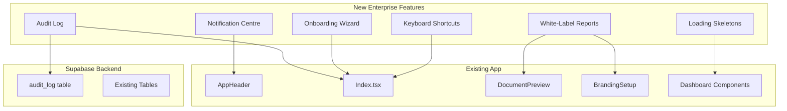

# Enterprise Polish Features

## Current State

The app has strong core functionality (config analysis, AI reports, Central integration, multi-tenant dashboard, team management), but is missing several features that enterprise customers and MSPs expect.

## Proposed Features (in priority order)

### 1. Audit Log / Activity Feed

Enterprise products need a tamper-evident record of who did what, when. This is often a compliance requirement (ISO 27001, SOC 2).

- **New Supabase table**: `audit_log` (id, org_id, user_id, action, resource_type, resource_id, metadata jsonb, created_at)
- **New Edge Function or client-side helper**: `logAuditEvent(action, resource, metadata)` called from key actions
- **Actions to log**: report generated, report saved, report deleted, config uploaded, assessment saved, Central API linked, Central synced, team member invited, team member removed, login/logout
- **New UI component**: `AuditLog.tsx` — searchable, filterable timeline in the Multi-Tenant Dashboard section (admin-only)
- **Files**: new migration, new `src/lib/audit.ts`, new `src/components/AuditLog.tsx`, edits to [Index.tsx](src/pages/Index.tsx) and action handlers

### 2. White-Label PDF/Word Reports

MSPs need to put their own brand on deliverables. Currently the PDF has a hardcoded Sophos SVG.

- **Inject `branding.logoUrl`** into `buildPdfHtml()` in [DocumentPreview.tsx](src/components/DocumentPreview.tsx), replacing the hardcoded Sophos SVG when a custom logo is set
- **Inject `branding.companyName`** into the PDF footer (replace "Generated by Sophos FireComply" with the company name)
- **Add optional fields** to `BrandingSetup`: accent colour, footer text, "Prepared by" field
- **Update Word export** (`generateWordBlob`) to use the custom logo and footer
- **Files**: edits to [DocumentPreview.tsx](src/components/DocumentPreview.tsx), [BrandingSetup.tsx](src/components/BrandingSetup.tsx)

### 3. Global Notification Centre

Replace scattered toasts/banners with a persistent bell-icon notification centre in the header.

- **New component**: `NotificationCentre.tsx` — popover from a bell icon in [AppHeader.tsx](src/components/AppHeader.tsx)
- **Notification types**: licence expiry warnings, Central sync failures, new team members joined, report generation complete, assessment score drops
- **State**: `useNotifications` hook storing notifications in React context (with optional Supabase persistence for cross-device)
- **Unread badge**: red dot on the bell icon when unread count > 0
- **Files**: new `src/components/NotificationCentre.tsx`, new `src/hooks/use-notifications.ts`, edits to [AppHeader.tsx](src/components/AppHeader.tsx)

### 4. Onboarding Wizard / First-Run Experience

New users currently see an empty dashboard. An enterprise product guides them through setup.

- **Step-by-step checklist** shown on first login (or when no configs have been uploaded):
  1. Set up your company branding
  2. Upload your first firewall config
  3. Connect Sophos Central (optional)
  4. Generate your first report
  5. Invite team members
- **Persistent progress**: stored in `localStorage` (guest) or a `user_preferences` column
- **Dismissible**: "Don't show again" option
- **Files**: new `src/components/OnboardingChecklist.tsx`, edits to [Index.tsx](src/pages/Index.tsx)

### 5. Loading Skeletons

Replace plain spinners with shimmer skeletons for a polished async experience.

- **New utility component**: `Skeleton.tsx` (already exists in `src/components/ui/skeleton.tsx` via shadcn)
- **Add skeletons to**: EstateOverview (while analysis runs), TenantDashboard (while loading assessments), SecurityDashboards (while computing), CentralEnrichment (while fetching), SavedReportsLibrary (while loading)
- **Skeleton variants**: card skeleton, chart skeleton, table skeleton
- **Files**: edits to each dashboard component, possibly new `src/components/DashboardSkeleton.tsx`

### 6. Keyboard Shortcuts

Power users expect keyboard shortcuts. Add a global shortcut system.

- **New hook**: `useKeyboardShortcuts()` — registers global listeners
- **Shortcuts**:
  - `?` — show shortcut help modal
  - `Ctrl/Cmd + S` — save reports/assessment
  - `Ctrl/Cmd + G` — generate all reports
  - `Escape` — close modals / go back to dashboard
  - `1-5` — switch report tabs (when viewing reports)
- **Help modal**: `KeyboardShortcuts.tsx` — accessible from `?` key and a footer link
- **Files**: new `src/hooks/use-keyboard-shortcuts.ts`, new `src/components/KeyboardShortcuts.tsx`, edits to [AppHeader.tsx](src/components/AppHeader.tsx)

## Architecture Diagram

## What This Does NOT Include (future considerations)

- **Scheduled/automated reports** — requires a cron/worker infrastructure (Supabase pg_cron or external)
- **Expanded RBAC** (viewer, auditor roles) — useful but complex; current admin/member is sufficient for now
- **i18n** — the product is English-only; internationalisation is a major effort best deferred
- **Data retention policies** — important for compliance but needs product/legal input on retention periods
- **SSO / SAML** — enterprise auth; depends on Supabase plan (Pro+ for SAML)

