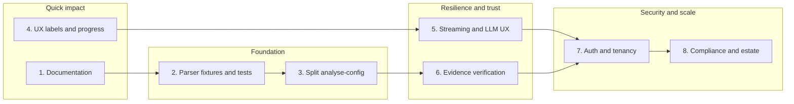

# FireComply — Next steps plan

Priorities are ordered by impact vs effort and by dependencies. Each item maps to section 6 (risks), section 7 (roadmap), or section 10 (immediate next steps) of the assessment.

---

## 1. Documentation (quick wins)

**Privacy and data-flow**

- Add a doc (e.g. `docs/DATA-PRIVACY.md` or a section in existing docs) that describes:
  - Where config data goes when not in local mode (Supabase, Gemini), and retention/processing.
  - What local mode and anonymisation do; that no data is sent in local mode.
- Refer to existing [src/lib/anonymise.ts](src/lib/anonymise.ts) and [src/lib/local-mode.ts](src/lib/local-mode.ts) so the doc stays accurate.

**Tenant model and data isolation**

- Document the multi-tenant model (orgs, roles, RLS) and how data is isolated (e.g. in `docs/` or README): who can see what, guest vs authenticated, portal slug vs org id. This supports section 6.7 and avoids misuse.

**Outcome:** Section 6.3 and 6.7 partially addressed; Phase 1 “explicit privacy/data-flow docs” progressed.

---

## 2. Parser reliability and fixtures (Phase 1 remaining)

**Fixture library**

- Add a small **fixture suite** of Sophos HTML exports (e.g. `src/test/fixtures/` or `tests/fixtures/`) from at least 2–3 versions or formats if available (e.g. different XGS/firmware or V1 vs V2 export).
- Keep fixtures small or anonymised to avoid committing sensitive configs.

**Tests**

- Extend [src/lib/**tests**/extract-sections.test.ts](src/lib/__tests__/extract-sections.test.ts) and [src/test/parser.test.ts](src/test/parser.test.ts) to:
  - Run extraction on each fixture and assert section presence and row-count parity (or min row counts) for critical sections (e.g. firewall rules, zones).
  - Optionally snapshot key section shapes (e.g. first few rows) to catch regressions when Sophos HTML changes.

**Outcome:** Section 6.1 addressed; “more parser fixture coverage” from Phase 1 done.

---

## 3. Code maintainability (section 6.6)

**Split `analyse-config.ts`**

- [src/lib/analyse-config.ts](src/lib/analyse-config.ts) (~3,076 lines) is the main maintainability risk. Plan a **domain-based split** without changing behaviour:
  - dentify clear domains (e.g. firewall rules + inspection posture, SSL/TLS, NAT, admin/device access, backup/NTP/HA, ATP/MDR/NDR, DNS/other).
  - Extract each domain into a dedicated module (e.g. `src/lib/analysis/firewall-rules.ts`, `ssl-tls.ts`, `nat.ts`, …) that returns a subset of findings or a part of the overall result.
  - Keep [analyse-config.ts](src/lib/analyse-config.ts) as a thin orchestrator that calls these modules and merges results, so existing callers (and [risk-score.ts](src/lib/risk-score.ts)) stay unchanged.
  - Move types used across domains to a shared file (e.g. `src/lib/analysis/types.ts`).

**Index.tsx (optional)**

- If desired later, split [src/pages/Index.tsx](src/pages/Index.tsx) (~893 lines) into sub-views or custom hooks (e.g. upload state, report generation state, report list) to reduce single-file size. Lower priority than analyse-config.

**Outcome:** Section 6.6 and “Split or modularise analyse-config.ts” from section 10 addressed.

---

## 4. UX improvements (sections 9 and 10)

**Extraction confidence / progress**

- Add lightweight **parsing/extraction progress or confidence** cues:
  - After upload/parse, show summary stats (e.g. sections extracted, rule count) in [UploadSection](src/components/UploadSection.tsx) or nearby (already partially present in EstateOverview); consider a short “Parsed N sections, M rules” or an indicator that extraction completed successfully.
  - If parsing can fail partially, surface a simple warning (e.g. “Some sections could not be parsed”) instead of failing silently.

**Report-mode hierarchy and labels**

- Make the three report types (Technical, Executive, Compliance) **first-class** in the UI with short purpose text and expected output (e.g. in [ReportCards](src/components/ReportCards.tsx) or generation flow). Use assessment-recommended labels where helpful: “Upload Firewall Exports”, “Assessment Context”, “Generate Technical Report”, “Generate Executive Brief”, “Generate Compliance Pack”, “Export Deliverables”.

**Enterprise shell (larger)**

- Sophos-style enterprise shell and “project/workspace” framing (header, workspace context, estate summary cards) can be a separate design pass; keep as a follow-up after the above.

**Outcome:** “Extraction confidence or progress indicators” and “clearer report-mode hierarchy” from section 10 and 9 addressed.

---

## 5. Streaming and LLM UX (section 6.4)

- Improve **error/diagnostic messaging** when the stream fails or times out (e.g. in [src/lib/stream-ai.ts](src/lib/stream-ai.ts) and the UI that shows “Still generating…” / errors): clear message on timeout, on network error, and on Supabase/Gemini error.
- Optionally add **partial-output save**: when the stream ends (done or error), persist the current markdown so the user can resume or export partial report. This may require a small state change in the report-generation flow (e.g. in [src/hooks/use-report-generation.ts](src/hooks/use-report-generation.ts) or wherever stream state lives).

**Outcome:** Section 6.4 “Clearer error/diagnostic messaging” and “optional resume or partial-output save” progressed.

---

## 6. Evidence verification (section 6.5)

- **Optional “extracted structure beside output”**: add a toggle or tab that shows key extracted data (e.g. firewall rule count, section list, or first few rows) next to the generated report so users can sanity-check. Could live in [DocumentPreview](src/components/DocumentPreview.tsx) or in the report view as a collapsible panel.
- **Rule-count parity**: in the report view or export, optionally show “Report documents N rules; extracted config has M rules” when N is truncated (e.g. 150) so it’s explicit that the report is partial.
- **Validation metadata**: optional footer or metadata in DOCX/HTML/PDF (e.g. “Generated from FireComply; extracted at ; section count X”) for traceability. Can be added in [src/lib/report-export.ts](src/lib/report-export.ts) and report-html/buildReportHtml if applicable.

**Outcome:** Section 6.5 recommendations partially implemented.

---

## 7. Auth and tenancy hardening (section 6.7)

- **RLS and viewer role**: verify that viewer-only users cannot trigger report generation or save; that all assessment/portal reads are scoped by org (RLS). Fix any gaps in [use-auth.ts](src/hooks/use-auth.ts) and API/edge usage.
- **Invite flow**: ensure invite/sign-up flow correctly assigns org and role and that only admins can invite (per [docs/ROADMAP.md](docs/ROADMAP.md)).
- Document the tenant model (see step 1) so data isolation is clear to operators and auditors.

**Outcome:** Section 6.7 “Continue hardening RLS, invite flows, and viewer-only restrictions” progressed.

---

## 8. Compliance and estate features (Phases 2–4, strategic)

These can be scheduled after the above:

- **Control-level evidence mapping**: link findings to framework controls and optionally show traceability in the compliance pack (Phase 2/4).
- **Estate-wide drift and recurring findings**: build on [ConsistencyChecker](src/components/ConsistencyChecker.tsx) and fleet data for drift reporting and “top recurring findings” (Phase 3).
- **Validation layer**: compare FireComply deterministic findings with Sophos/open audit tooling where available; surface in UI (section 8.8).
- **Admin/config audit log evidence**: ingest config audit logs and attach to evidence pack (section 8.3).

**Outcome:** Roadmap Phases 2–4 and strategic enhancements advanced in a planned way.

---

## Suggested order of execution

- **First:** Documentation (1) and lightweight UX (4) — no code structure change, high clarity.
- **Second:** Parser fixtures (2) and split of `analyse-config.ts` (3) — improves reliability and maintainability.
- **Third:** Streaming/LLM UX (5) and evidence verification (6) — better resilience and trust.
- **Fourth:** Auth/tenancy hardening (7) and compliance/estate features (8) — security and product depth.

Product direction (section 10) remains non-technical: keep positioning as review/assessment and compliance evidence support; avoid “compliance certifier” language in all copy.