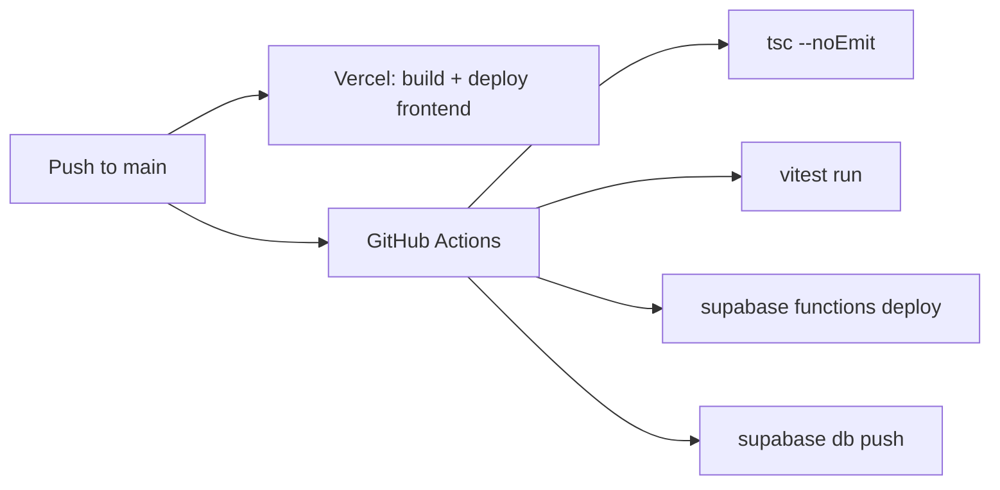

# GitHub Actions CI/CD for Supabase

## What it does

On every push to `main`:
1. Type-check the frontend with `tsc --noEmit`
2. Run tests with `vitest`
3. Deploy all Edge Functions via `supabase functions deploy`
4. Apply any pending database migrations via `supabase db push`

Vercel already handles frontend deployment separately (triggered by GitHub push).

## File to create

- [`.github/workflows/deploy.yml`](.github/workflows/deploy.yml) — the CI/CD workflow

## GitHub secrets needed (user adds manually)

1. `SUPABASE_ACCESS_TOKEN` — from [supabase.com/dashboard/account/tokens](https://supabase.com/dashboard/account/tokens)
2. `SUPABASE_PROJECT_ID` — `dayrljixkklrlymshcin` (already known from `.env`)

## What stays manual

- Enabling auth providers (one-time dashboard toggle)
- Adding new GitHub secrets if project changes
