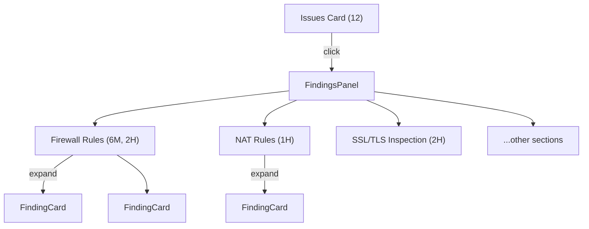

# Interactive Section-Grouped Findings

## Current State

The "Issues" stat card at the top is a static number. Below it, `FindingsPanel` in `[src/components/EstateOverview.tsx](src/components/EstateOverview.tsx)` renders all findings as a flat list of `FindingCard` components — no grouping by section.

The `Finding.section` field already categorises every finding into one of ~20 sections:

- Firewall Rules, NAT Rules, SSL/TLS Inspection, Intrusion Prevention, Application Control, Web Filter Policies, Local Service ACL, Authentication & OTP, Admin Settings, Virus Scanning, High Availability, Active Threat Response, etc.

## Proposed Change

Make the **Issues stat card clickable** — clicking it scrolls/jumps to the Findings panel and opens it. Then rebuild the **FindingsPanel** so findings are grouped by section, each in its own collapsible accordion.

### Layout per section group

Each section becomes a collapsible card:

- **Header row**: Section icon + section name + severity count badges (e.g. "6M 2I 1C") + finding count + chevron
- **Body** (collapsed by default, expands on click): The existing `FindingCard` components for that section
- Sections are sorted by highest severity first, then by count

### Issues card interaction

- Clicking the Issues stat card scrolls to the `FindingsPanel` and optionally auto-expands the first section
- A subtle "clickable" visual cue (cursor pointer, hover effect) on the card

## Files to change

- `**[src/components/EstateOverview.tsx](src/components/EstateOverview.tsx)`** — The main file:
  - Add `onClick` / `ref` prop to the Issues `StatCard` to scroll to findings
  - Rebuild `FindingsPanel` to group findings by `f.section` using a `useMemo`
  - Create a new `SectionGroup` component (collapsible accordion per section)
  - Keep existing `FindingCard` inside each group
  - CSV/PDF export buttons remain at the top of the panel
- `**[src/pages/Index.tsx](src/pages/Index.tsx)`** — Minor wiring:
  - Pass a ref or callback so the Issues card click can scroll to the findings panel

