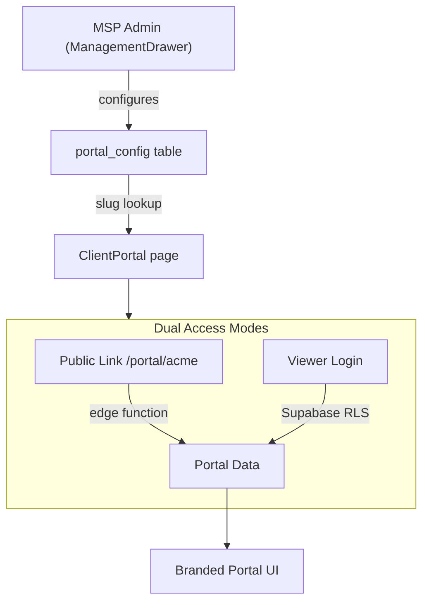

# MSP-Branded Client Portal

## Architecture Overview



## 1. Database: `portal_config` table

New migration file: `supabase/migrations/20250315000003_portal_config.sql`

```sql
create table public.portal_config (
  id uuid primary key default gen_random_uuid(),
  org_id uuid not null references public.organisations(id) on delete cascade,
  slug text unique,  -- vanity path, e.g. "acme"
  logo_url text,
  company_name text,
  accent_color text default '#2006F7',
  welcome_message text,
  sla_info text,
  contact_email text,
  contact_phone text,
  footer_text text,
  visible_sections jsonb default '["score","history","findings","compliance","reports"]',
  show_branding boolean default true,
  created_at timestamptz default now(),
  updated_at timestamptz default now(),
  unique(org_id)
);
```

RLS policies:
- Org admins can read/write their own config
- **Public read** by slug (needed for shareable link) -- only exposes branding + section toggles, not assessment data

## 2. Edge Function: `portal-data`

New edge function: `supabase/functions/portal-data/index.ts`

Acts as a secure proxy for public (unauthenticated) portal access:
- Accepts `slug` or `org_id` parameter
- Looks up `portal_config` to get branding + visible sections
- Fetches the org's latest score history, findings summary, and compliance data from `score_history` and `assessments` tables using the service-role key
- Returns a sanitised, read-only payload
- Rate-limited to prevent abuse

This keeps all assessment data behind a controlled endpoint rather than exposing tables publicly.

## 3. Route Change: `/portal/:slug`

In [src/App.tsx](src/App.tsx):
- Keep `/portal/:tenantId` for backward compatibility (UUID detection)
- Add support for slug-based lookup: `/portal/acme` resolves the slug to an org_id

In [src/pages/ClientPortal.tsx](src/pages/ClientPortal.tsx):
- Detect whether the URL param is a UUID or a slug
- If slug, call the `portal-data` edge function which returns branding + data
- If UUID, maintain current behaviour for backward compatibility

## 4. Portal Branding Application

Enhance [src/pages/ClientPortal.tsx](src/pages/ClientPortal.tsx) to apply branding from `portal_config`:

- **Header**: Show MSP logo (from `logo_url`) + `company_name` instead of customer initial
- **Accent colour**: Apply `accent_color` to buttons, links, gauge fill, and header accent via CSS custom properties
- **Welcome message**: New card at top of portal showing `welcome_message` if set
- **Contact info**: Footer card with `contact_email` and `contact_phone`
- **SLA info**: Optional card showing `sla_info` text
- **Footer**: Custom `footer_text` replacing default
- **Section visibility**: Only render sections that appear in `visible_sections` array

Available section IDs for `visible_sections`:
- `score` -- Score Summary gauge
- `history` -- Assessment History table
- `findings` -- Findings by severity
- `compliance` -- Compliance framework status
- `reports` -- Report download buttons
- `feedback` -- Customer feedback form

## 5. MSP Portal Config UI

New component: `src/components/PortalConfigurator.tsx`

Added as a new Settings section in [src/components/ManagementDrawer.tsx](src/components/ManagementDrawer.tsx) (visible to admins only, icon: `Globe`):

- **Slug field**: Set vanity URL path (validated: lowercase, alphanumeric + hyphens)
- **Logo upload**: File input, converts to base64 or uploads to Supabase Storage
- **Company name**: Text input
- **Accent colour**: Colour picker input
- **Welcome message**: Textarea
- **SLA info**: Textarea
- **Contact email / phone**: Text inputs
- **Footer text**: Text input
- **Section toggles**: Checkboxes for each portal section
- **Copy Link button**: Copies the full portal URL to clipboard
- **Live Preview button**: Opens the existing `ClientPortalView` dialog with branding applied
- **Save button**: Upserts to `portal_config` table

## 6. Authenticated Portal Access

Add a login option to the portal page for viewer-role users:

- Small "Sign in" link in the portal header
- When clicked, shows a login form (email + password) using existing Supabase auth
- On successful login, if user has `viewer` role for this org, fetches data via authenticated Supabase queries (richer data, e.g. full assessment details)
- If user is not a viewer for this org, shows "Access denied"
- Logged-in state persists via Supabase session
- Sign-out button replaces sign-in link when authenticated

The existing `viewer` role in `org_members` and `isViewerOnly` flag in [src/hooks/use-auth.ts](src/hooks/use-auth.ts) handle permissions -- no changes needed to the role system.

## 7. Key Files Modified

| File | Change |
|------|--------|
| `supabase/migrations/new` | New `portal_config` table |
| `supabase/functions/portal-data/index.ts` | New edge function for public data access |
| `src/pages/ClientPortal.tsx` | Branding, slug support, login, section visibility |
| `src/components/PortalConfigurator.tsx` | New MSP config component |
| `src/components/ManagementDrawer.tsx` | Add Portal Configurator settings section |
| `src/App.tsx` | Route update (slug support) |

## Constraints and Notes

- Logo images will be stored as base64 in the `portal_config.logo_url` column (same pattern as existing `BrandingData.logoUrl`), keeping it simple without needing Supabase Storage buckets
- The vanity slug must be unique across all orgs (enforced by `UNIQUE` constraint)
- The `portal-data` edge function uses the service-role key server-side, so no public RLS holes for assessment data
- The existing `ClientPortalView` component in ManagementDrawer can be updated to use the same branding data for preview
