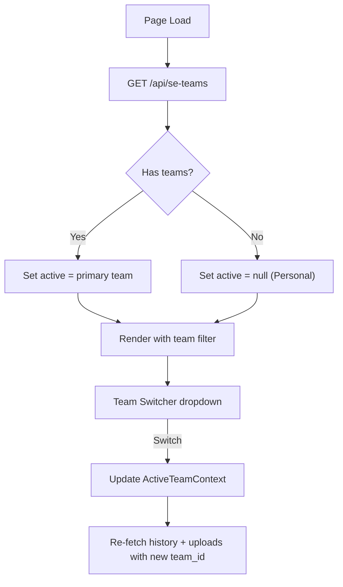

# Multi-Team SE Scoping

## Problem

Currently there is no team concept at all. The previous plan (`se-team-handoff`) proposed a single `team_id` on `se_profiles`, but you need to belong to **multiple teams** (e.g., Enterprise and Midmarket) and switch between them so reports, uploads, and history don't get mixed up.

## Data Model

### New table: `se_teams`

```sql
create table public.se_teams (
  id          uuid primary key default gen_random_uuid(),
  name        text not null,
  created_by  uuid not null references public.se_profiles(id),
  invite_code text not null unique default substr(gen_random_uuid()::text, 1, 8),
  created_at  timestamptz not null default now()
);
```

### New join table: `se_team_members` (replaces single `team_id`)

```sql
create table public.se_team_members (
  id            uuid primary key default gen_random_uuid(),
  team_id       uuid not null references public.se_teams(id) on delete cascade,
  se_profile_id uuid not null references public.se_profiles(id) on delete cascade,
  role          text not null default 'member' check (role in ('admin','member')),
  is_primary    boolean not null default false,
  joined_at     timestamptz not null default now(),
  unique(team_id, se_profile_id)
);
```

- An SE can have rows in many teams.
- `is_primary = true` on one row determines the default team on page load.
- Creator gets `role = 'admin'`.

### New column on `se_health_checks`: `team_id`

```sql
alter table public.se_health_checks
  add column team_id uuid references public.se_teams(id) on delete set null;
```

- NULL = personal / no team (backward compatible with all existing rows).
- When an SE saves while switched to a team, the active `team_id` is written.

### New column on `config_upload_requests`: `team_id`

```sql
alter table public.config_upload_requests
  add column team_id uuid references public.se_teams(id) on delete set null;
```

Same pattern — scoped to active team.

### RLS changes

RLS grants access to everything the user **can** see; the frontend filters by active team.

`**se_health_checks` SELECT** (updated):

```sql
se_user_id IN (select id from se_profiles where user_id = auth.uid())
OR team_id IN (select team_id from se_team_members
               where se_profile_id IN (select id from se_profiles where user_id = auth.uid()))
```

This lets teammates see each other's team-scoped health checks.

`**config_upload_requests` SELECT** (updated): same OR pattern.

INSERT policies add a check that `team_id IS NULL` or belongs to one of the SE's teams.

### Migration file

Single new migration: `supabase/migrations/20250326000000_se_teams_multi.sql`

## Edge Function Routes

Add to [supabase/functions/api/index.ts](supabase/functions/api/index.ts):

- `**GET /api/se-teams`** — list teams the authenticated SE belongs to (with role, is_primary)
- `**POST /api/se-teams`** — create a new team; creator auto-added as admin + is_primary (if they have no primary yet)
- `**POST /api/se-teams/join`** — join by invite code; added as member. **Sends notification email to team admin(s)** that a new member has joined
- `**POST /api/se-teams/:id/leave`** — leave a team (remove membership row). **Blocked if you are the only admin** — must transfer admin first
- `**GET /api/se-teams/:id/members`** — list members of a team (must be a member)
- `**DELETE /api/se-teams/:id`** — delete team (admin only)
- `**PATCH /api/se-teams/:id`** — rename team (admin only)
- `**POST /api/se-teams/:id/regenerate-invite`** — regenerate invite code (admin only)
- `**POST /api/se-teams/:id/transfer-admin**` — transfer admin role to another member (admin only), body: `{ target_se_profile_id }`
- `**DELETE /api/se-teams/:id/members/:memberId**` — remove a member (admin only, cannot remove self)
- `**PATCH /api/health-checks/:id/team**` — reassign an existing health check to a different team (or null for Personal); SE must own the row
- `**PATCH /api/health-checks/bulk-team**` — bulk reassign multiple health checks; body: `{ ids: [...], team_id }`. SE must own all rows

Update existing config-upload routes to accept optional `team_id` in request body and filter by team when listing.

## Frontend Changes

### 1. Team Switcher (new component)

- Dropdown in the health check page header area (near the SE auth badge)
- Options: each team the SE belongs to + "Personal" (no team)
- State stored in React context/state — **not persisted** across sessions
- On page load: fetch `GET /api/se-teams`, default to the team where `is_primary = true`, or "Personal" if no teams

### 2. Active Team Context

- New React context (`ActiveTeamContext`) providing `{ activeTeam, setActiveTeam, teams, loading }`
- Both [src/pages/HealthCheck.tsx](src/pages/HealthCheck.tsx) and [src/pages/HealthCheck2.tsx](src/pages/HealthCheck2.tsx) consume this
- All Supabase queries add `.eq("team_id", activeTeamId)` or `.is("team_id", null)` based on selection

### 3. Scoped Queries

- **Save health check** ([src/pages/HealthCheck.tsx](src/pages/HealthCheck.tsx) line ~893, [src/pages/HealthCheck2.tsx](src/pages/HealthCheck2.tsx) line ~899): add `team_id: activeTeamId ?? null` to the insert object
- **Health check history** ([src/components/SEHealthCheckHistory.tsx](src/components/SEHealthCheckHistory.tsx), [src/components/SEHealthCheckHistory2.tsx](src/components/SEHealthCheckHistory2.tsx)): pass `activeTeamId` as a prop, add filter to the query
- **Config upload requests**: pass `team_id` when creating, filter when listing
- **My Upload Requests panel**: show uploads for active team, with teammate uploads visually distinct (different badge/icon)

### 4. Team Management in SE Management Drawer

Add a new "Teams" section to [src/components/SeHealthCheckManagementDrawer.tsx](src/components/SeHealthCheckManagementDrawer.tsx) and [src/components/SeHealthCheckManagementDrawer2.tsx](src/components/SeHealthCheckManagementDrawer2.tsx):

- **Create Team**: name input + create button, returns invite code to share
- **Join Team**: invite code input + join button
- **My Teams list**: name, role badge (Admin/Member), member count, leave button
- **Set Primary**: star/radio to mark one team as the session default
- **Admin actions** (shown only for admins):
  - Rename team
  - Regenerate invite code (with confirmation — old code stops working)
  - View members list with remove button
  - Transfer admin role to another member
  - Delete team (with confirmation — health checks move to Personal)

### 5. Reassign Existing Health Checks

- In the health check history list, add a small "Move to team" action (context menu or icon button) on each row the SE owns
- Opens a dropdown with the SE's teams + "Personal"
- Calls `PATCH /api/health-checks/:id/team` to update the `team_id`
- Row moves out of the current view if the target team differs from the active filter
- **Bulk move**: checkbox selection on history rows + "Move selected to..." button that applies to all checked rows in one batch (`PATCH /api/health-checks/bulk-team` with `{ ids: [...], team_id }`)

### 6. Team Name on Exports

- When a health check has a non-null `team_id`, the PDF/HTML export shows the team name alongside the SE name:
  - e.g., "Prepared by: Joe McDonald — Enterprise Team"
- Requires joining `se_teams.name` when generating the export
- Falls back to just the SE name if no team is set

### 7. Visual Indicator

- When a team is active: show team name badge in the page header (e.g., "Enterprise" in a pill next to "Health Check")
- When "Personal": no extra badge (default behavior)




## Backward Compatibility

- All existing `se_health_checks` rows have `team_id = NULL` — they appear under "Personal"
- All existing `config_upload_requests` rows have `team_id = NULL` — same
- SEs who never create/join a team see no change in behavior
- The team switcher only appears if the SE has at least one team membership

