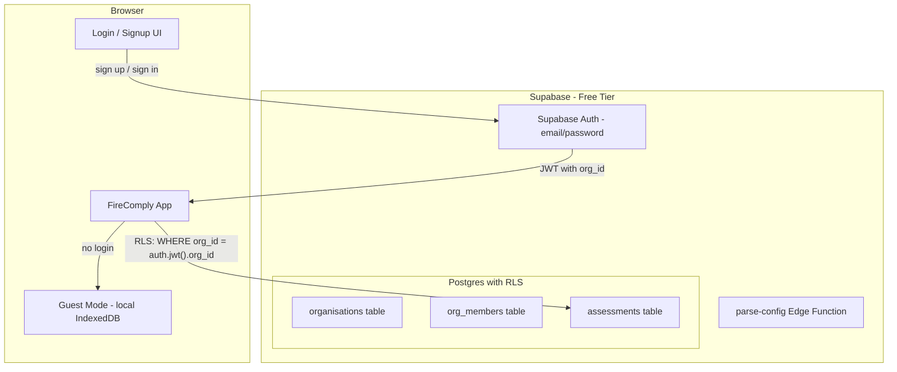
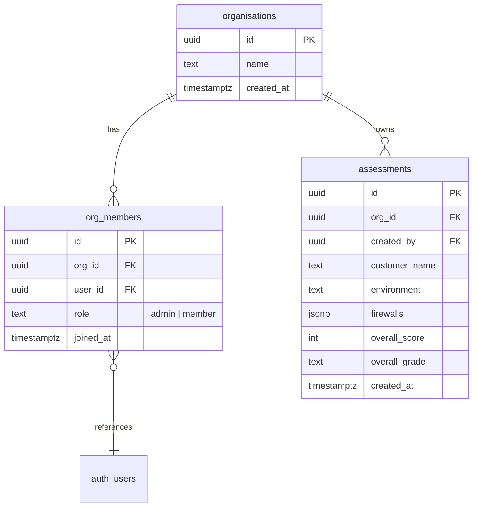

# Multi-Tenant MSP Authentication and Data Isolation

## Architecture

## Data Model (4 tables)

- **organisations** -- one row per MSP
- **org_members** -- links Supabase Auth users to an org, with role (admin can invite, member can view/create)
- **assessments** -- the same data currently in IndexedDB, but stored server-side and scoped to an org
- Row Level Security (RLS) on `assessments` and `org_members` ensures **MSP 1 cannot see MSP 2's data** -- every query is filtered by the user's org_id from their JWT

## Key Decisions

- **Signup flow**: First user creates an org (becomes admin). Admin can invite staff via email. Invited users sign up and are auto-added to that org.
- **Guest mode preserved**: If not logged in, the app works exactly as it does today (local IndexedDB). The "Save to cloud" and "Multi-Tenant Dashboard" features only appear when authenticated.
- **JWT custom claim**: On signup/login, a Postgres function sets `org_id` and `role` as JWT claims so RLS policies can reference them without extra queries.
- **No breaking changes**: All existing local functionality remains. The cloud layer is additive.

## Implementation Steps

### Phase 1: Database Schema + RLS (Supabase SQL)

- Create a migration file at `supabase/migrations/001_multi_tenant.sql` with:
  - `organisations`, `org_members`, `assessments` tables
  - RLS policies: users can only read/write assessments where `org_id` matches their JWT claim
  - A trigger function that sets `org_id` in the JWT custom claims on login
  - An invite function that creates an `org_members` row for a given email

### Phase 2: Auth UI Components

- Create `src/components/AuthGate.tsx` -- login/signup form using `supabase.auth.signInWithPassword` / `signUp`
- Create `src/components/OrgSetup.tsx` -- first-time org creation form (MSP name)
- Create `src/components/InviteStaff.tsx` -- admin-only invite form (enter email, sends magic link or creates pending invite)
- Add auth state to `src/hooks/use-auth.ts` -- `useAuth()` hook returning `{ user, org, role, isGuest, signOut }`

### Phase 3: Cloud Assessment Storage

- Create `src/lib/assessment-cloud.ts` -- mirrors the existing [assessment-history.ts](src/lib/assessment-history.ts) API but backed by Supabase Postgres:
  - `saveAssessmentCloud()` -- insert into `assessments` table
  - `loadHistoryCloud()` -- select from `assessments` where org matches
  - `deleteAssessmentCloud()`, `renameAssessmentCloud()`
- Update [AssessmentHistory.tsx](src/components/AssessmentHistory.tsx) to use cloud storage when authenticated, IndexedDB when guest

### Phase 4: Multi-Tenant Dashboard (Cloud-Backed)

- Update [TenantDashboard.tsx](src/components/TenantDashboard.tsx) to:
  - When authenticated: fetch from Supabase `assessments` table (all customers within the MSP org)
  - When guest: show existing IndexedDB data (current behaviour)
  - Show org name in header, staff member list for admins

### Phase 5: Navigation + Header Updates

- Update [AppHeader.tsx](src/components/AppHeader.tsx) with login/logout button, org name display
- Add a user menu dropdown (profile, org settings, invite staff, sign out)
- Conditionally show "Save to Cloud" button in Assessment History when logged in

## Files to Create

- `supabase/migrations/001_multi_tenant.sql` -- schema + RLS
- `src/hooks/use-auth.ts` -- auth state hook
- `src/lib/assessment-cloud.ts` -- cloud CRUD for assessments
- `src/components/AuthGate.tsx` -- login/signup UI
- `src/components/OrgSetup.tsx` -- org creation
- `src/components/InviteStaff.tsx` -- staff invite (admin only)

## Files to Modify

- [src/integrations/supabase/types.ts](src/integrations/supabase/types.ts) -- regenerate with new tables
- [src/components/AppHeader.tsx](src/components/AppHeader.tsx) -- add auth controls
- [src/components/AssessmentHistory.tsx](src/components/AssessmentHistory.tsx) -- dual-mode (local/cloud)
- [src/components/TenantDashboard.tsx](src/components/TenantDashboard.tsx) -- cloud-backed when authenticated
- [src/pages/Index.tsx](src/pages/Index.tsx) -- wrap with auth context, show org setup flow
- [supabase/config.toml](supabase/config.toml) -- enable auth settings

## What Stays Free

- Supabase Auth: 50,000 MAUs (you'll use a few dozen)
- Database: 500 MB (assessment JSON is tiny -- thousands of assessments fit in a few MB)
- Edge Functions: already using, no change
- No additional services needed

