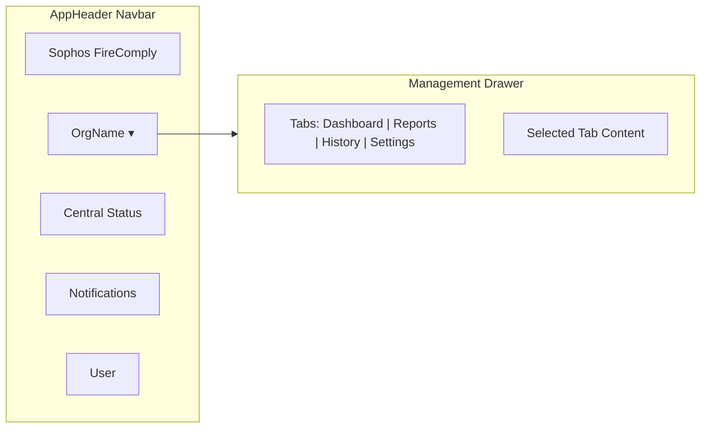

# Navbar Management Hub

## Current State

Assessment History, Saved Reports, and Multi-Tenant Dashboard live as collapsible sections at the bottom of the main page in `Index.tsx`. They clutter the analysis workflow and are hard to find.

## Proposed Design

Turn the **organisation name** in the header (the "Building2" icon + org name, currently just a label) into a clickable dropdown that opens a **slide-out panel / drawer** from the right side of the screen. This is better than a hover popover because these sections contain rich interactive content (tables, charts, forms) that needs space.

### Drawer Tabs

| Tab | Content | Visibility |
| --- | ------- | ---------- |

- **Dashboard** -- TenantDashboard + LicenceExpiryWidget (the MSP overview)
- **Reports** -- SavedReportsLibrary (previously saved reports)
- **History** -- AssessmentHistory (trend comparison)
- **Settings** -- Central API config, Team Management, Activity Log (the 3 sub-sections currently nested inside Multi-Tenant Dashboard)

### Key UX Details

- The org name in the header becomes a button with a subtle chevron-down indicator
- Clicking it opens a full-height slide-out drawer from the right (~480px wide) with tabs across the top
- The drawer has a proper close button and closes when clicking the backdrop
- For **guest users** (no org), the button still appears but labelled "Management" and only shows Reports + History tabs (no Dashboard/Settings)
- The three bottom `CollapsibleSection` blocks are removed from the main page body entirely, cleaning up the analysis workflow

## Files to Change

- `**[src/components/AppHeader.tsx](src/components/AppHeader.tsx)`** -- Turn org name into clickable button, accept an `onOrgClick` callback prop
- **New: `src/components/ManagementDrawer.tsx`** -- The slide-out drawer with tabs containing all four sections
- `**[src/pages/Index.tsx](src/pages/Index.tsx)**` -- Remove the 3 CollapsibleSections (Assessment History, Saved Reports, Multi-Tenant Dashboard + its sub-sections), add ManagementDrawer with state, wire up `onOrgClick` to AppHeader

