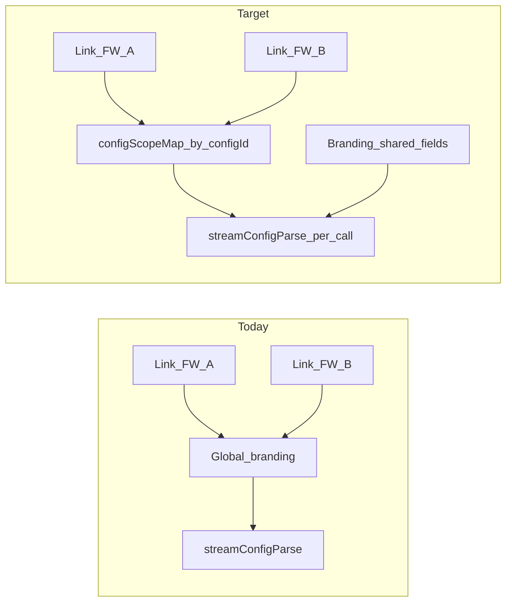

# Per-firewall-config compliance scope

## Problem (current behavior)

- Fleet data and `[mergeLinkedCentralCustomerContext](src/lib/linked-firewall-compliance.ts)` already resolve **effective** `country`, `state`, `environment` per Central firewall (device override → tenant defaults).
- `[UploadSection](src/components/UploadSection.tsx)` `onFirewallLinked` merges every link into **one** `[BrandingData](src/components/BrandingSetup.tsx)`: each new link overwrites `country`, `environment`, `selectedFrameworks` via `[getDefaultFrameworks](src/lib/compliance-context-options.ts)` (see ~372–400 in `UploadSection.tsx`).
- `[use-report-generation](src/hooks/use-report-generation.ts)` passes that global `branding` into `[streamConfigParse](src/lib/stream-ai.ts)` for **every** call (~177–181), so individual and compliance runs cannot differ by file.
- `[saveSession` / `PersistedSession](src/hooks/use-session-persistence.ts)` only persists `branding` + reports — no per-config scope map.
- Edge function `[parse-config](supabase/functions/parse-config/index.ts)` reads **one** `environment`, `country`, `selectedFrameworks` from the JSON body (~312–318) and builds **one** `complianceContext` string. For **multi-firewall compliance** (`firewallLabels.length > 1`, ~495–499), that single context is still applied to all firewalls — structurally wrong when UK vs US Ohio need different frameworks and narrative.

## Recommended architecture

### 1. Canonical type: `ConfigComplianceScope`

- Fields aligned with branding subset: `{ country, state, environment, selectedFrameworks, tenantCustomerDisplayName? }`.
- `**selectedFrameworks` (effective)**: `uniq([...getDefaultFrameworks(environment, country, state), ...additionalFrameworks])` — see **§1b\*\* for per-config add-ons.

#### 1b. When one config needs _extra_ frameworks (defaults are not enough)

Auto defaults from `getDefaultFrameworks(environment, country, state)` are **per jurisdiction/sector**. Two configs can each have the _correct_ country/env and still differ because one site must also be assessed against **additional** frameworks (e.g. contractual PCI, sector add-on, customer-specific scheme).

**Approach: split “defaults” vs “add-ons” per `configId` (recommended)**

- Store `**defaultFrameworks`** (or derive on the fly from `country` / `state` / `environment`) and separately `**additionalFrameworks: string[]`\*\* chosen by the user for that config only.
- **Effective list** for reports and for `perFirewallComplianceContext[label].selectedFrameworks`:
  - `uniq([...getDefaultFrameworks(environment, country, state), ...additionalFrameworks])`
- When a **link refresh** or Fleet edit updates `environment` / `country` / `state`, **recompute defaults** but **preserve** `additionalFrameworks` so MSP-chosen extras are not wiped.
- **Do not** merge config B’s add-ons into config A. Multi-firewall compliance already sends **per-firewall** framework lists; the model assesses each firewall only against the list attached to that firewall’s row.
- **Three or more configs (A, B, C):** Same model. `scopeMap` is `Record<configId, ConfigComplianceScope>` — each id has its own `additionalFrameworks`. They may be **entirely disjoint** (e.g. A adds PCI, B adds HIPAA, C adds none); individual reports and each row in `perFirewallComplianceContext` use only that config’s effective list.

**UX (v1 practical minimum)**

- Reuse the same framework multi-select pattern as `[BrandingSetup](src/components/BrandingSetup.tsx)`, scoped to **“This configuration”** (one row per file): show effective frameworks as **defaults (read-only or tagged) + optional “Add frameworks”** for that config.
- Global Customer Context can remain **session defaults** for unlinked files; linked files primarily follow `scopeMap` + their add-ons.

**Alternatives (if you want to avoid extra UI in v1)**

- **Temporary**: user runs **Compliance Readiness twice** — once per config with global branding adjusted — acceptable but poor UX; document as workaround only.
- **Heavier**: store add-ons in Supabase per `firewall_config_links` or `central_firewalls` — only if extras must survive across devices/users without session.

For **multi-firewall compliance**, each entry in `perFirewallComplianceContext` must include the **full effective** framework array (defaults + add-ons) for that label so the second config’s extra frameworks appear **only** under that firewall in the prompt, not globally.

- **Source of truth per config**:
  - **Central-linked**: from `FirewallLink` / `mergeLinkedCentralCustomerContext` + optional `tenantCustomerDisplayName` (already on link enrichment).
  - **Agent-sourced file**: mirror the merge logic used in `[Index.tsx](src/pages/Index.tsx)` fleet deep-link path (agent row + `agent_customer_compliance_environment` bucket) — either extract a shared helper or call a small `fetchAgentFileComplianceScope(orgId, agentId)` used when adding/restoring agent files.
  - **Manual upload / unlinked**: no row in map, or explicit `{ }` — **fallback** to global `branding` for country/environment/frameworks when generating that file’s report (preserves current behavior for non-linked configs).

State lives in `[Index.tsx](src/pages/Index.tsx)` (or a dedicated hook colocated with `files` + `branding`): `Record<string, ConfigComplianceScope>` keyed by `**ParsedFile.id`\*\* (matches `config_hash` in `firewall_config_links` and `FileUpload`’s `onFirewallLinked?.(f.id, link)` — already wired in `[FileUpload.tsx](src/components/FileUpload.tsx)` ~123–128).

### 2. Lifecycle: link, unlink, restore

| Event                              | Action                                                                                                                                                                                                                                                                                                                                                                                                |
| ---------------------------------- | ----------------------------------------------------------------------------------------------------------------------------------------------------------------------------------------------------------------------------------------------------------------------------------------------------------------------------------------------------------------------------------------------------- |
| `onFirewallLinked(configId, link)` | Upsert `scopeMap[configId]` from `link.complianceContext` + `tenantCustomerDisplayName`; recompute **default** frameworks and merge with existing `**additionalFrameworks`** for that `configId` (preserve add-ons). **Do not** overwrite other configs’ map entries. Optionally refresh **shared\*\* `branding.customerName` only when empty or single-config (product choice).                      |
| Link removed / picker cleared      | Delete `scopeMap[configId]` (or mark stale); regenerate reports uses fallback.                                                                                                                                                                                                                                                                                                                        |
| Session restore (`loadSession`)    | Today restores `branding` only. After change: restore `scopeMap` from persisted JSON **or** rehydrate from Supabase `firewall_config_links` + `fetchLinkedCentralFirewallCompliance` per `files[].id` where links exist (more accurate if Fleet edited after save). **Recommendation**: persist `scopeMap` in session for simplicity; optional background refresh from DB when org + links available. |
| File removed from list             | Remove `scopeMap[entry]` for that `id`.                                                                                                                                                                                                                                                                                                                                                               |

### 3. Threading into report generation

- Change `[generateSingleReport](src/hooks/use-report-generation.ts)` (and `handleRetry` paths) to accept an optional `**scopeOverride`\*\* or resolve scope internally from `(reportId, files, scopeMap, branding)`:
  - **Individual** (`report-${f.id}`): use `scopeMap[f.id]` merged over `branding` for `environment`, `country`, `customerName` (if per-config name stored), `selectedFrameworks`. Pass **US state** only if `streamConfigParse` / backend need it — today the API passes `country` only; if state matters for framework defaults, ensure `getDefaultFrameworks` already consumed state client-side (it does); no backend change required for state if frameworks are precomputed client-side.
  - **Executive** (`report-executive`): see product rule below (single vs multi-jurisdiction).
  - **Compliance** (`report-compliance`): single-file → same as individual. Multi-file → see backend section.
- `[streamConfigParse](src/lib/stream-ai.ts)`: extend `StreamOptions` with optional `**perFirewallComplianceContext?: Record<string, { environment?, country?, selectedFrameworks? }>`\*\* (or a structured array keyed by display label). When absent, behavior unchanged.

### 4. Backend: multi-firewall compliance (`parse-config`)

When `compliance === true` and `firewallLabels.length > 1`:

- If `perFirewallComplianceContext` is provided, inject into `complianceContext` (before `SHARED_RULES` merge) a clear block, e.g. **“Per-firewall compliance scope”**, listing each label with its environment, country, and framework list.
- Instruct the model to **assess each firewall against its own listed frameworks** and to avoid claiming a single jurisdiction for the whole estate when scopes differ.
- If `perFirewallComplianceContext` is **missing** but multiple labels exist, **fallback**: keep current single global context **and** append a warning line: “Multiple firewalls; user did not supply per-device scope — frameworks may not match all sites.” (Safety net for old clients.)

**Executive** reports: optional second field `jurisdictionSummary` string for the prompt when scopes differ; otherwise unchanged.

No database migration required for this feature unless you later choose to store per-config overrides in Supabase (out of scope for v1).

### 5. Customer Context UX (`[BrandingSetup](src/components/BrandingSetup.tsx)` / `[UploadSection](src/components/UploadSection.tsx)`)

- **Minimum (v1)**: In the file list / config area (near each `[FirewallLinkPicker](src/components/FirewallLinkPicker.tsx)`), show a read-only line: **effective sector · country (flag)** from `scopeMap[configId]` or “Using session defaults” / “Set link or Customer Context” when empty.
- **Branding panel**: Treat current fields as **session defaults** when multiple configs exist; show a short note when `scopeMap` entries disagree with global branding (“Some files use per-link scope; see per-file labels”).
- **Optional v2**: Per-file editable overrides (local-only or persisted) — defer unless required.

### 6. Product rules (goal 5) — proposed defaults

| Report type                  | When scopes differ | Behavior                                                                                                                                                                                                                                                                                                                                                                                          |
| ---------------------------- | ------------------ | ------------------------------------------------------------------------------------------------------------------------------------------------------------------------------------------------------------------------------------------------------------------------------------------------------------------------------------------------------------------------------------------------- |
| **Individual** (per file)    | N/A                | Always use `scopeMap[file.id]` fallback → `branding`.                                                                                                                                                                                                                                                                                                                                             |
| **Compliance (single file)** | N/A                | Same as individual.                                                                                                                                                                                                                                                                                                                                                                               |
| **Compliance (multi file)**  | UK vs US OH        | Send `perFirewallComplianceContext` + prompt instructions; model produces one doc with **per-firewall subsections** or a **table mapping firewall → jurisdiction → frameworks**. Do **not** claim one country for the whole Scope line — adjust Scope line instructions in `parse-config` when per-firewall map is present (e.g. “multi-jurisdiction estate; see Per-firewall compliance scope”). |
| **Executive**                | Scopes differ      | Keep **estate-wide** posture narrative; add a short **“Jurisdictional note”**: firewalls span multiple compliance jurisdictions — detailed framework mapping appears in individual or compliance reports. Avoid selecting one `country` in the opening context unless user picks a **primary** scope (optional future toggle).                                                                    |

If product prefers stricter behavior: **block** multi-firewall compliance until scopes match or user confirms a primary jurisdiction — document as alternative.

### 7. Deterministic analysis (`[analyseConfig](src/lib/analyse-config.ts)`)

`[AnalyseOptions](src/lib/analysis/types.ts)` today has no country/environment. Most findings are config-structural. **v1**: no change unless you identify a specific rule that should be jurisdiction-aware; **v2**: pass optional scope into domains that reference KCSIE/NCSC text.

### 8. Edge cases

- **HA pair**: Same as picker — key scope by **primary** `firewallId` / config row; peers share tenant-level sector unless modeled separately in DB.
- **Two files, same customer, different sites**: Two `configId` entries; map has two keys.
- **Manual upload + link later**: Link upsert fills `scopeMap[id]` without touching sibling keys.
- **Guest / no org**: No Central link; map empty; full fallback to manual branding.
- **Stale session**: If only `branding` restored in old sessions, migration: `scopeMap` optional; missing map → current behavior until user re-links or edits context.

### 9. Session persistence

- Extend `[PersistedSession](src/hooks/use-session-persistence.ts)` with optional `configComplianceScopes: Record<string, ConfigComplianceScope>` (serializable subset — framework ids as string[]).
- Bump a `**sessionVersion`\*\* field if you need to invalidate old blobs cleanly; or accept `undefined` map and fallback.

### 10. Files to touch (implementation checklist)

| Area             | Files                                                                                                                                                                                           |
| ---------------- | ----------------------------------------------------------------------------------------------------------------------------------------------------------------------------------------------- |
| State + wiring   | `[src/pages/Index.tsx](src/pages/Index.tsx)` (lift or hook `scopeMap`, pass to `UploadSection` / `useReportGeneration`), `[src/components/UploadSection.tsx](src/components/UploadSection.tsx)` |
| Reports          | `[src/hooks/use-report-generation.ts](src/hooks/use-report-generation.ts)`                                                                                                                      |
| Client API       | `[src/lib/stream-ai.ts](src/lib/stream-ai.ts)` (`StreamOptions` + JSON body)                                                                                                                    |
| Edge             | `[supabase/functions/parse-config/index.ts](supabase/functions/parse-config/index.ts)`                                                                                                          |
| Persistence      | `[src/hooks/use-session-persistence.ts](src/hooks/use-session-persistence.ts)`                                                                                                                  |
| Types / helpers  | New small module e.g. `src/lib/config-compliance-scope.ts` (`mergeScopeWithBranding`, `scopeFromFirewallLink`, `scopesConflict`)                                                                |
| Agent parity     | `[src/pages/Index.tsx](src/pages/Index.tsx)` or shared helper for agent pull path                                                                                                               |
| UX               | `[src/components/UploadSection.tsx](src/components/UploadSection.tsx)` / file row component; `[src/components/BrandingSetup.tsx](src/components/BrandingSetup.tsx)` copy                        |
| Docs / changelog | `[docs/plans/per-config-compliance-scope.md](docs/plans/per-config-compliance-scope.md)` (this plan), `[src/pages/ChangelogPage.tsx](src/pages/ChangelogPage.tsx)` when shipping                |
| Tests            | `[src/components/__tests__/UploadSection.test.tsx](src/components/__tests__/UploadSection.test.tsx)`, any `use-report-generation` tests if present; manual QA script below                      |

### 11. Manual QA checklist

- Two agent configs, two Central links: UK vs US Ohio — individual reports show correct frameworks in opening “Compliance Context”; global Customer Context no longer flips when linking second device.
- Multi-firewall **Compliance Readiness**: output lists distinct jurisdictions / frameworks per firewall; no single-country Scope line contradiction when per-map sent.
- Session save → reload → Resume: both scopes preserved or rehydrated from links.
- Unlink one config: only that key removed from map; other unchanged.
- Manual upload + one linked: linked uses map; manual uses branding fallback.
- Retry failed report: same scope as first attempt.
- Config A: defaults only; Config B: same country/env as A **plus** two extra frameworks — individual and multi-firewall compliance show B’s extras **only** for B; A unchanged.
- Configs A, B, C: mutually different `additionalFrameworks` (or some empty) — each individual report and each line in multi-firewall compliance matches only that config’s union of defaults + add-ons.

## Deliverable: repo plan file

After you approve this plan, save the finalized markdown as `**[docs/plans/per-config-compliance-scope.md](docs/plans/per-config-compliance-scope.md)`\*\* and mirror to `~/.cursor/plans/` if you use Cursor Plans UI ([workspace rule](.cursor/rules/plans-in-git-repo.mdc)).
