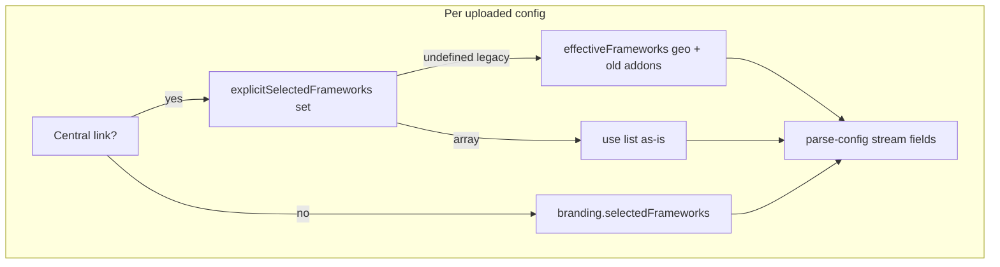

# Per-firewall compliance frameworks (linked = own grid; unlinked = customer context)

## Decision (product)

- **Linked Central firewall:** user can **toggle the full framework set** for that upload; that list is what **parse / reports** use for that config.
- **Not linked:** keep today’s behavior — **`branding.selectedFrameworks`** from **Customer Context / Compliance Alignment** (plus geo defaults when the user hasn’t customized).

## Reality check (engine today)

[`resolveStreamFieldsForConfig`](../../src/lib/config-compliance-scope.ts) already passes **per-file** `selectedFrameworks` when a scope row exists with geo/tenant/addons: it uses **`effectiveFrameworks(mergedScope)`** = `getDefaultFrameworks(env, country, state)` **+** `additionalFrameworks`. There is **no** stored “full explicit list” today — only **extras** in `additionalFrameworks`, while defaults are implicit from geo.

So the gap is **UI + persistence**: users see a **global** grid and an “extras only” row, not a **full** per-file grid that matches what the engine uses.

## Data model

Extend [`ConfigComplianceScope`](../../src/lib/config-compliance-scope.ts) (and [`SerializableConfigComplianceScope`](../../src/lib/config-compliance-scope.ts)):

- Add optional **`explicitSelectedFrameworks?: ComplianceFramework[] | null`** (name TBD in code: e.g. `frameworkSelection`).

**Semantics:**

- **Unlinked** or no scope row: unchanged — use `branding` only (existing paths).
- **Linked** with scope row:
  - If **`explicitSelectedFrameworks` is `undefined` / missing** (legacy sessions): behave as today — `effectiveFrameworks(mergedScope)` for stream fields.
  - If **set** (including empty array if we allow “none selected”): use **exactly that list** for `resolveStreamFieldsForConfig` → `selectedFrameworks` for that file (no implicit merge with `getDefaultFrameworks` unless we define hybrid rules — **default: no merge** when explicit is set).

**Initialization when link is applied:**

- On `scopeFromFirewallLink` / first scope write: optionally **do not** set explicit list (keep implicit effective) **or** seed **`explicitSelectedFrameworks = effectiveFrameworks(mergedScope)`** once so the per-file grid matches the engine and every toggle is persisted. **Recommendation:** seed on link so the grid is never “empty while parse uses defaults”.

**`additionalFrameworks`:**

- **Deprecate for linked configs** once explicit list exists, or treat explicit list as **source of truth** and stop merging `additionalFrameworks` when explicit is set. **Recommendation:** when `explicitSelectedFrameworks` is defined, ignore `additionalFrameworks` for parse; migrate UI from “Additional frameworks only” to one **Frameworks for this firewall** grid for linked rows. Remove or hide [`ConfigFileAdditionalFrameworks`](../../src/components/ConfigFileAdditionalFrameworks.tsx) for linked files after replacement.

## Resolution logic

Update **`resolveStreamFieldsForConfig`**:

```text
if (!scope || no meaningful scope) → branding-only (unchanged)

if scope.explicitSelectedFrameworks !== undefined
  → selectedFrameworks = [...explicitSelectedFrameworks]  // allow []

else
  → selectedFrameworks = effectiveFrameworks(mergedScope)  // today’s implicit path
```

Keep env/country/customerName merge rules as they are today.

## UI

1. **Per linked file** (under upload row / link strip): replace or augment **Additional frameworks** with a **full framework checkbox grid** (reuse patterns from [`BrandingSetup`](../../src/components/BrandingSetup.tsx) — extract a small **`ComplianceFrameworkGrid`** if needed).
2. **Compliance Alignment (global):** tighten copy: applies to configs **without** a Central link (and as geo fallback text where relevant). If **all** files are linked and use explicit lists, optional note: “Linked firewalls use the framework list under each file.”
3. **Customer Context** unchanged as fallback for unlinked.

## Session / persistence

- Extend **serialize / deserialize** scope in [`use-session-persistence`](../../src/hooks/use-session-persistence.ts) and any session types for the new field.
- Round-trip tests in [`use-session-persistence.test.ts`](../../src/hooks/__tests__/use-session-persistence.test.ts).

## Tests

- **Unit:** `resolveStreamFieldsForConfig` with explicit list vs implicit `effectiveFrameworks`; legacy scope without explicit field.
- **Optional:** component test for linked row toggles calling `onScopeFrameworksChange`.

## Changelog

- Update [`ChangelogPage.tsx`](../../src/pages/ChangelogPage.tsx) + [`CHANGELOG.md`](../../CHANGELOG.md) when shipped.

## Out of scope (unless requested)

- Changing **executive / multi-report** jurisdiction copy beyond using the same per-file resolution (already wired via `scopeMap`).
- **Fleet Command** customer defaults editor (separate surface).



## Implementation todos

1. Add `explicitSelectedFrameworks` to scope types + serialize/deserialize + migration note in comments (optional runtime migration: on load, if linked and field missing, leave implicit).
2. `resolveStreamFieldsForConfig` + [`use-report-generation`](../../src/hooks/use-report-generation.ts) consumers unchanged if they already use this helper per file.
3. [`Index.tsx`](../../src/pages/Index.tsx): handler `handleConfigExplicitFrameworksChange`; on link in `handleFirewallScopeChange`, seed explicit list from `effectiveFrameworks`.
4. New or refactored component: full grid for linked rows; remove redundant **Additional frameworks** UX for linked (keep or simplify for unlinked-only if any path still uses addons without link — clarify: unlinked has no scope → no per-file grid).
5. Tests + changelog.
