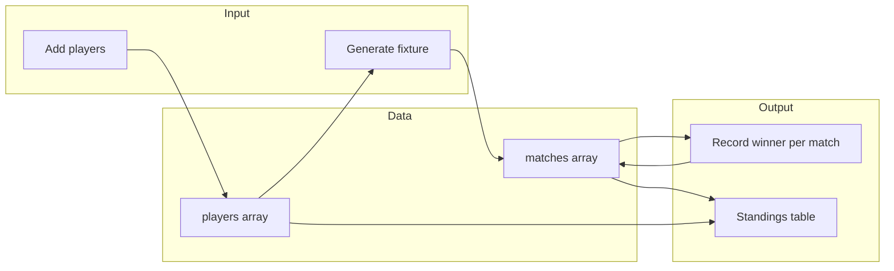

# Pool Tournament Web Application – Plan

## Scope

- **Add players**: Name-only; list and remove.
- **Create fixture**: Generate all matches (round-robin: every player plays every other player once).
- **Show who won**: Record winner per match; display standings (wins/losses) and match results.

No backend: data stored in **localStorage** so it survives refresh. Optional: later add export/import or a simple server.

---

## Tech choices


| Concern             | Choice                                        |
| ------------------- | --------------------------------------------- |
| Frontend            | React 18 + Vite                               |
| Styling             | CSS (or Tailwind if you prefer)               |
| State / persistence | React state + `localStorage` (sync on change) |
| Routing             | Single page (no router needed for v1)         |


---

## Data model

- **Players**: `{ id: string, name: string }[]`
- **Matches**: `{ id: string, playerAId: string, playerBId: string, winnerId: string | null }[]`

Fixture generation: for each unordered pair of players, create one match. Load/save players and matches to localStorage with a single key (e.g. `pool-tournament`).

---

## UI structure

1. **Players**
  - Input + “Add player” button.
  - List of players with optional “Remove”.
  - Require at least 2 players to generate fixture.
2. **Fixture**
  - “Generate fixture” button (enabled when ≥2 players). Creates all round-robin matches; disabled or hidden after generation to avoid overwriting (or “Regenerate” with confirm).
  - List of matches: “Player A vs Player B” and a control to set winner (e.g. dropdown or “A wins” / “B wins” / “No result yet”).
3. **Results / Standings**
  - **Standings table**: columns e.g. Rank, Player, Wins, Losses, (optionally Points or win %). Sorted by wins descending.
  - Optionally a “Results” section repeating the fixture list with winner highlighted.

---

## File layout

```
Pool scoring/
├── index.html
├── package.json
├── vite.config.js
├── src/
│   ├── main.jsx
│   ├── App.jsx              # layout, load/save from localStorage
│   ├── App.css
│   ├── components/
│   │   ├── PlayerList.jsx   # add/remove players
│   │   ├── Fixture.jsx      # generate + list matches, set winner
│   │   └── Standings.jsx    # table of wins/losses
│   └── lib/
│       └── fixture.js       # round-robin match generation + standings calc
└── README.md
```

- `**fixture.js**`:  
  - `generateRoundRobin(players)` → array of `{ id, playerAId, playerBId, winnerId: null }`.  
  - `computeStandings(players, matches)` → array of `{ playerId, name, wins, losses }` sorted by wins.
- `**App.jsx**`:  
  - State: `players`, `matches`.  
  - `useEffect` to read from localStorage on mount; save to localStorage when `players` or `matches` change.  
  - Render: `<PlayerList />`, `<Fixture />`, `<Standings />`.

---

## Flow (mermaid)




---

## Implementation order

1. **Scaffold**: Vite + React, `index.html`, `main.jsx`, `App.jsx` + `App.css`.
2. **Data + persistence**: types/structure for players and matches; localStorage load/save in `App.jsx`.
3. `**src/lib/fixture.js`**: `generateRoundRobin(players)`, `computeStandings(players, matches)`.
4. `**PlayerList**`: add/remove, bound to `players` in `App.jsx`.
5. `**Fixture**`: “Generate fixture” (only if not already generated or with clear “Regenerate”), list matches, set winner per match; bound to `matches` in `App.jsx`.
6. `**Standings**`: table from `computeStandings(players, matches)`.
7. **Polish**: basic layout (sections for Players, Fixture, Standings), responsive styling, clear labels and empty states.

---

## Out of scope for v1

- Authentication or multi-tournament (single tournament per browser).
- Double elimination or custom bracket; only round-robin.
- Backend or database (localStorage only).

If you later want a **single-elimination bracket**, the plan would add a second mode: generate bracket from players (byes if not power of 2), then matches advance winner to next round until one champion.