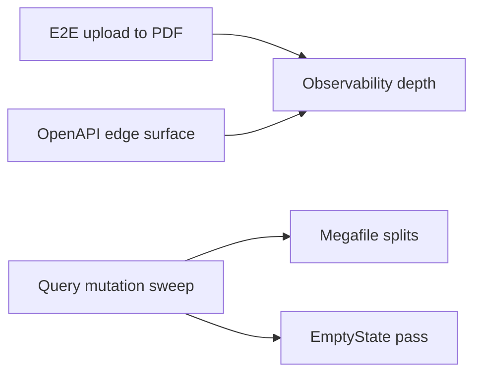

# Plan: Six post-remediation tracks

Mirror of the engineering backlog plan (Cursor UI may reference a paired `.plan.md` under `~/.cursor/plans/`).

## Sequencing

Ship **(1)** first (or land **(1)** with **CI secrets** / mocks decided). Run **(2)** and **(3)** in parallel. **(4)** as small PRs on the same screens as **(2)** when touching those files. **(5)** and **(6)** are ongoing; deepen **(6)** after **(1)–(2)** stabilize what you measure.

---

## Track 1 — Playwright: upload → AI → PDF export

**Current state:** `e2e/tier2-flows.spec.ts` does guest upload; signed-in block uses `E2E_USER_EMAIL` / `E2E_USER_PASSWORD`. `playwright.config.ts` is Chromium-only. CI may pass secrets so signed-in tests run when configured.

**Implementation notes:** Upload fixture → Executive one-pager → assert export controls; **Word** download asserted in CI (PDF is print-dialog). Document in `docs/TEST-PLAN-TIER2-BACKLOG.md` (T9.3a).

**Follow-ups:** (1) **Real PDF file** — when the product serves PDF as a download, extend `e2e/tier2-flows.spec.ts` with a download assertion (keep print-stub coverage if both paths exist). (2) **`page.route` auth mocks** — if CI removes `VITE_E2E_AUTH_BYPASS`, stub Supabase auth REST or use a test project + fixtures. (3) **Live AI** — use describe-scoped timeouts (e.g. 120s) for flaky LLM assertions, not a higher global `testTimeout`.

---

## Track 2 — Query / mutation sweep + exception table

**Policy:** `docs/api/client-data-layer.md` + `src/hooks/queries/keys.ts`.

**Method:** Inventory `supabase.from` vs `useQuery`/`useMutation`; per screen add keys, `signal` on fetch, `invalidateQueries` on writes; document remaining exceptions in `client-data-layer.md`.

**Targets:** PortalConfigurator (`queryKeys.portal.tenantBootstrap`), then other hot lists.

---

## Track 3 — EmptyState on remaining lists/tables

**Reference:** `src/components/EmptyState.tsx` and existing hubs.

Audit ad-hoc empty copy; normalize props; extend tier-2 test plan rows.

---

## Track 4 — Further splits: health-check + wizard

Vertical slices from `HealthCheckInnerLayout` / `use-health-check-inner-state`; wizard: one `StepId` → one file under `setup-wizard/steps/`.

---

## Track 5 — OpenAPI + in-app docs (beyond `api`)

Partner-facing paths (e.g. `api-public` shared GETs) in `openapi.yaml`, `ApiDocumentation.tsx`, and `edge-routes.md` where the contract matters.

---

## Track 6 — Observability depth

`docs/observability.md`: saved searches, spike thresholds, latency charting notes, optional Edge Sentry policy.

---

## Risk notes

| Risk                      | Mitigation                                               |
| ------------------------- | -------------------------------------------------------- |
| AI E2E flaky or expensive | Download assertion + skip/mock strategy; strict timeouts |
| Query sweep regressions   | One screen per PR; keep exception table honest           |
| OpenAPI drift             | Touch YAML + Zod + tests in same PR when adding routes   |
