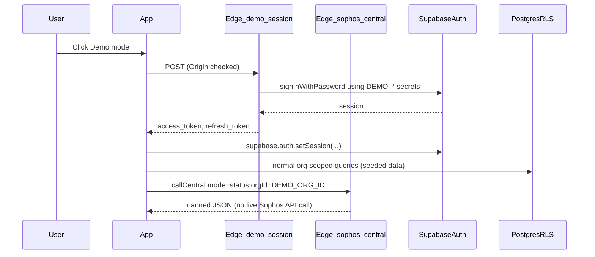

# Public demo mode (login button + seeded workspace)

## Constraints (production/public)

- **Never** put a demo password in `VITE_`\* or any client bundle; the browser only receives normal Supabase `access_token` / `refresh_token` after a **server-side** sign-in.
- Reuse existing patterns: `[supabase/functions/api-public](supabase/functions/api-public/index.ts)` (public routes, CORS, `verify_jwt = false`) and `[AuthGate.tsx](src/components/AuthGate.tsx)` / `[AuthFlow.tsx](src/components/AuthFlow.tsx)` for the login UI.
- Align with `[e2e-auth-bypass.ts](src/lib/e2e-auth-bypass.ts)` **only conceptually** — demo mode is **not** loopback-only; it uses **real** JWTs and **real** RLS like any other user.

## Architecture

## 1. Edge Function: issue demo session

- New function: `**public-demo-session**` (not added to `api-public`).
- **Handler**: `POST` only; validate **Origin** against allowlist (env `ALLOWED_ORIGIN` + localhost origins).
- **Secrets** (Supabase Dashboard / deploy env, never in repo):
  - `DEMO_AUTH_EMAIL`
  - `DEMO_AUTH_PASSWORD`
- Implementation: Supabase client with **anon key** + `signInWithPassword({ email, password })` from Edge runtime. Return `{ access_token, refresh_token, expires_in, expires_at, user }`.
- **Abuse controls** (MVP): optional Upstash rate limit (already available via `[portal-data](supabase/functions/portal-data/index.ts)`'s `redisGet`/`redisSet`), or simple per-IP counter.
- **Config**: `[supabase/config.toml](supabase/config.toml)` entry with `verify_jwt = false`.

## 2. Client: "Demo mode" on login gate

- `[AuthGate.tsx](src/components/AuthGate.tsx)`: secondary **"Demo mode"** button (outline style under primary actions).
- **Visibility**: gated by `import.meta.env.VITE_PUBLIC_DEMO_ENABLED === "1"`.
- `[use-auth.ts](src/hooks/use-auth.ts)`: add `enterDemoMode(): Promise<{ error: string | null }>` that calls the Edge function and `supabase.auth.setSession(...)` on success.
- `[AuthFlow.tsx](src/components/AuthFlow.tsx)`: pass `onEnterDemo` into `AuthGate`.
- **signOut**: no special case — real session signs out normally.

## 3. Fake Central API integration (fully realistic)

The UI calls `callCentral({ mode, orgId })` via the `[sophos-central` Edge Function](supabase/functions/sophos-central/index.ts). For the demo org, those calls must return realistic canned data **without** hitting the real Sophos API.

### How it works today (real users)

- `mode: "status"` — reads `central_credentials` row, returns `{ connected, partner_type, last_synced_at, ... }`
- `mode: "tenants"` — OAuth token + fetchAllPages from Sophos API, upserts `central_tenants`
- `mode: "firewalls"` — same pattern, upserts `central_firewalls`
- `mode: "alerts"` / `"licenses"` / `"firewall-licenses"` / `"mdr-threat-feed"` — live Sophos fetch
- `mode: "connect"` / `"disconnect"` — stores or deletes encrypted credentials

### Demo intercept (in `[sophos-central/index.ts](supabase/functions/sophos-central/index.ts)`)

After `verifyOrgMembership` succeeds, before loading real credentials:

- Check `orgId === DEMO_ORG_ID` (env variable, same UUID as seed script).
- If demo org, return **canned responses** per mode from a `**_shared/demo-central-data.ts`\*\* module:
  - `**status`\*\* — `{ connected: true, partner_id: "...", partner_type: "partner", api_hosts: { global: "https://api-eu01.central.sophos.com", dataRegion: "https://api-eu01.central.sophos.com" }, last_synced_at: <rolling "5 min ago" timestamp> }`
  - `**tenants`\*\* — 7 realistic tenant objects matching seeded customer names across multiple countries:
    - Cheltenham Academy Trust (Education, UK)
    - Westfield NHS Foundation (Healthcare, UK)
    - Borough of Swindon Council (Government, UK)
    - Pennine Building Society (Financial Services, UK)
    - Rheinland Logistik GmbH (Logistics, Germany)
    - Clinique Saint-Martin (Healthcare, France)
    - Nordic Insurance Group (Financial Services, Sweden)
    - Lakewood Medical Center (Healthcare, USA)
    - Summit Ridge Credit Union (Financial Services, USA)
    - Atlas Global Industries (Manufacturing, multi-country HQ in USA — firewalls in UK, DE, US, JP, AU)
  - `**firewalls`** — varied count per customer with **HA pairs\*\* (not uniform). HA is detected by two firewalls sharing the same `hostname` with a `cluster` object (`cluster.id` matching, `cluster.status: "primary"` / `"auxiliary"`, `cluster.mode: "active-passive"`). Example layout:
    - **Cheltenham Academy Trust** (4 FWs, UK): 1 HA pair (XGS 3300, `fw-cheltenham-hq.local`) + 2 standalone XGS 87 at branch campuses
    - **Westfield NHS Foundation** (8 FWs, UK): 2 HA pairs (XGS 4500 main hospital, XGS 2300 satellite clinic) + 4 standalone XGS 87/136 at GP surgeries
    - **Borough of Swindon Council** (6 FWs, UK): 1 HA pair (XGS 4500, civic centre) + 4 standalone XGS 2300/136 at libraries, depot, leisure centre
    - **Pennine Building Society** (3 FWs, UK): 1 HA pair (XGS 3300, head office) + 1 standalone XGS 2300 at branch
    - **Rheinland Logistik GmbH** (5 FWs, DE): 1 HA pair (XGS 3300, Cologne DC) + 3 standalone XGS 136 at warehouses (Dortmund, Frankfurt, Munich)
    - **Clinique Saint-Martin** (2 FWs, FR): 1 HA pair (XGS 2300, main clinic) — no standalone
    - **Nordic Insurance Group** (4 FWs, SE): 1 HA pair (XGS 4500, Stockholm HQ) + 2 standalone XGS 2300 at Gothenburg and Malmo offices
    - **Lakewood Medical Center** (6 FWs, US): 1 HA pair (XGS 4500, main campus) + 4 standalone XGS 2300/136 at outpatient centres
    - **Summit Ridge Credit Union** (3 FWs, US): 1 HA pair (XGS 3300, Denver HQ) + 1 standalone XGS 2300 at Colorado Springs branch
    - **Atlas Global Industries** (10 FWs, multi-country): firewalls spread across 5 countries, each with per-firewall `compliance_country` set on the agent/central_firewalls row:
      - US (Chicago HQ): 1 HA pair (XGS 4500) + 1 standalone XGS 2300
      - UK (London office): 1 HA pair (XGS 3300)
      - DE (Berlin factory): 1 standalone XGS 2300
      - JP (Tokyo office): 1 standalone XGS 2300
      - AU (Sydney warehouse): 1 HA pair (XGS 3300)
    - All FWs: realistic serial numbers (C-prefix, 12 chars), SFOS 20.0 MR-3 / 21.0 GA firmware, `status: { connected: true, managing: "partner", suspended: false }`, `geoLocation` for UK, `externalIpv4Addresses` (RFC 5737: 203.0.113.x)
  - `**alerts`\*\* — 4-6 alerts (mix: high malware detection, medium IPS event, low policy violation, info heartbeat lost)
  - `**licenses`** / `**firewall-licenses`\*\* — realistic subscriptions (Xstream Protection, Enhanced Support, Standard Protection; mix of term/trial, some expiring in 30-90 days)
  - `**mdr-threat-feed`\*\* — a few indicator items
  - `**connect`** / `**disconnect`** — return `{ error: "Demo workspace — Central connection is pre-configured." }` (prevents demo user from wiping seed or storing real creds)
- **No real Sophos fetch** for the demo org; returns before `getToken`.
- Rolling `last_synced_at` (current time minus 5 min) so "Last synced: 5 min ago" always looks fresh.

### What this makes realistic

- **App header**: green pulsing dot, "Sophos Central Connected", partner type "partner", last synced time
- **CentralIntegration** panel: tenant list, firewalls per tenant, alert count, licence cards
- **CentralEnrichment** on Assess: "Sophos Central Live Data" with linked firewalls "All Online"
- **CentralHealthBanner**: shows OK (no error/stale banner)
- **Customer Management**: "Sophos Central" pill on customer cards, country flags (GB, DE, FR, SE, US, JP, AU), sector badges, varied health statuses
- **Fleet Command** (Atlas Global): expanding the customer group shows firewalls in different countries — each agent card displays its per-firewall country (UK, DE, US, JP, AU) and the "Firewall Location" dropdown shows the correct country pre-selected, just like the screenshot
- **Fleet Command**: central firewalls in fleet view
- **Licence Expiry Widget**: subscription cards with renewal dates

## 4. Database seed: demo org + linked data

Goal: after the demo user signs in, `[fetchCustomerDirectory](src/lib/customer-directory.ts)` and all screens see **real rows** — no parallel mock layer.

- **Stable identifiers**: fixed UUIDs for `organisations.id` and all `org_id` references, exported as `DEMO_ORG_ID` constant.
- **Auth user**: `**scripts/seed-demo-workspace.ts`** (Deno or Node) run with **service role\*\* that:
  1. Ensures Auth user exists (`auth.admin.createUser` or update password) for `DEMO_AUTH_EMAIL`.
  2. Upserts `organisations`, `org_members`, then all dependent rows.
- **Tables to populate** (must match canned Central data for consistency):
  - `organisations`, `org_members` (role: admin)
  - `central_credentials` — dummy encrypted row so status reads work on non-intercepted paths too
  - `central_tenants` — same tenant IDs/names as canned `tenants` response
  - `central_firewalls` — same firewall IDs/serials as canned `firewalls` response (UI paths like `[getCachedFirewalls](src/lib/sophos-central.ts)` read these from DB)
  - `agents` — **one agent per physical firewall** (~51 agents matching 51 firewalls across 10 customers / 7 countries). HA pairs produce 2 agents with the same `customer_name` but distinct serials. **Critical**: `serial_number` and `firmware_version` must be non-null or the agent fails `[isAgentFleetEligible](src/lib/agent-fleet-eligibility.ts)` and never appears in "Connected Firewalls". Required columns:
    - `org_id`, `name` (e.g. "cheltenham-hq-primary"), `firewall_host` (private IP)
    - `customer_name` matching a seeded assessment customer (fleet groups by this)
    - `tenant_name` matching a seeded Central tenant (triggers "Central Linked" badge)
    - `serial_number` matching the corresponding `central_firewalls` row serial
    - `firmware_version` (e.g. "SFOS 20.0.2 MR-3"), `hardware_model` (e.g. "XGS 3300")
    - `status`: "online", `last_seen_at`: recent ISO
    - `last_score` / `last_grade` (e.g. 87 / "A") for fleet posture cards
    - `connector_version` (e.g. "1.4.2") — avoids "Outdated" label
    - `central_firewall_id` matching the `central_firewalls` row for enrichment linking
    - `compliance_country`: set **per firewall** — most customers use one country (e.g. "United Kingdom", "Germany"), but Atlas Global agents each have the country of their physical site (e.g. London agent → "United Kingdom", Tokyo agent → "Japan", Sydney agent → "Australia")
    - `api_key_hash` / `api_key_prefix`: dummy values
    - HA pair agents share `customer_name` + `tenant_name` but have distinct `serial_number`, `name`, and `central_firewall_id`
  - `portal_config` — multiple `portal_slug` values with branding/accent colours
  - `assessments` — one per customer (10 rows), narrow `firewalls` JSON consistent with `[FirewallSnapshot](src/lib/customer-directory.ts)`; mix of grades and countries:
    - Cheltenham Academy Trust: A (87), Pennine Building Society: A (91), Summit Ridge Credit Union: A (89)
    - Nordic Insurance Group: B (78), Lakewood Medical Center: B (73), Atlas Global Industries: B (75)
    - Westfield NHS Foundation: C (62), Rheinland Logistik GmbH: C (58)
    - Borough of Swindon Council: D (44), Clinique Saint-Martin: D (41)
  - `saved_reports` — 2-3 rows so Report Centre has cards (executive one-pager, QBR, compliance report)
  - Optional: `portal_viewers` for portal login demos
- **Consistency rule**: tenant names, customer names, firewall serials, and agent names must match across all tables **and** canned Edge responses.
- **RLS**: seed via service role script; demo user is **admin** for full "run reports / manage" story.

## 5. CI / deploy wiring

- **GitHub Actions** (`[.github/workflows/deploy.yml](.github/workflows/deploy.yml)` / staging): deploy new function; add secrets in Supabase for `DEMO_AUTH`\_\* + `DEMO_ORG_ID`; set `VITE_PUBLIC_DEMO_ENABLED=1` only where the function + user exist.
- **Do not** enable demo in Vercel Production until seed + secrets are confirmed.

## 6. Product / docs

- Update `[ChangelogPage.tsx](src/pages/ChangelogPage.tsx)` (user-visible entry).
- Add `**docs/DEMO-ACCOUNT.md`\*\*: one-time setup, rotation, rate limits, "demo data is reset on schedule?" (optional future cron).
- `**.env.example`\*\*: document `VITE_PUBLIC_DEMO_ENABLED` and required Edge secrets.

## Out of scope (explicit)

- Calling **live** Sophos Central APIs with real tokens — canned data from the Edge intercept covers all UI surfaces.
- Replacing every E2E test with demo user (keep `VITE_E2E_AUTH_BYPASS` for CI).
- Write-back protection beyond connect/disconnect block — demo user can create assessments, reports, etc. in their demo org (that is fine; a future cron can reset the demo org nightly if needed).
