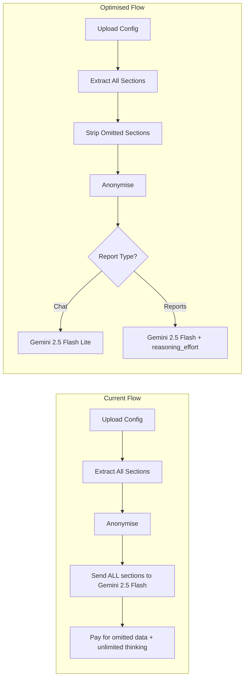

# Reduce Gemini AI Costs

## Current Cost Drivers

Your Edge Function sends **every** extracted config section to Gemini, including ~80 sections the prompt explicitly says to ignore. The system prompt is ~6K tokens of repeated rules. Chat uses the same expensive model as reports. No thinking budget is set, so Gemini reasons as much as it wants.

**Current pricing (Gemini 2.5 Flash):** $0.30/M input, $2.50/M output

**Available cheaper model (Gemini 2.5 Flash Lite):** $0.10/M input, $0.40/M output — 3x cheaper input, 6x cheaper output. Perfect for chat Q&A.




## Changes

### 1. Strip omitted sections client-side before sending

**File:** [src/lib/stream-ai.ts](src/lib/stream-ai.ts)

Add a `stripOmittedSections()` function that removes all ~80 section keys the prompt tells Gemini to ignore. Apply it to the `sections` object before anonymisation in `streamConfigParse()`. For executive/compliance reports where sections are nested under firewall labels, recurse one level deep.

The omit list (extracted from the prompt in [supabase/functions/parse-config/index.ts](supabase/functions/parse-config/index.ts) lines 95-101) includes: DHCP, DHCP Servers, DHCPBinding, CliDhcp, WAF TLS Settings, ArpFlux, FQDN Hosts, High Availability, Network Groups, Schedules, Services, WebProxy, Admin Profiles, Web Filters, Web Filter Categories, Web Filter URL Groups, Web Filter Exceptions, Networks, Networks (Hosts), Hosts, Email Protection, SMTP Scanning, Anti-Spam, Firewall Rule Groups, Service Groups, SSL VPN Policies, Local Service ACL, and ~50 more. Full list in prompt lines 96-101.

The section keys in `ExtractedSections` are human-readable display names (e.g. `"Firewall Rules"`, `"Zones"`). The filter should do case-insensitive matching and also handle variants (e.g. `"WebFilterSettings"` vs `"Web Filter Settings"`).

**Estimated saving:** 30-50% of input tokens on a typical config. For a 60K-token config, that's ~20-30K tokens saved = ~$0.006-$0.009 per call.

### 2. Add reasoning_effort to control thinking costs

**File:** [supabase/functions/parse-config/index.ts](supabase/functions/parse-config/index.ts)

Add `reasoning_effort` to the Gemini request body (line 404-412). The OpenAI-compatible endpoint maps this to Gemini's thinking budget:

- `"none"` = no thinking (cheapest)
- `"low"` = 1,024 thinking tokens
- `"medium"` = 8,192 thinking tokens
- `"high"` = 24,576 thinking tokens

Use per-mode defaults, overridable by a `GEMINI_REASONING_EFFORT` env var:

- **Chat:** `"none"` — Q&A doesn't need reasoning; your prompts are specific enough
- **Individual reports:** `"low"` — the system prompt is so prescriptive that the model doesn't need deep reasoning
- **Executive reports:** `"medium"` — cross-firewall analysis benefits from some reasoning
- **Compliance reports:** `"medium"` — framework mapping benefits from reasoning

This is the `doRequest` body change:

```typescript
body: JSON.stringify({
  model,
  messages: [
    { role: "system", content: systemPrompt },
    { role: "user", content: userMessage },
  ],
  stream: true,
  temperature: 0.1,
  reasoning_effort: chat ? "none" : (compliance || executive) ? "medium" : "low",
}),
```

**Estimated saving:** Significant on output tokens (thinking tokens are charged as output). Speed will also improve since less thinking = faster first token.

### 3. Use Gemini 2.5 Flash Lite for chat

**File:** [supabase/functions/parse-config/index.ts](supabase/functions/parse-config/index.ts)

Add a `GEMINI_CHAT_MODEL` env var (default: `gemini-2.5-flash-lite`). When `chat === true`, use this model instead of the report model. Flash Lite is 3x cheaper on input and 6x cheaper on output, with 240 tokens/sec output speed (faster than Flash).

At line 299-300:

```typescript
const reportModel = Deno.env.get("GEMINI_REPORT_MODEL") || "gemini-2.5-flash";
const chatModel = Deno.env.get("GEMINI_CHAT_MODEL") || "gemini-2.5-flash-lite";
const model = chat ? chatModel : reportModel;
```

**Estimated saving:** Chat queries drop from ~$0.30/$2.50 per M to ~$0.10/$0.40 per M. With `reasoning_effort: "none"`, chat becomes very cheap and very fast.

### 4. Compress the system prompts

**File:** [supabase/functions/parse-config/index.ts](supabase/functions/parse-config/index.ts)

The omit list (lines 96-101) repeats many section names that are also listed individually in lines 97-101. Once we strip sections client-side (change 1), the prompt no longer needs the massive "Do NOT include these sections" block — a short note saying "only document sections present in the payload" suffices.

Additionally, the web filtering rule ("Destination Zone WAN + Service HTTP/HTTPS/ANY") is stated ~8 times across the prompt. Consolidate into one clear definition and reference it.

Extract shared rules (VPN profiles, wireless, external logging, API accounts, SSL/TLS) into a `SHARED_RULES` constant and append to each prompt, eliminating duplication.

**Estimated saving:** ~1,500-2,500 fewer input tokens per call = ~$0.0004-$0.0007 per call. Small per-call but adds up, and makes the prompt more maintainable.

### 5. Pass report type from client to Edge Function for routing

**File:** [src/lib/stream-ai.ts](src/lib/stream-ai.ts)

Currently the Edge Function infers report type from `executive`/`compliance`/`chat` booleans. Add an explicit `reportType` field to the request body so the Edge Function can make routing decisions (model, reasoning_effort) cleanly. Values: `"individual"`, `"executive"`, `"compliance"`, `"chat"`.

This is a small refactor but makes the reasoning_effort routing in change 2 cleaner and extensible.

## Files changed

- **[src/lib/stream-ai.ts](src/lib/stream-ai.ts)** — Add `stripOmittedSections()` function, apply before anonymisation; add `reportType` to request body
- **[supabase/functions/parse-config/index.ts](supabase/functions/parse-config/index.ts)** — Add `GEMINI_CHAT_MODEL` env var, add `reasoning_effort` routing, compress system prompts, remove omit list from prompt
- **[src/hooks/use-report-generation.ts](src/hooks/use-report-generation.ts)** — No changes needed (sections are already passed through stream-ai.ts)

## What this does NOT change

- Report output format and content — identical
- Anonymisation pipeline — untouched
- Streaming SSE flow — untouched
- Retry logic — untouched
- Local mode — untouched (no AI calls)

## Expected impact

- **Cost:** ~40-60% reduction per report generation cycle
- **Speed:** Faster, especially for chat (Flash Lite + no thinking) and individual reports (lower reasoning)
- **Quality:** No degradation — omitted sections were never used; reasoning_effort `low`/`medium` with temperature 0.1 and a highly prescriptive prompt produces equivalent output

