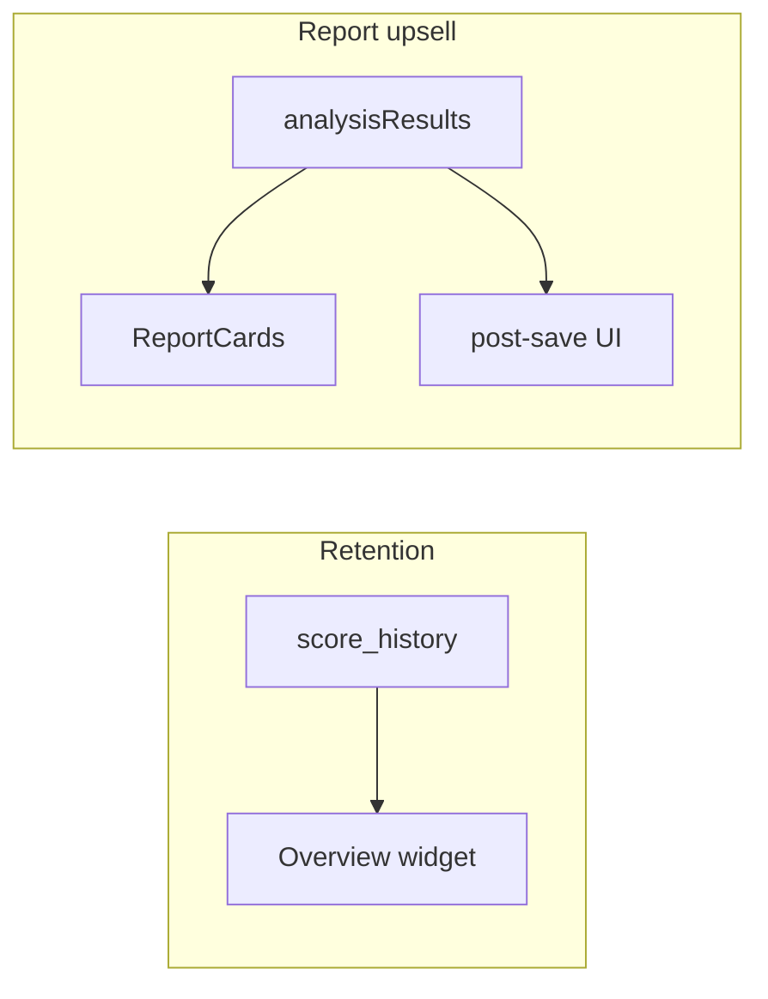

# Retention + upsell reports

## Goals

- **Retention:** Make “come back” obvious—show progress over time and a clear next assessment action without new backend unless needed.
- **Upsell reports:** Increase use of **Executive**, **Compliance**, and **full packs** by contextual prompts when data already supports them (multi-firewall, low score, first save).
- **Interactive deliverable + portal depth:** Let customers and MSPs **explore findings** beyond flat tables—via a **downloadable interactive HTML** pack and a **richer Client Portal** experience (aligned with data you already store on submissions).
- **Micro-tours (retention / discovery):** Short **1–3 step** spotlights when a user hits an analysis tab for the **first time** after results exist—reduce “what’s here?” friction and surface **Widgets** and high-value actions without rerunning the long Getting Started tour.

## Current anchors (reuse, don’t reinvent)

- Report CTAs and gating: `[src/components/ReportCards.tsx](src/components/ReportCards.tsx)` (e.g. executive requires `fileCount >= 2`).
- Score persistence: `[src/lib/score-history.ts](src/lib/score-history.ts)` + inserts from `[src/pages/Index.tsx](src/pages/Index.tsx)` (post-analysis effect).
- Saved packages + cloud: `[src/lib/saved-reports.ts](src/lib/saved-reports.ts)`.
- Share links: `[src/lib/share-report.ts](src/lib/share-report.ts)` + `[src/pages/SharedReport.tsx](src/pages/SharedReport.tsx)`.
- Overview personalisation: `[src/lib/widget-preferences.ts](src/lib/widget-preferences.ts)` + `[src/components/WidgetCustomiser.tsx](src/components/WidgetCustomiser.tsx)` + widget slots in `[src/components/AnalysisTabs.tsx](src/components/AnalysisTabs.tsx)`.
- **“Detailed Security Analysis”** in the UI is the **sticky header + tabbed workspace** in `[src/components/AnalysisTabs.tsx](src/components/AnalysisTabs.tsx)` (Overview, Security, Compliance, …)—not a single markdown report.
- Portal today: `[src/pages/ClientPortal.tsx](src/pages/ClientPortal.tsx)` loads JSON from `[supabase/functions/portal-data/index.ts](supabase/functions/portal-data/index.ts)`; findings are **title + severity + id** only, sourced from `agent_submissions.findings_summary` or legacy `assessments.firewalls[].findings`.
- **Rich data already exists:** connector submissions store `full_analysis` (full `AnalysisResult`) on `agent_submissions` per `[firecomply-connector/src/api/submit.ts](firecomply-connector/src/api/submit.ts)`—portal does not expose it yet.
- **Tours:** `[src/lib/guided-tours.ts](src/lib/guided-tours.ts)` uses **driver.js** and `[data-tour="..."]` selectors; `[src/components/GuidedTourButton.tsx](src/components/GuidedTourButton.tsx)` exposes full tours. Analysis tabs and widgets already expose targets e.g. `analysis-tabs`, `widget-customiser`, `export-buttons`.

---

## Feature 1 — “Assessment pulse” Overview widget (retention)

**What:** A compact **Card** (same `rounded-xl border border-border bg-card` pattern as other widgets) on the **Overview** tab showing for the current org:

- Latest overall score vs previous snapshot (delta), or “first assessment” state.
- Optional: count of assessments in last 30 days (query `[loadScoreHistoryForFleet](src/lib/score-history.ts)` or per-host `[loadScoreHistory](src/lib/score-history.ts)` when a single firewall is in focus).

**Where:** New lazy widget in `[src/components/AnalysisTabs.tsx](src/components/AnalysisTabs.tsx)`; register in `[WIDGET_REGISTRY](src/lib/widget-preferences.ts)` (e.g. `assessment-pulse`, tab `overview`, default **on** for authenticated users).

**Auth:** Only when `org` present (mirror patterns in widgets that call Supabase). Guest/local: show a static hint to sign in to track history.

**Effort:** Low–medium; no schema change if `score_history` is sufficient.

---

## Feature 2 — Contextual “next report” strip (upsell)

**What:** A slim **banner or Card** above or below `[ReportCards](src/components/ReportCards.tsx)` in `[src/components/UploadSection.tsx](src/components/UploadSection.tsx)` (or the parent that renders reports) driven by rules:

| Condition                                                | Nudge                                                                                             |
| -------------------------------------------------------- | ------------------------------------------------------------------------------------------------- |
| `files.length === 1`                                     | “Add a second firewall or upload another config to unlock **Executive summary**.”                 |
| `files.length >= 2` && no compliance frameworks selected | Point to **Assessment Context** / frameworks: “Tag **Compliance** report to selected frameworks.” |
| Average score below threshold (e.g. < 75)                | “**Executive** + **Compliance** help prioritize remediation for leadership.”                      |

**Pattern:** `useMemo` from `files`, `analysisResults`, `branding`/framework state; dismissible with `localStorage` key per rule id so it doesn’t nag forever.

---

## Feature 3 — Post-save “share + next report” panel (upsell)

**What:** After a successful **Save reports** (cloud path in Index / upload flow), show **Sonner** toast or inline **Card** with:

- **Copy share link** (wire to existing `[saveSharedReport](src/lib/share-report.ts)` if not already invoked on save—only if product-safe).
- Primary CTA: “Generate **Compliance** report” or “Run **Generate all**” linking to existing handlers.

**Where:** Hook in the same place that sets `reportsSaved` / toast today (`[src/pages/Index.tsx](src/pages/Index.tsx)` or save handler in UploadSection). Reuse existing buttons/styles from ReportCards.

**Note:** If share is not always created on save, either **optional second step** (“Create client link”) or only show share CTA when markdown is available—avoid blocking save.

---

## Feature 4 — “Welcome back” empty / partial state (retention)

**What:** When user lands on `/` authenticated with **no files** but **score_history** has rows for org, show a **Card** in the upload area ( `[UploadSection](src/components/UploadSection.tsx)` ): “Last assessment: {date} · {score}. **Upload a new export** or **load from agent** to refresh.”

**Pattern:** `useEffect` + `loadScoreHistoryForFleet(orgId, 1)`; loading skeleton; link/buttons consistent with existing “Add from connected agents”.

---

## Feature 5 — Milestone toasts (lightweight retention)

**What:** On analysis complete (existing effect in Index when `analysisResults` updates), if authenticated:

- First time overall grade **A** or score **≥ 90** → **Sonner** success (once per browser via `localStorage` flag).
- “3rd assessment this month” using simple count from `score_history` or client-side counter.

**Where:** `[src/pages/Index.tsx](src/pages/Index.tsx)` next to existing score snapshot save effect; keep logic small and non-blocking.

---

## Feature 6 — Interactive HTML export (“Detailed Security Analysis” pack)

**Intent:** A **single self-contained `.html` file** (inline CSS + vanilla JS) that feels “fancy” but needs **no server** and **no React runtime**—open in any browser, share offline.

**Content (minimum viable):**

- Cover block: customer name, date, firewall count, aggregate score/grade (from existing `[computeRiskScore](src/lib/risk-score.ts)` inputs).
- **Findings explorer:** all `Finding` objects per firewall—**search**, **severity filters**, **expandable rows** for detail / remediation / evidence / section (escape HTML to prevent XSS).
- Optional: **table of contents** + anchor jumps; print-friendly `@media print` stylesheet.

**Implementation sketch:**

- New module e.g. `[src/lib/analysis-interactive-html.ts](src/lib/analysis-interactive-html.ts)` — `buildInteractiveAnalysisHtml(analysisResults, branding): string` returning a full document string.
- Trigger **Download** from the same area as other exports in `[src/components/AnalysisTabs.tsx](src/components/AnalysisTabs.tsx)` (near CSV/Excel risk register) or a small secondary row under “Detailed Security Analysis” heading—label e.g. **Export interactive HTML**.

**Scope note:** Replicating every **widget** (charts, maps) inside static HTML is expensive; v1 should focus on **findings + summary stats**. Charts can be a later v2 (e.g. embedded SVG snapshots) if needed.

---

## Feature 7 — Customer portal: delve through findings (rich view)

**Intent:** End customers on `[src/pages/ClientPortal.tsx](src/pages/ClientPortal.tsx)` can **open each finding** (detail, remediation, section) the same way power users do in-app—without shipping the full FireComply SPA.

**Data path:**

- Extend `[supabase/functions/portal-data/index.ts](supabase/functions/portal-data/index.ts)` to attach `**findingsRich`** (or per-firewall arrays) when:
  - `portal_config.visible_sections` includes a new key e.g. `detailed_findings` (or reuse `findings` with a `depth: "full"` flag in config JSON—prefer explicit section to avoid surprising MSPs), and
  - Source is `agent_submissions.full_analysis.findings` (and hostname label), merging latest per agent like today.
- For **legacy** `assessments` path: only include rich fields if stored on `firewalls[].findings` objects; otherwise keep current shallow list.

**Privacy / upsell:**

- Default **off** for new portals or default **summary only**; MSP enables “Detailed findings” in `[src/components/PortalConfigurator.tsx](src/components/PortalConfigurator.tsx)` (or DB column) with clear copy that remediation text is exposed to clients.
- If portal supports **viewer login**, consider requiring auth before returning `detail`/`remediation` (optional hardening).

**UI:**

- Replace or enhance the findings **Table** with **expandable rows** or a **side panel** (Radix `Collapsible` / `Sheet` patterns already in repo).
- Optional: link **“Download latest interactive report”** if MSP stores a shared artifact (future); v1 can skip and rely on in-app export (Feature 6) for the MSP to email.

---

## Feature 8 — Contextual micro-tours (tab-first discovery)

**Intent:** After the user has **analysis results** (not empty state), the first time they switch to a given **Detailed Security Analysis** sub-tab (Overview, Security, Compliance, Optimisation, Tools, Remediation, Compare), run a **tiny tour** (1–3 steps) so they notice power features—especially **Widgets**, exports, and tab-specific value.

**Behaviour:**

- **Gate:** Only if `Object.keys(analysisResults).length > 0` (or equivalent “has findings / has assessment”).
- **Frequency:** **Once per tab per browser** (or per user+tab if you prefer sync later)—store in `localStorage`, e.g. `firecomply-micro-tour-tab-compliance: "1"`.
- **Do not** stack: if user flips tabs quickly, queue at most one micro-tour at a time or debounce 300–500ms after `activeTab` settles.
- **Skip** if: guest/local-only mode where tours don’t apply, or `data-tour` target missing (reuse `filterVisible` pattern from `[guided-tours.ts](src/lib/guided-tours.ts)`).

**Implementation sketch:**

- Add `startMicroTourForTab(tab: string, callbacks?: TourCallbacks)` (or one function with a map `Record<string, DriveStep[]>`) in `[src/lib/guided-tours.ts](src/lib/guided-tours.ts)` next to existing exports.
- From `[src/components/AnalysisTabs.tsx](src/components/AnalysisTabs.tsx)` (or Index): `useEffect` on `[activeTab, analysisResult]` that checks storage → calls micro tour → sets storage on **Done** (driver `onDestroyed` or last step).
- **Example steps (customise per tab):**
  - **Overview:** (1) `widget-customiser` — “Turn on more widgets here.” (2) `export-buttons` or `export-risk-register` — “Export risk register for stakeholders.”
  - **Compliance:** first widget in compliance grid or `data-tour` on compliance summary if present.
  - **Tools:** `baseline-manager` / `compare-baseline` if visible in DOM.
- **Styling:** Reuse same `createTour()` / `driver()` options as full tours for brand consistency.

**Out of scope for v1:** Server-side “tour completed” sync; A/B copy testing.

---

## Implementation order

1. Feature 2 (strip) + Feature 4 (welcome back)—fast UX wins, mostly client-side.
2. Feature 8 (micro-tours)—high leverage vs effort; pure client; pairs with Feature 2 for “discover compliance / reports”.
3. Feature 6 (interactive HTML)—standalone value for MSP deliverables; no portal dependency.
4. Feature 7 (portal rich findings)—backend + UI; coordinate `portal_config` with Feature 6 messaging.
5. Feature 1 (pulse widget)—deeper value, uses existing `score_history`.
6. Feature 3 (post-save)—coordinate with actual save/share flow to avoid duplicate links; optionally mention “Export interactive HTML” in the same toast/card.
7. Feature 5 (toasts)—polish last.

## Out of scope (unless you expand later)

- Email/push re-engagement (needs product + infra).
- New Supabase tables (only if `score_history` is insufficient for fleet “last assessment” UX).
- Full static export of **every** dashboard widget/chart (defer to v2 of Feature 6).

## Success metrics (for you to track)

- Report type mix: executive/compliance vs individual.
- Repeat assessments per org per month (`score_history` row counts).
- Share link creation rate (if instrumented).

