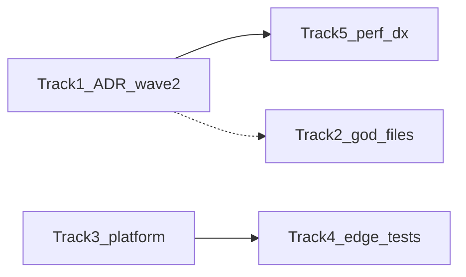

# REVIEW.md follow-on — implementation plan

**Source:** Priorities extracted from [docs/REVIEW.md](../REVIEW.md) (Findings 1.1, 1.5, 1.9, 2.x, §4 Brutal Truth, Path to Exceptional, Tier 3 open rows).  
**Companion:** [review-next-backlog.md](review-next-backlog.md) (weighted score narrative).

This document is the **action checklist** for engineering; update it as tranches ship.

---

## 0. Execution sequencing — how to ship this plan

**Principles**

- **Small PRs:** one component or one Edge function per PR where possible; always update [client-data-layer.md](../api/client-data-layer.md) inventory when a box in §1 flips to done.
- **Invalidate before features:** every new `useMutation` must call existing **`invalidateQueries`** helpers (or extend **`invalidateOrgScopedQueries`** / fleet helpers) so the drawer and hubs stay consistent.
- **Rescore [REVIEW.md](../REVIEW.md)** in the same PR as each **milestone** below (Architecture when Track 1 done; Scalability when job worker ships; Testing when Track 4 adds substantive Deno coverage).

### Track 1 — ADR 0004 Wave 2 (recommended order)

| Step    | Focus                   | Files / hooks                                                                            | Notes                                                           |
| ------- | ----------------------- | ---------------------------------------------------------------------------------------- | --------------------------------------------------------------- |
| **1.1** | Passkey delete          | `PasskeyManager` → `usePasskeyDeleteMutation`                                            | Lowest coupling; list already on Query.                         |
| **1.2** | MSP checklist probes    | `MspSetupChecklist` → `useMspSetupStatusQuery` or `src/lib/data/msp-setup-status.ts`     | Read-only; good warm-up for patterns.                           |
| **1.3** | Scheduled reports       | `ScheduledReportSettings` → mutations + `queryKeys.org.scheduledReports`                 | Align with existing scheduled-report consumers.                 |
| **1.4** | Invite / member deletes | `InviteStaff` → mutations; keep `useOrgTeamRosterQuery` invalidation                     | Higher traffic; test invite + revoke flows.                     |
| **1.5** | Portal rows             | `PortalConfigurator` — move `portal_config.update` + effect reads into mutations / Query | May touch `PortalConfigurator` + keys only.                     |
| **1.6** | Fleet panel agents      | `AgentFleetPanel` — align with `useOrgAgentsQuery` + `signal`                            | Regression-test expand/load.                                    |
| **1.7** | Remediation upsert      | Shared `useRemediationStatusUpsertMutation` + `PlaybookLibrary` / `RemediationPlaybooks` | Single invalidation path for `queryKeys.org.remediationStatus`. |

**Exit:** `rg 'supabase\.from' src/components` only hits files still listed as **exceptions** in [client-data-layer.md](../api/client-data-layer.md).

### Track 2 — God files (parallelizable)

- **Health check:** one **vertical slice** per PR (e.g. “follow-ups section only”) per **§2** below; avoid mixing section moves with behaviour changes.
- **Wizard:** one **`StepId` → new file** per PR; **final PR** adds `steps/registry.ts` and shrinks `SetupWizardBody.tsx`.

### Track 3 — Platform spine

Follow numbered steps in [job-queue-outline.md](../job-queue-outline.md) **Implementation plan v1** in order (migration → idempotency → producer → worker → cron → runbook → tests). **Edge Sentry** can land in parallel once DSN/policy approved — use [observability.md](../observability.md) checklist.

### Track 4 — Edge contract

- **4.1** Extend [portal_data_test.ts](../../supabase/functions/portal-data/portal_data_test.ts) (404 slug, optional).
- **4.2** `send-scheduled-reports` Deno test with mocked Resend / env.
- **4.3** `parse-config` constrained integration test (headers / early error paths) without live Gemini if possible.
- **4.4** Zod for **portal-data** GET query shape + OpenAPI row.

### Track 5 — Tier 3 perf / DX

- Run after Track 1 **or** in cooldown weeks: **`fetch`** sweep, **`React.memo`** on profiled leaves, stable **`key`** audit, ESLint phases per **§5** below.

### Dependency sketch

Track **2** can start anytime; **5** benefits from **1** reducing noise in components under edit.

### Single-developer rough calendar (indicative)

| Weeks | Focus                                             |
| ----- | ------------------------------------------------- |
| 1–2   | Track 1 steps **1.1–1.5**                         |
| 3     | Track 1 **1.6–1.7** + start Track 4.1–4.2         |
| 4–6   | Track 3 job queue v1 + Track 2 wizard extractions |
| 7+    | Track 4.3–4.4, Edge Sentry, Track 5               |

Adjust for releases and support load.

---

## 1. ADR 0004 — Wave 2 (Architecture / Finding 1.5)

**Goal:** No remaining **`supabase.from` / `fetch`** for domain work inside **drawer-mounted** workspace components except documented exceptions.

**Checklist**

- [x] **`InviteStaff`:** move `org_invites` insert/delete and `org_members` delete into **`useMutation`** hooks (keys under **`queryKeys.org.teamRoster`**) in `src/hooks/queries/`; thin component.
- [x] **`ScheduledReportSettings`:** `scheduled_reports` insert/delete → **`useMutation`** + **`queryKeys.org.scheduledReports`** (already referenced elsewhere).
- [x] **`PortalConfigurator`:** keep reads on Query; move `portal_config.update` and any stray effect reads into **`useMutation`** / shared fetch in **`src/lib/data/`** if needed.
- [x] **`PasskeyManager`:** `passkey_credentials` delete → **`useMutation`** (list already Query).
- [x] **`MspSetupChecklist`:** central/agents/portal probe → small **`useQuery`** or **`src/lib/data/msp-setup-status.ts`** + single hook.
- [x] **`AgentFleetPanel`:** replace ad hoc **`agents`** query with **`useOrgAgentsQuery`** pattern + **`signal`** (see [client-data-layer.md](../api/client-data-layer.md)).
- [x] **`RemediationPlaybooks` / `PlaybookLibrary`:** centralise **`remediation_status` upsert** in one mutation module + invalidation.

**Verification:** `rg 'supabase\.from' src/components` shows only shims pending migration; update [client-data-layer.md](../api/client-data-layer.md) inventory table.

**References:** [ADR 0004](../adr/0004-frontend-data-boundary.md), [client-data-layer.md](../api/client-data-layer.md).

---

## 2. God-file reduction (Finding 1.1)

**Targets:** ~**800 lines/file** where feasible.

### Health Check

| Step | Action                                                                                                                                         |
| ---- | ---------------------------------------------------------------------------------------------------------------------------------------------- |
| 1    | Inventory **`HealthCheckInnerLayout.tsx`** by **section** (upload, team, follow-ups, PDF strip, dialogs) — name slice files before moving JSX. |
| 2    | Extract **section components** + colocated **`useSectionXxx`** hooks; keep **`use-health-check-inner-state.tsx`** as orchestrator only.        |
| 3    | Move **pure helpers** (formatting, URL builders) to **`src/pages/health-check/*.ts`**.                                                         |

### Setup wizard

| `StepId` (see `wizard-types.ts`)                                                                                           | Status                          | Target module under `setup-wizard/steps/`                                                     |
| -------------------------------------------------------------------------------------------------------------------------- | ------------------------------- | --------------------------------------------------------------------------------------------- |
| `welcome`, `branding`                                                                                                      | Extracted                       | `WelcomeStep.tsx`, `BrandingStep.tsx`                                                         |
| `central`, `connector-agent`, `guide-upload`, `guide-pre-ai`                                                               | Extracted                       | `CentralSetupStep.tsx`, `ConnectorAgentStep.tsx`, `GuideUploadStep.tsx`, `GuidePreAiStep.tsx` |
| `guide-ai-reports`                                                                                                         | Extracted                       | `GuideAiReportsStep.tsx`                                                                      |
| `guide-optimisation`, `guide-remediation`, `guide-tools`, `guide-management`, `guide-team-security`, `guide-portal-alerts` | **Inline in `SetupWizardBody`** | One file per id + **`steps/registry.ts`** mapping `StepId` → component (lazy optional).       |
| `done`                                                                                                                     | Partially inline                | `DoneStep.tsx` or merge with registry.                                                        |

**Finish:** **`SetupWizardBody.tsx`** becomes **orchestrator + registry** only (~200–400 lines target).

---

## 3. Platform spine — job queue v1 + Edge Sentry + dashboards

### 3a. Job queue (from [job-queue-outline.md](../job-queue-outline.md))

Implementation phases are spelled out at the bottom of **`job-queue-outline.md`** (migration → producer → worker → DLQ). **First job kind:** `scheduled_report` send only.

### 3b. Edge Sentry

| Step | Action                                                                                                                                                         |
| ---- | -------------------------------------------------------------------------------------------------------------------------------------------------------------- |
| 1    | Create **separate Edge DSN** (not SPA); document in [SELF-HOSTED.md](../SELF-HOSTED.md).                                                                       |
| 2    | Wrap **hot functions** (`api`, `parse-config`, `portal-data`) top-level `serve` catch — capture **non-PII** fingerprint + `logJson` correlation id if present. |
| 3    | Set **sample rate** (e.g. 10% success / 100% errors) per policy.                                                                                               |

### 3c. Dashboards / alerts ([observability.md](../observability.md))

| Step | Action                                                                                                          |
| ---- | --------------------------------------------------------------------------------------------------------------- |
| 1    | Save drain **saved searches** for `api_unhandled`, `*_invalid_body` spike, `send_scheduled_reports_*` failures. |
| 2    | Chart **p95 duration** per function in Supabase dashboard (or drain).                                           |
| 3    | One **pager / Slack** alert on sustained **5xx** or **`api_unhandled`** &gt; 0 in prod.                         |

### 3d. Redis (optional widen)

After **portal-data** pilot metrics: decide TTL increase, second route, or **cache purge** hooks — [redis-pilot.md](../redis-pilot.md).

---

## 4. Edge tests + Zod / OpenAPI parity

### Deno integration (Path to Exceptional #2)

| Function                     | Minimum next tests                                                                                                      |
| ---------------------------- | ----------------------------------------------------------------------------------------------------------------------- |
| **`parse-config`**           | Authenticated **happy path** mock (stream headers) + **rate limit** branch if testable without real Gemini.             |
| **`send-scheduled-reports`** | **Cron-style POST** with mock env — assert **200** and **logJson** message presence (mock Resend).                      |
| **`portal-data`**            | Extend **`portal_data_test.ts`** — cache **miss/hit** behaviour when Redis env unset (already) + optional **404** slug. |

### Zod (non-`api` router)

| Candidate                             | Rationale                                                                       |
| ------------------------------------- | ------------------------------------------------------------------------------- |
| **`portal-data`**                     | Query params (`slug` / `org_id`) + optional flags — small schema, high traffic. |
| **`api-public`** selected POST bodies | Align with OpenAPI; one route per PR.                                           |

### OpenAPI

On each Zod addition, update [openapi.yaml](../api/openapi.yaml) and [ApiDocumentation.tsx](../../src/components/ApiDocumentation.tsx) if integrator-visible.

---

## 5. Tier 3 — perf, memo, keys, ESLint

### Fetch / `signal` sweep

- `rg '\bfetch\(' src/pages src/components` — migrate to **`useQuery`** or pass **`AbortController`** from effect cleanup.
- Prefer **`supabaseWithAbort`** + **`queryFn`** pattern from [supabase-with-abort.ts](../../src/lib/supabase-with-abort.ts).

### `React.memo` (Finding 1.9)

Profile **Lighthouse/React Profiler** on **`/`** and **`/command`**, then memo **in order:** **`ScoreDialGauge`**, **`CategoryScoreBars`**, heavy **table rows** (fleet, customer directory).

### Stable keys (Finding 2.6)

- Audit **`key={index}`** / **`key={i}`** in **`src/components`** and **`src/pages`**; replace with **stable ids** from data rows.

### ESLint **`no-unused-vars` → `error`**

- **Phase A:** `src/lib/**` only — fix or prefix `_`.
- **Phase B:** `src/hooks/**`.
- **Phase C:** `src/components/**` (largest).
- **Phase D:** `supabase/functions/**` imports.
- Flip rule in **`eslint.config.js`** when each phase is green in CI.

### Server PDF (product gate)

- If shipping: follow [pdf-generation-client-ceiling.md](../pdf-generation-client-ceiling.md) + [TEST-PLAN-TIER2-BACKLOG.md](../TEST-PLAN-TIER2-BACKLOG.md) for **real PDF** E2E.
- If deferring: keep client **pdfmake** lazy load; no score expectation for server PDF.

---

## Maintenance

When a **section above** ships, update **§ FINAL VERDICT** scorecard in [REVIEW.md](../REVIEW.md) in the **same PR** (per REVIEW’s own rule).
