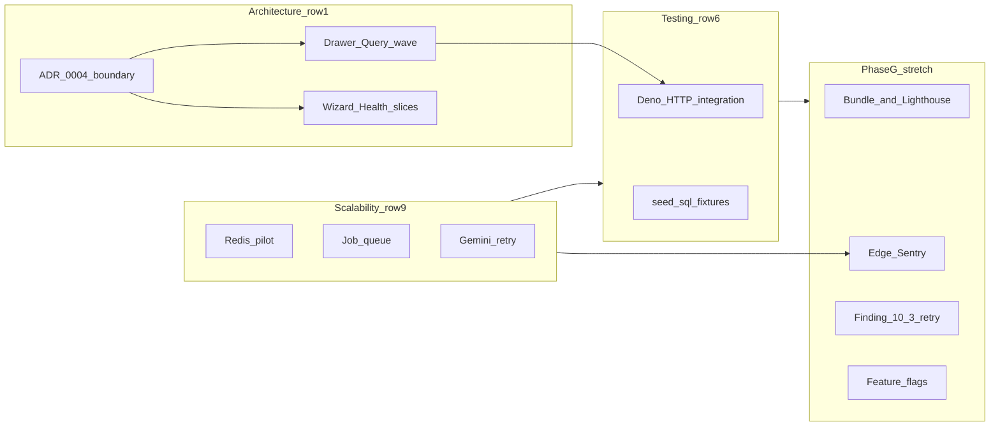

# REVIEW.md — next backlog (expanded): score jump + architecture recovery

**Companion:** Cursor plan `review_next_backlog` (sync if you use Plans UI).  
**Source audit:** [docs/REVIEW.md](../REVIEW.md) scorecard weights and “Brutal Truth.”  
**Action checklist (wave 2 onward):** [review-follow-on-from-REVIEW.md](review-follow-on-from-REVIEW.md).

---

## Why the score only moved ~1 point last time

The **weighted score** blends **10 dimensions**; a strong slice in one area (e.g. Playwright, one index, hot-path abort) moves the **average** a little unless several **high-weight** rows move together.

**Weights (from REVIEW):** Security 15%, **Architecture 12%**, **Scalability 12%**, **Testing 12%**, Performance 10%, Functionality 10%, Product 10%, DX 8%, UX 6%, Documentation 5%.

**Headroom for a bigger jump (typical 1–2 point row moves → ~3–6+ points on the 100 scale if clustered):**

| Dimension           | Current (REVIEW) | Why it’s capped                                             | What would move it                                                                        |
| ------------------- | ---------------- | ----------------------------------------------------------- | ----------------------------------------------------------------------------------------- |
| **9 Scalability**   | **5/10**         | No Redis, no job queue, no full observability stack         | **741–743** done as a **designed** platform (not ad hoc)                                  |
| **1 Architecture**  | **7/10**         | God files, mixed Supabase/fetch, no unified client boundary | **Data-access boundary**, **drawer** fully on Query, **wizard/health-check** file budgets |
| **6 Testing**       | **7/10**         | No full edge HTTP integration for hot functions             | Deno **happy path + auth failure** for **parse-config**, **portal-data**, one scheduler   |
| **2 Performance**   | **6/10**         | Residual `fetch`, client PDF weight                         | **736** sweep, **753** or stronger server PDF story                                       |
| **5 Functionality** | **7/10**         | Silent catches                                              | **Finding 5.2** burn-down to near-zero                                                    |
| **7 Documentation** | **6/10**         | Partial OpenAPI                                             | **Complete OpenAPI** for all deployed functions + **ADR** for target architecture         |

Security (8) and Product (8) have **less upside** alone — but **+1 on Security (15% weight)** and **+1 on Product (10%)** still matter in a **“big jump”** program if you stack them **on top of** Architecture / Scalability / Testing moves.

**Program goal — baseline (honest range):** After an **8–12 week** pass on **Scalability + Architecture + Testing** together, a **~74–78/100** narrative is defensible if row **9** reaches **7+**, row **1** reaches **8**, row **6** reaches **8**, and rows **2/5/7** each gain **~1**.

**Program goal — stretch (“big jump”):** **~78–82/100** is only credible if you **also** lift **DX (8%)** and **UX (6%)** by **~1** each, add **meaningful** **Security (15%)** hardening beyond “audit clean,” and ship **one** flagship **Functionality** improvement on the **core journey** (not only refactors). Rough mental model: **4–6 dimensions** moving **+1 to +2** in the **top half of weights** ≈ **+5–10** on the **100** scale **if** reviewers accept the narrative (still subjective).

---

## Stretch tier — extra work for a larger weighted jump

Map each initiative to **REVIEW** rows so you don’t duplicate low-leverage polish.

| Initiative                                                                                            | Rows moved                                                         | What “done” looks like                                                                                |
| ----------------------------------------------------------------------------------------------------- | ------------------------------------------------------------------ | ----------------------------------------------------------------------------------------------------- |
| **ESLint `no-unused-vars` → `error`** (incremental burn-down, CI stays green)                         | **DX (8%)**, **Architecture signal**                               | Stricter bar than “warn”; fewer dead paths in large files.                                            |
| **Prettier on `supabase/functions`** (REVIEW: Prettier still skips functions)                         | **DX (8%)**                                                        | One format command for Edge code; CI `format:check` includes Deno tree or a parallel `deno fmt` gate. |
| **Realistic `seed.sql` + documented `supabase db reset` dev loop**                                    | **DX (8%)**, **Testing (12%)**                                     | Local data matches MSP-shaped org; enables integration tests and demos without prod.                  |
| **Vitest coverage thresholds** on **`src/lib/**` + critical hooks (not 100% repo)                     | **Testing (12%)**                                                  | CI fails if core modules regress below floor; document exclusions.                                    |
| **Nightly / staging Playwright** (real auth or stable fixtures, not only bypass)                      | **Testing (12%)**                                                  | Catches integration drift; pairs with **TEST-PLAN** auth-mock follow-ups.                             |
| **Bundle budget in CI** (`vite build` size limit or `rollup-plugin-visualizer` gate on main chunks)   | **Performance (10%)**                                              | Prevents accidental pdf/chart regressions.                                                            |
| **Lighthouse CI** (or **Unlighthouse**) on `/`, `/command`, one heavy route                           | **Performance (10%)**, **UX (6%)**                                 | Stored scores; fix LCP/CLS regressions.                                                               |
| **Core journey: “Retry analysis” + clearer XML failure copy** ([Finding 10.3](../REVIEW.md))          | **Functionality (10%)**, **UX (6%)**                               | User-trust win beyond engineering metrics.                                                            |
| **Edge Sentry** (separate DSN) + **1–2 alert rules** on `logJson` error rates                         | **Security (15%)** / ops story, **Scalability (12%)** “full stack” | Closes “optional Edge Sentry” gap in REVIEW.                                                          |
| **Short threat model** (STRIDE one-pager) + **dependency review** automation                          | **Security (15%)**, **Documentation (5%)**                         | Justifies **8 → 8.5–9** if you want Security row movement.                                            |
| **Feature flags** (Edge Config or env-driven) for **risky** or **low-usage** surfaces                 | **Product (10%)**                                                  | Supports measurement + kill switch (**Finding 10.1** direction).                                      |
| **WCAG 2.1 AA pass** documented (axe is smoke; add manual checklist or paid audit subset)             | **UX (6%)**                                                        | **7 → 8** with evidence.                                                                              |
| **OpenAPI → TypeScript types codegen** for integrators (optional package under `packages/` or script) | **DX (8%)**, **Documentation (5%)**                                | Professional “platform” signal.                                                                       |

**Intentionally heavy / defer unless dedicated program:** Turborepo split, micro-frontends, or rewriting the SPA — high cost; **not** required for the stretch numbers above if **row 9** and **row 1** move strongly.

---

## Phase G — Stretch pack (weeks 10–16, parallel where possible)

Run **after** Phases **A–D** have started showing green metrics (or in parallel with **D** if staffed).

1. **DX:** Prettier/Deno format for functions + ESLint unused **error** rollout plan.
2. **Testing:** Seed fixtures + coverage thresholds + staging E2E cadence.
3. **Performance + UX:** Bundle budget + Lighthouse (or equivalent) on 3 URLs.
4. **Functionality + UX:** **Finding 10.3** retry + copy.
5. **Security:** Edge Sentry + threat model one-pager + dependency automation.
6. **Product:** Feature flags for 1–2 surfaces tied to **740** analytics.
7. **Documentation:** OpenAPI codegen **or** expanded partner “integration guide” chapter.

---

## Narrative shift: from “outgrown architecture” to “bounded architecture under migration”

REVIEW’s **Brutal Truth** cites **width**: huge **health-check** / **wizard** modules, **ManagementDrawer** still mixing direct Supabase, no single **API** story for the Edge layer, **OpenAPI** incomplete.

**Concrete initiatives (pick an explicit name in an ADR, e.g. “ADR 0004 — Frontend data boundary”):**

1. **Enforce a data-access boundary (highest leverage for row 1)**
   - **Policy:** No `supabase.from` / raw `fetch` in **route/page/components** except rare escapes documented in [docs/api/client-data-layer.md](../api/client-data-layer.md).
   - **Implementation:** Centralize reads/writes in **`src/lib/data/*`** modules + **`useQuery` / `useMutation`** hooks in **`src/hooks/queries/*`** with keys from **`keys.ts`**.
   - **Migrate in waves:** **ManagementDrawer** lazy panels first (same invalidation story as Fleet), then **health-check** reads that are still ad hoc.

2. **God-file reduction with measurable targets (Finding 1.1)**
   - **SetupWizardBody:** remaining **`StepId` → `setup-wizard/steps/*.tsx`** ([REVIEW 734](REVIEW.md)).
   - **HealthCheckInnerLayout / use-health-check-inner-state:** slice by **section** (e.g. team, follow-ups, PDF) with **&lt;~800 lines** per file target where feasible.
   - **Optional:** ESLint **`max-lines`** warning threshold for **new** files only (does not rewrite history in one PR).

3. **Edge as a proper API (Path to Exceptional §5)**
   - **Zod** on **parse-config**, **portal-data**, **api-public** request bodies (Tier 2 still-open).
   - **OpenAPI** entries for **every** function in [supabase/config.toml](../supabase/config.toml) + [docs/api/edge-routes.md](../api/edge-routes.md) parity.
   - Reduces “collection of scripts” perception and lifts **Documentation** + **Architecture** (contracts are architecture).

4. **Platform spine (row 9)**
   - **741** Redis: **one** well-defined cache (e.g. org-scoped read) with TTL + invalidation doc.
   - **742** Jobs: outbox or queue for **email + scheduled reports** with retries/DLQ.
   - **743** Gemini: **retry + idempotency** + user-visible retry (**Finding 10.3**).
   - Together these justify **“we have a system design”** not only **“we have functions.”**

5. **Proof in tests (row 6)**
   - Integration tests that treat **parse-config** / **portal-data** as **HTTP contracts** (mocked DB/auth) → supports the API narrative and de-risks refactors.

6. **Communicate the shift**
   - Update **Brutal Truth** paragraph when **ADR 0004** + **first** boundary wave ships: wording becomes **“migration in progress under documented boundaries”** instead of **“outgrown.”**

---

## Phased work (merged with prior Tier 3 list)

### Phase A — Architecture recovery (weeks 1–4, parallel)

- Data-access **policy** + **ADR 0004** (**landed:** org **purge** in [`src/lib/data/purge-org-cloud-data.ts`](../src/lib/data/purge-org-cloud-data.ts); drawer component has no **`supabase.from`**); extend wave: **ManagementDrawer** lazy panels + [invalidate-org-queries](../src/lib/invalidate-org-queries.ts) (purge path now also invalidates **client portal preview** prefix + **regulatory digest**).
- **734** wizard step extractions; **health-check** section extractions.
- **736** complete as much as possible inside the boundary (Query `signal`, no stray `fetch` on hot routes).

### Phase B — Client perf (overlap weeks 1–3)

- **737** `React.memo` on **profiled** hot leaves.
- **739** WebP + lazy for raster PNGs.
- **735** compliance grid debounce if still hot.

### Phase C — Measurement (week 4–5)

- **740** PostHog or minimal events → supports feature cuts (**Finding 10.4**) and justifies **741–743**.

### Phase D — Platform scale (weeks 6–10)

- **741** Redis pilot.
- **742** Job queue for reports/email.
- **743** Gemini retry queue; tie to UI retry.

### Phase E — Product / performance capstone

- **753** Server PDF **if** product commits; else document **client-only** ceiling and invest in **736** + **edge** offload of **non-PDF** work.

### Phase F — Testing + docs (continuous, heaviest weeks 4–8)

- Deno integration: **parse-config**, **portal-data**, **send-scheduled-reports** (mocked).
- OpenAPI + ApiDocumentation completion.
- **seed.sql** realistic fixtures (lifts **DX** and **Testing**) — **expand further in Phase G** if Phase F only ships a minimal slice.
- **Finding 5.2** silent-catch burn-down.

### Phase G — Stretch pack (weeks 10–16)

See **Stretch tier** table above: DX gates, coverage + staging E2E, bundle + Lighthouse, **Finding 10.3**, Edge Sentry + threat model, feature flags, optional OpenAPI codegen.

---

## Mermaid — dependency overview

---

## After shipping — REVIEW.md maintenance

When a phase completes, **edit the scorecard one-liners** and **weighted score history** in [docs/REVIEW.md](../REVIEW.md) in the **same PR** as the work (per in-repo audit hygiene).

---

## Excluded

- **738** stable list keys — **[x]** partial; audit only on regression or new lists.
