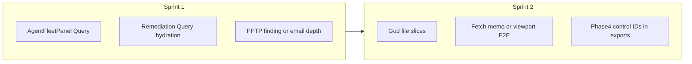

# Next up: roadmap + REVIEW + execution planning

## Where things stand

| Source                                                                                           | Headline                                                                                                                                                                                                                                                                                                                                                                |
| ------------------------------------------------------------------------------------------------ | ----------------------------------------------------------------------------------------------------------------------------------------------------------------------------------------------------------------------------------------------------------------------------------------------------------------------------------------------------------------------- |
| [docs/REVIEW.md](docs/REVIEW.md)                                                                 | **~79/100** weighted; Tier 1–2 largely done. **Open:** god-file splits, **AgentFleetPanel** direct Supabase batches + scan poll, **remediation_status** `useEffect` hydration on playbooks, partial **fetch cancellation / Query**, **memo** on heavy leaves, **server PDF** (documented ceiling), extend **viewport/a11y** to more hub routes.                         |
| [docs/ROADMAP.md](docs/ROADMAP.md)                                                               | **Phase 4 — Compliance productization:** control-level evidence → per-finding control IDs in exports; reviewer sign-off; validation layer. **Planned (not started):** PPTP/legacy VPN finding, deeper email security, trend UX, certificate UX, VPN topology, scheduled comparison, remediation programme, WAF depth, SD-WAN, retention/DPA follow-ups, ops visibility. |
| [docs/plans/sophos-firewall-master-execution.md](docs/plans/sophos-firewall-master-execution.md) | Most horizons **shipped**; **open:** **G3.5 (XL)** Docker/Helm in-repo; **X1–X3** cross-cutting polish (role-aware toast, telemetry funnel, staging E2E).                                                                                                                                                                                                               |

No single “correct” order: **platform/review debt** improves velocity and risk; **roadmap bullets** drive customer-visible value. Below is a **default sequencing** that balances both.

---

## Track A — REVIEW residuals (engineering quality)

High leverage and already called out in REVIEW Dimension 1 / Tier 3:

1. **AgentFleetPanel** — Move **batched `agent_submissions`** reads + **scan polling** onto **TanStack Query** + `AbortSignal` (align with [docs/api/client-data-layer.md](docs/api/client-data-layer.md) exception table). Closes a called-out **High** severity data-pattern gap.
2. **Playbooks remediation hydration** — Replace **`useEffect`** reads of **`remediation_status`** on [PlaybookLibrary](src/pages/PlaybookLibrary.tsx) / [RemediationPlaybooks](src/components/RemediationPlaybooks.tsx) (or shared hook) with **Query + mutations** already used elsewhere for remediation.
3. **God files (Phase B)** — Continue [architecture-pressure-remediation](docs/plans/architecture-pressure-remediation-a0859c58.md): slice **`HealthCheckInnerLayout`** / **`use-health-check-inner-state`** toward **~&lt;800 lines**; extract remaining **`SetupWizardBody`** **`StepId`** branches into **`setup-wizard/steps/`** (REVIEW Finding 1.1 FIX).
4. **Tier 3 checklist (pick 1–2 per sprint)** — Bro **`fetch` → Query** or **`AbortController`** sweep; **`React.memo`** on next **profiled** chart/table leaves after **`ScoreDialGauge` / `ScoreTrendChart`**; stable **`key`** audit on dynamic lists (REVIEW 2.x / 1.9).

**Testing / UX parity:** Extend [e2e/viewport-layout.spec.ts](e2e/viewport-layout.spec.ts) / signed-in specs to **additional hub routes** called out in REVIEW Finding 4.3 (optional screenshots later).

---

## Track B — Product roadmap (near-term)

**Quick wins** ([ROADMAP.md](docs/ROADMAP.md) §Planned):

- **PPTP / legacy remote-access VPN** finding (dedicated rule in parser/analysis domain; IPsec/SSL already exist).
- **Email security (deeper)** — anti-spam / SPF-DMARC signals if present in export; extend beyond current licenced-feature + malware-scan rows.

**Phase 4 (compliance productization)** — sequential product story:

1. **Per-finding control IDs** + traceable evidence references in exports (extends Evidence Verification panel).
2. **Reviewer sign-off / annotations** (greenfield).
3. **Validation layer** (compare to external audit tooling; confidence in UI).

**Medium effort** (schedule after or parallel to A2–A3 if PM priority): assessment **trend UX**, **certificate** inventory/60-day horizon, **VPN topology** diagram.

---

## Track C — Platform / scale (when triggers fire)

[docs/SCALE-TRIGGERS.md](docs/SCALE-TRIGGERS.md) + REVIEW **Scalability** row:

- **`job_outbox`** — migration exists; **producer + worker + cron** wiring ([docs/job-queue-outline.md](docs/job-queue-outline.md)).
- **Optional Edge Sentry** + **live dashboards** on existing **`logJson`** names ([docs/observability.md](docs/observability.md)).
- **Server-side PDF** — only when product drops print-dialog approach ([docs/pdf-generation-client-ceiling.md](docs/pdf-generation-client-ceiling.md)).

**Self-hosted XL:** **G3.5 Docker/Helm** remains explicitly **not started** in master execution.

---

## Suggested 2-sprint default (example)

---

## Planning artifacts (keep in sync)

- **Single execution checklist:** continue to treat [docs/plans/sophos-firewall-master-execution.md](docs/plans/sophos-firewall-master-execution.md) as the epic index; add dated notes when A/B/C items ship.
- **Deep gap analysis:** [docs/plans/sophos-firewall-gaps-and-improvements-roadmap.md](docs/plans/sophos-firewall-gaps-and-improvements-roadmap.md) for acceptance criteria on larger epics.
- **REVIEW living backlog:** [docs/plans/review-follow-on-from-REVIEW.md](docs/plans/review-follow-on-from-REVIEW.md) (if present) or Tier 3 section in [docs/REVIEW.md](docs/REVIEW.md) — tick items as you close them.
- **Cursor Plans UI:** per repo rule, mirror any new/edited plan under **`docs/plans/`** to **`~/.cursor/plans/*.plan.md`** when you use paired files.

---

## Optional clarification (only if you want to reprioritize)

If the next month is **MSP growth** vs **compliance sales**, the split between **Track A** (tech debt) and **Track B Phase 4** shifts. The work above is valid either way; only **ordering** changes.
