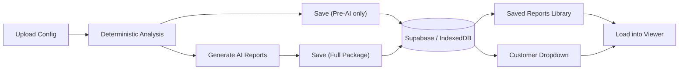

# Save Reports to Cloud

## What gets saved per "saved report"

Each saved report package contains:

- Customer name + environment
- AI-generated markdown reports (Technical, Executive, Compliance) if any were generated
- Deterministic analysis results (findings, scores, stats) -- always present
- Timestamp, created_by user, report type label
- Linked to the MSP org via `org_id` (guest mode uses IndexedDB fallback)

## Database

New table `saved_reports` added via migration `003_saved_reports.sql`:

```sql
create table public.saved_reports (
  id uuid primary key default gen_random_uuid(),
  org_id uuid not null references public.organisations(id) on delete cascade,
  created_by uuid references auth.users(id) on delete set null,
  customer_name text not null,
  environment text not null default '',
  report_type text not null default 'full',
  reports jsonb not null default '[]',
  analysis_summary jsonb not null default '{}',
  created_at timestamptz not null default now()
);
```

With RLS policies matching the `assessments` table pattern (members can CRUD within their org).

`reports` JSONB stores an array of `{ id, label, markdown }` -- the same shape as the existing `ReportEntry` type.

`analysis_summary` JSONB stores a compact snapshot: findings count, overall score, grade, per-category scores.

## Where saved reports appear

### 1. Customer dropdown in Assessment Context

When the user selects a customer from the searchable dropdown in [BrandingSetup.tsx](src/components/BrandingSetup.tsx), show a count of saved reports next to each customer name (e.g. "Acme Corp (3 reports)"). After selecting, the user can still upload new configs -- the saved reports are just for reference/loading.

### 2. Saved Reports Library (new section)

A new collapsible section "Saved Reports" in [Index.tsx](src/pages/Index.tsx) that shows:

- A searchable/sortable table of all saved reports across customers
- Each row shows: customer name, report type (Technical/Executive/Compliance/Pre-AI), date, score
- Click to expand and preview or reload the saved reports into the viewer
- Delete button per saved report

## New files

- `supabase/migrations/003_saved_reports.sql` -- table + RLS
- `src/lib/saved-reports.ts` -- cloud + local CRUD (dual-mode like assessment-cloud.ts)
- `src/components/SavedReportsLibrary.tsx` -- the library UI section

## Modified files

- [src/integrations/supabase/types.ts](src/integrations/supabase/types.ts) -- add `saved_reports` table type
- [src/components/BrandingSetup.tsx](src/components/BrandingSetup.tsx) -- show report count per customer in dropdown
- [src/pages/Index.tsx](src/pages/Index.tsx) -- add "Save Reports" button after generation, add SavedReportsLibrary section, add load-from-saved flow
- [src/components/DocumentPreview.tsx](src/components/DocumentPreview.tsx) -- may need minor update to support loading saved reports

## User flow




