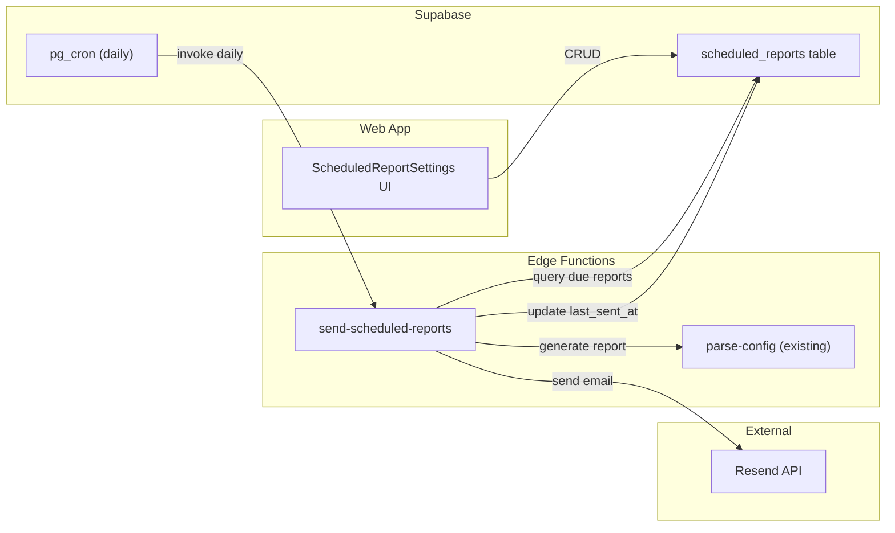

# Scheduled Email Reports

## Architecture



## Components to Build

### 1. Database Migration

New table `scheduled_reports`:

```sql
create table scheduled_reports (
  id uuid primary key default gen_random_uuid(),
  org_id uuid not null references organisations(id) on delete cascade,
  name text not null,
  schedule text not null check (schedule in ('weekly','monthly','quarterly')),
  recipients text[] not null,
  report_type text not null default 'one-pager'
    check (report_type in ('one-pager','executive','compliance')),
  customer_name text,
  include_sections jsonb default '{"scoreOverview":true,"findingsSummary":true,"complianceStatus":true,"remediationPlan":true}'::jsonb,
  enabled boolean not null default true,
  last_sent_at timestamptz,
  next_due_at timestamptz not null,
  created_at timestamptz not null default now()
);
```

Add RLS policies so only org members can manage their schedules. Add a pg_cron entry that calls the Edge Function daily.

File: `supabase/migrations/YYYYMMDD_scheduled_reports.sql`

### 2. Edge Function: `send-scheduled-reports`

New function at `supabase/functions/send-scheduled-reports/index.ts`:

- Triggered daily by pg_cron (or Supabase cron webhook)
- Queries `scheduled_reports` where `enabled = true AND next_due_at <= now()`
- For each due report:
  - Fetches latest assessment data from `agent_submissions` / `assessments` for the org
  - Generates the report content:
    - **One-pager**: Use `buildExecutiveOnePagerMarkdown()` logic (deterministic, no AI needed) — port the template function to Deno
    - **Executive/Compliance**: Call the existing `parse-config` Edge Function internally
  - Converts markdown to HTML email using a clean template
  - Sends via Resend API (`POST https://api.resend.com/emails`)
  - Updates `last_sent_at` and computes `next_due_at`
- Env var: `RESEND_API_KEY`

### 3. UI Component: `ScheduledReportSettings`

New component at `src/components/ScheduledReportSettings.tsx`:

- Lives in the Management Drawer under a "Scheduled Reports" section
- Form fields:
  - **Name**: e.g. "Monthly Compliance Report — Acme Corp"
  - **Schedule**: weekly / monthly / quarterly
  - **Recipients**: comma-separated email addresses
  - **Report type**: Executive One-Pager (no AI, fast) / Executive Summary (AI) / Compliance Report (AI)
  - **Customer**: dropdown of known customers
  - **Sections to include**: checkboxes matching `include_sections`
  - **Enabled**: toggle
- List view showing all configured schedules with status (last sent, next due, enabled)
- "Send Now" button to trigger an immediate send for testing
- CRUD via Supabase client (`scheduled_reports` table)

### 4. Resend Integration

- Add `RESEND_API_KEY` to Supabase Edge Function secrets
- Email template: clean HTML with MSP branding (logo, colors from `organisations` table)
- From address: configurable or `reports@firecomply.io` (requires Resend domain verification)
- Subject line: `[CustomerName] Firewall Compliance Report — March 2026`
- Body: HTML-rendered report with a "View full report" link to the app

### 5. Wire Into Management Drawer

Add the new section to [src/components/ManagementDrawer.tsx](src/components/ManagementDrawer.tsx):

- New nav item: "Scheduled Reports" with a calendar/mail icon
- Positioned after "Alerts" in the nav order
- Replaces/upgrades the existing `EmailDigestSettings` which is localStorage-only

## Key Decisions

- **One-pager as default**: The executive one-pager uses `buildExecutiveOnePagerMarkdown()` which is deterministic (no AI). This is the safest option for scheduled reports since it doesn't hit AI API limits. AI-generated reports (executive/compliance) are optional and will consume API credits.
- **pg_cron**: Run daily at 06:00 UTC. The function checks `next_due_at` so it only processes reports that are actually due.
- **Resend**: Free tier allows 100 emails/day, 3,000/month. More than enough for MSP use.
- **Port one-pager logic to Deno**: The `buildExecutiveOnePagerMarkdown()` function from `src/lib/report-templates.ts` needs to be available in the Edge Function. Copy the template logic (it's pure string formatting, no browser dependencies).
