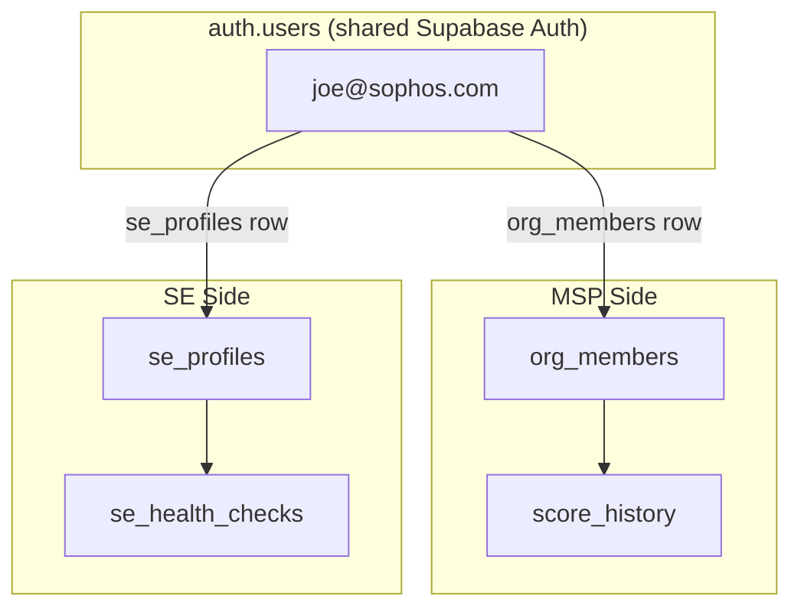

# SE Auth — Sophos Domain Lock

## Architecture

Same Supabase project, same `auth.users` — but a parallel profile/session layer that only accepts `@sophos.com` emails.

A single `auth.users` account (e.g. `joe@sophos.com`) can have:
- An `org_members` row (MSP side) — for testing the partner experience
- An `se_profiles` row (SE side) — for the health check tool

These are **independent**. The SE auth gate checks `se_profiles`, not `org_members`.

## Database Changes

### New migration: `supabase/migrations/20250322000000_se_auth.sql`

**`se_profiles` table:**
- `id` UUID PK default `gen_random_uuid()`
- `user_id` UUID NOT NULL REFERENCES `auth.users(id)` ON DELETE CASCADE, UNIQUE
- `email` TEXT NOT NULL
- `display_name` TEXT
- `created_at` TIMESTAMPTZ default `now()`
- CHECK constraint: `email ~* '@sophos\.com$'` (enforces `@sophos.com` domain at DB level)

**`se_health_checks` table** (stores SE health check history):
- `id` UUID PK default `gen_random_uuid()`
- `se_user_id` UUID NOT NULL REFERENCES `se_profiles(id)` ON DELETE CASCADE
- `customer_name` TEXT
- `overall_score` INT
- `overall_grade` TEXT
- `findings_count` INT
- `firewall_count` INT
- `checked_at` TIMESTAMPTZ default `now()`
- `summary_json` JSONB (category scores, top findings, etc.)

**Trigger:** `before_insert_se_profiles` — validates that `auth.users.email` for the given `user_id` ends with `@sophos.com`. Raises an exception if not. This is the **server-side enforcement** — the client-side check is just UX.

**RLS policies:**
- `se_profiles`: SELECT/INSERT/UPDATE/DELETE only when `user_id = auth.uid()`
- `se_health_checks`: SELECT/INSERT only when `se_user_id` belongs to the current `auth.uid()` via `se_profiles`

## Frontend Changes

### New hook: [`src/hooks/use-se-auth.ts`](src/hooks/use-se-auth.ts)

Similar pattern to `use-auth.ts` but checks `se_profiles` instead of `org_members`:
- `useSEAuthProvider()` — manages SE session state
- `useSEAuth()` — context consumer
- `SEAuthProvider` — context provider
- On sign-in, queries `se_profiles` for the user. If no row exists and email is `@sophos.com`, auto-creates one
- If email is NOT `@sophos.com`, shows an error: "Only @sophos.com email addresses can access the SE Health Check tool"
- Exposes: `seUser`, `isLoading`, `isAuthenticated`, `signIn`, `signUp`, `signOut`

### New component: [`src/components/SEAuthGate.tsx`](src/components/SEAuthGate.tsx)

A self-contained login/register form specifically for the SE health check:
- Sophos-branded header ("Sophos SE Health Check")
- Email + password fields
- Sign in / Register toggle
- Domain validation on the client side (show error if not `@sophos.com` before submitting)
- Clear messaging: "This tool is restricted to Sophos employees. Please use your @sophos.com email."

### Modified: [`src/pages/HealthCheck.tsx`](src/pages/HealthCheck.tsx)

- Wrap in `SEAuthProvider` + auth gate (similar to how `Index.tsx` uses `AuthFlow`)
- If not authenticated, show `SEAuthGate`
- If authenticated, show the health check tool
- Pass `seUser` to the dashboard for saving health check history
- After running a health check, save results to `se_health_checks`

### New component: [`src/components/SEHealthCheckHistory.tsx`](src/components/SEHealthCheckHistory.tsx)

A simple table/list showing the SE's past health checks from `se_health_checks`:
- Customer name, score, grade, date, findings count
- Click to view details (future enhancement)
- Shown in a collapsible panel on the health check page

## Domain Enforcement (defense in depth)

1. **Client-side** — `SEAuthGate` validates email domain before calling `signUp`
2. **Database CHECK** — `se_profiles.email` CHECK constraint rejects non-sophos.com
3. **Database trigger** — validates `auth.users.email` matches `@sophos.com` on insert
4. **RLS** — `se_profiles` rows only accessible by the owning `auth.uid()`

## What stays the same

- `auth.users` — shared, no changes
- `org_members` / `organisations` — MSP side, untouched
- A Sophos employee can sign up on the MSP side AND the SE side with the same email
- The MSP side does NOT check email domains (any email can register as an MSP partner)
