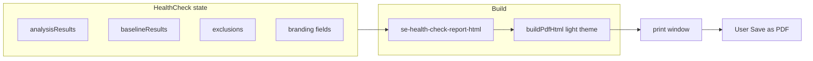

# SE Firewall Health Check — branded PDF / print report

## Branding strategy (Sophos SE)

The app already ships a **Sophos-aligned print shell** in [`src/lib/report-export.ts`](src/lib/report-export.ts) via [`buildPdfHtml`](src/lib/report-export.ts) (`export function buildPdfHtml` ~L213):

- **Sophos wordmark** (inline SVG, white on navy header bar)
- **Palette**: `--text: #001A47`, `--accent: #2006F7`, header `--accent-dark: #10037C` (matches SE Health Check UI in [`src/pages/HealthCheck.tsx`](src/pages/HealthCheck.tsx))
- **Header meta**: customer name, prepared-by, date (from `BrandingData`-shaped fields)
- **Optional confidential** watermark + **page footer** with title / customer in print CSS

**Plan:** Generate SE health report HTML as `innerHTML`, then call **`buildPdfHtml(innerHTML, title, branding, { theme: "light" })`** and reuse the same **print-window + `print()`** flow as [`src/pages/SharedReport.tsx`](src/pages/SharedReport.tsx) (`handlePdf` ~L90–99).

### Cover block inside `innerHTML` (mirror Central PDF pattern)

Match the **structure** of the user’s Central Security Checkup PDF (not its product content):

- **Title**: e.g. `Sophos Firewall Health Check` (subtitle line: *Sales Engineer assessment* or *Configuration export review*)
- **Metadata lines** (plain block under title): **Customer Name**, **Prepared for** (optional stakeholder if you add a field later), **Prepared by** (SE — from `seAuth.seProfile.email` or display name), **Date** (same locale style as `buildPdfHtml` uses)
- **CONFIDENTIAL** — set `branding.confidential: true` when opening print so watermark + tone align
- **Footer / copyright line**: the reference PDF uses *© Sophos Ltd.* **Confirm wording with Sophos partner / legal** before hard-coding; until then use existing footer pattern (*Generated by Sophos FireComply* + date) or a **configurable static string** constant reviewed by you

### Optional small enhancement to `buildPdfHtml`

Today `brand-sub` in the header is `companyName || "FireComply"`. For a purer “Sophos SE” header line, consider an **optional** `options.headerProgram?: string` (e.g. `"Firewall Health Check"`) so the navy bar reads **Sophos wordmark | Firewall Health Check** without overloading `companyName`. **Fallback:** keep current API and put the program name only in the inner cover `h1` (zero change to `report-export.ts`).

## Functional scope (firewall-only, no Central)

**Inputs** (all already on SE page):

- `analysisResults`, `baselineResults`, `licence`, `files` (labels, filenames, optional serial)
- Exclusion state: `dpiExemptZones`, `dpiExemptNetworks`, `webFilterComplianceMode`, `webFilterExemptRuleNames`
- `customerName` (optional)

**Do not** include Central threat policy / endpoint tables. Optional one-line scope note: *“This report is based on uploaded firewall configuration exports; Sophos Central console data is not included.”*

## Report outline (`innerHTML`)

Use semantic **`h2` sections** so existing TOC logic in `buildPdfHtml` can populate when ≥2 headings:

1. **Report overview** — scope, methodology (deterministic checks + Sophos BP baseline), licence assumption
2. **Executive summary** — per firewall: BP score/grade, baseline %, severity counts or top findings
3. **Baseline alignment** — table or list from `evaluateBaseline` requirements (`met`, `detail`)
4. **Findings** — sorted by severity; columns: title, severity, section, truncated detail; remediation optional
5. **Assessment scope & exclusions** — DPI zones/networks; web filter mode + excluded rule names
6. **File manifest** — file name, display label, optional serial, **export type** (HTML vs entities XML) per file

**Multi-firewall:** one PDF with **`page-break-before` / `break-after`** between devices (reuse print CSS patterns already in `buildPdfHtml` for `h2`).

## Recommended additions (beyond core outline)

Worth including for SE/customer-facing quality and parity with “official” checkup PDFs:

1. **Limitations & disclaimer (short)** — Point-in-time assessment from **customer-supplied exports** only; not a penetration test; findings depend on export completeness and parser coverage; customer should validate in-product. Standard for professional services reports.

2. **Report provenance** — **Generated** timestamp (UTC + local), **Sophos FireComply** product name, optional **app/build version** if available from env (e.g. `import.meta.env`); reinforces audit trail.

3. **Finding severity summary** — One compact table per firewall: counts by severity (critical / high / medium / low / info) — quick risk snapshot before the full findings list.

4. **Device context from analysis** — If present in [`AnalysisResult`](src/lib/analyse-config.ts) (e.g. `hostname`, firmware/threat-related fields already extracted), surface on cover or executive block so the PDF ties to a **specific appliance**, not only filename.

5. **Recommended next steps** — 3–5 bullets derived from **top N** critical/high findings (titles only or title + one-line remediation), mirroring the “actionable” feel of the Central PDF executive narrative.

6. **Optional Central context (one line, no Central body data)** — e.g. “Sophos Central API: not used” vs “Connected for discovery only — report content is from configuration exports.” Keeps honesty when SE used Central for firewall list only.

7. **Prepared for (stakeholder)** — Optional input on SE page (like the reference UI); include on cover when set. Defer if you want a thinner MVP.

8. **Mini glossary (half page)** — One short **h2**: what “Sophos best practices score”, “baseline alignment”, “DPI exclusions”, and “web filter scope” mean in this tool — reduces customer confusion when sharing PDF externally.

**Prioritisation:** Implement **1 + 2 + 3** in v1 if time allows; **4–6** are high value for SE workflows; **7–8** are optional polish.

## UI

- [`src/pages/HealthCheck.tsx`](src/pages/HealthCheck.tsx): **Generate report** (or **Print / Save PDF**) on **results** step, enabled when `analysisResults` is non-empty, placed after exclusion controls and before/above [`HealthCheckDashboard`](src/components/HealthCheckDashboard.tsx) (or in the results toolbar next to Summary JSON).

## New code

- **`src/lib/se-health-check-report-html.ts`** (or similar): pure function  
  `buildSEHealthCheckReportHtml(params): string`  
  Params bundle analysis, baseline, BP scores per label, licence, exclusions, customer, preparedBy, files manifest.
- **Wire** `buildPdfHtml` + print window in `HealthCheck.tsx`; pass branding:  
  `customerName`, `preparedBy` (SE), `confidential: true`, `companyName` / `headerProgram` per decision above.

## Tests

- Unit test: HTML builder returns expected sections and escapes user-controlled strings (customer name, finding titles) to avoid XSS in `document.write`.

## Mermaid (data flow)

