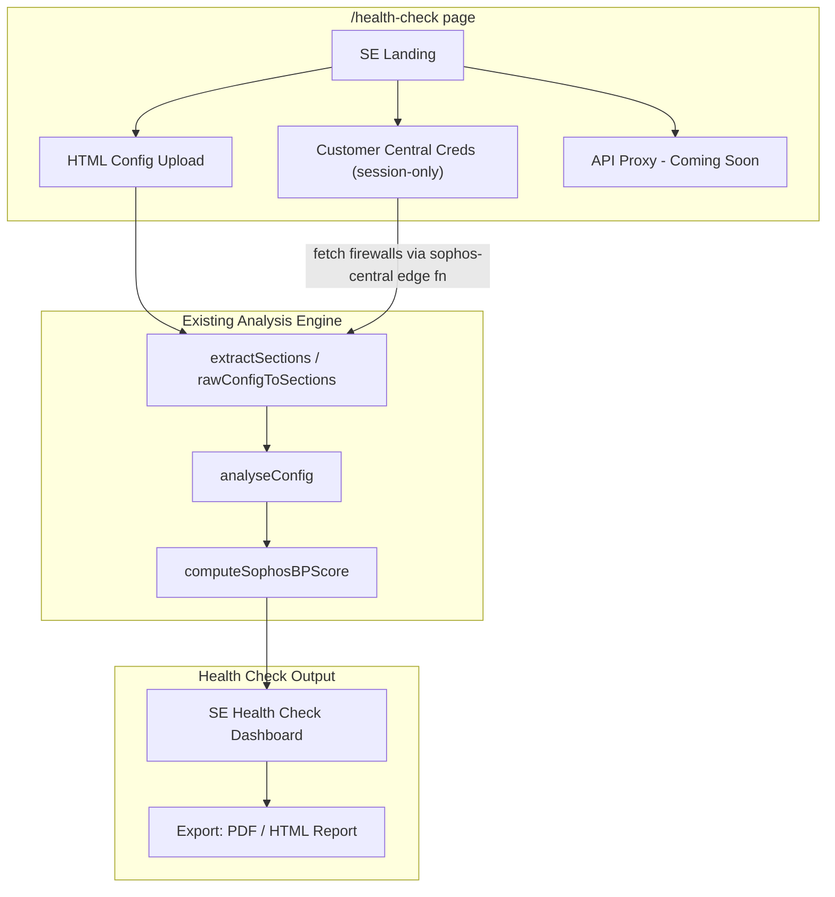

# Sophos SE Firewall Health Check Tool

## Context

Sophos Sales Engineers currently fill out health check documents manually. This feature gives them a dedicated tool that:
- Runs automated Sophos best-practice checks against a customer's firewall
- Produces a professional health check report they can hand to the customer
- Is separate from the MSP compliance workflow

The customer either shares their Central API credentials or an HTML config export. Sophos is building an API proxy through Central in the future, which would allow direct firewall interrogation without config exports — we build the foundation now and label that path "coming soon".

## Architecture

## Data Sources (v0)

### 1. HTML config viewer upload (ready now)
- Same as MSP flow: `extractSections()` parses HTML, feeds `analyseConfig()`
- No raw XML/full config required — customers are comfortable sharing config viewer exports

### 2. Customer-provided Central API credentials (ready now)
- Customer gives SE their Central client ID + secret
- **Session-only**: credentials are held in React state for the session, **not persisted** to `central_credentials` table
- SE calls the existing `sophos-central` edge function with a new `ephemeral: true` flag so the backend authenticates and fetches firewalls/alerts/licences without writing to DB
- After session ends (tab close / navigate away), credentials are gone

### 3. Sophos Central API proxy (coming soon)
- When Sophos ships their Central-to-firewall API proxy, SEs could pull live firewall config directly through Central
- Show a locked card with "Coming Soon" badge, link to Sophos roadmap/docs
- Foundation: a `HealthCheckSource` type union that already includes `"api-proxy"` so the pipeline is ready

## Key Files to Create / Modify

### New files
- **[`src/pages/HealthCheck.tsx`](src/pages/HealthCheck.tsx)** — dedicated SE page; no `useAuth` org requirement, no MSP sidebar. Clean layout: data-source picker at top, analysis dashboard below, export controls
- **[`src/components/health-check/SELanding.tsx`](src/components/health-check/SELanding.tsx)** — data source cards (Upload / Central / API Proxy coming soon)
- **[`src/components/health-check/SECentralConnect.tsx`](src/components/health-check/SECentralConnect.tsx)** — ephemeral Central credential form (adapted from `CentralIntegration.tsx` but session-only)
- **[`src/components/health-check/HealthCheckDashboard.tsx`](src/components/health-check/HealthCheckDashboard.tsx)** — best-practice results view (derived from `SophosBestPractice.tsx`, stripped of licence tier selection UI)
- **[`src/components/health-check/HealthCheckReport.tsx`](src/components/health-check/HealthCheckReport.tsx)** — exportable report layout (PDF/HTML) using `report-export.ts` patterns

### Modified files
- **[`src/App.tsx`](src/App.tsx)** — add `<Route path="/health-check" element={<HealthCheck />} />` (lazy-loaded)
- **[`supabase/functions/sophos-central/index.ts`](supabase/functions/sophos-central/index.ts)** — support `ephemeral: true` on `connect` mode: authenticate with Sophos, return token + tenant/firewall data, but skip the `central_credentials` upsert. Potentially a new `mode: "ephemeral-session"` that does OAuth + whoami + tenant list in one call without DB writes

## What We Reuse (no changes needed)

- **[`src/lib/analyse-config.ts`](src/lib/analyse-config.ts)** — full analysis engine, 40+ finding sections
- **[`src/lib/sophos-licence.ts`](src/lib/sophos-licence.ts)** — `BEST_PRACTICE_CHECKS`, `computeSophosBPScore()`, module/tier definitions
- **[`src/lib/extract-sections.ts`](src/lib/extract-sections.ts)** — HTML config parsing
- **[`src/lib/report-export.ts`](src/lib/report-export.ts)** — PDF/HTML/Word export infrastructure
- **[`src/lib/policy-baselines.ts`](src/lib/policy-baselines.ts)** — `sophos-firewall-audit-inspired` template for structured pass/fail

## SE Health Check Dashboard Design

The dashboard is purpose-built for SEs — focused, no noise:

1. **Health Score Gauge** — overall grade (A-F) from `computeSophosBPScore`, prominent at top
2. **Category Breakdown** — expandable cards per category (Device Hardening, Visibility & Monitoring, Encryption & Inspection, etc.) showing pass/fail/warn per check with Sophos doc links
3. **Critical Findings** — top-severity items needing immediate attention, with remediation steps
4. **Sophos Firewall Audit Baseline** — `evaluateBaseline()` against `sophos-firewall-audit-inspired` template, showing requirement-level pass/fail
5. **Licence Recommendations** — if Central licences are available, show what modules are active vs what would improve the score (natural upsell moment for SEs)
6. **"Coming Soon" Card** — API proxy live monitoring, with Sophos branding and a brief explanation

## Export: SE Health Check Report

- **PDF**: Branded Sophos-style (not FireComply MSP branding) health check document with: executive summary, overall grade, category scores, top findings + remediation, baseline compliance
- **Interactive HTML**: Self-contained HTML with collapsible categories, filterable findings (reuse pattern from the planned interactive HTML export feature)
- Both leverage existing `buildPdfHtml` / report export patterns from [`src/lib/report-export.ts`](src/lib/report-export.ts)

## Auth Model

- The `/health-check` page does **not** require a FireComply org or user account
- Optional: SE can sign in to save health check history (future enhancement, not v0)
- Guest mode (`isGuest: true`) is already supported by the existing analysis engine
- No Central credentials are persisted — session-only React state

## "Coming Soon" Pattern

Follow existing patterns from the codebase:
- Disabled card with lock icon and tooltip (like `RemediationPlaybooks.tsx` auto-fix button)
- "Coming Soon" badge
- Brief copy: "When Sophos ships the Central API proxy, run live health checks directly through Central — no config export needed."

## Implementation Order

Features are ordered so each builds on the last and delivers standalone value at each step.
