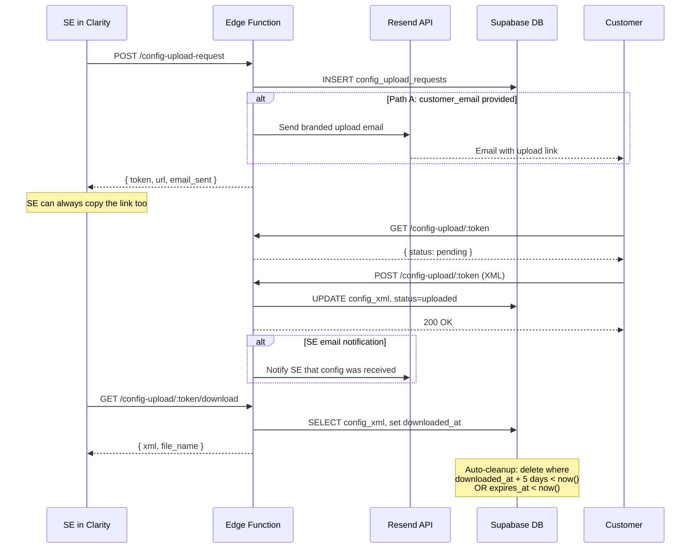

# Secure Config Upload Link

## Flow

Two paths for the SE to get the link to the customer:

**Path A — Auto-email (default, for pre-call prep):** SE enters customer email, system sends a branded Sophos email with the upload link automatically via Resend.

**Path B — Quick copy link (fallback, for on-call):** SE skips the email field, gets a copyable URL to paste into the call chat or share however they want.




## Database

New migration file: `supabase/migrations/2025XXXX_config_upload_requests.sql`

```sql
create table public.config_upload_requests (
  id             uuid primary key default gen_random_uuid(),
  se_user_id     uuid not null references public.se_profiles(id),
  token          text not null unique default gen_random_uuid()::text,
  customer_name  text,
  customer_email text,
  se_email       text,
  expires_at     timestamptz not null,
  status         text not null default 'pending'
                   check (status in ('pending','uploaded','downloaded','expired')),
  config_xml     text,
  file_name      text,
  email_sent     boolean not null default false,
  reminder_sent  boolean not null default false,
  uploaded_at    timestamptz,
  downloaded_at  timestamptz,
  created_at     timestamptz not null default now()
);

create index idx_config_upload_token
  on public.config_upload_requests(token);

alter table public.config_upload_requests enable row level security;

create policy "se_insert_own" on public.config_upload_requests
  for insert with check (
    se_user_id in (select id from public.se_profiles where user_id = auth.uid())
  );

create policy "se_select_own" on public.config_upload_requests
  for select using (
    se_user_id in (select id from public.se_profiles where user_id = auth.uid())
  );
```

- `customer_email` — optional; when provided, the system auto-sends the upload link via Resend
- `se_email` — the SE's email, used to send a notification when the customer uploads
- `email_sent` — tracks whether the outbound email was sent successfully
- Public reads/writes go through the edge function using `adminClient()` (service role), same pattern as `shared-health-check`

## Edge Function Routes

Add to [supabase/functions/api/index.ts](supabase/functions/api/index.ts). Reuse the Resend email pattern from [supabase/functions/send-scheduled-reports/index.ts](supabase/functions/send-scheduled-reports/index.ts).

- `**POST /api/config-upload-request**` (JWT required, SE only)
  - Body: `{ customer_name?, customer_email?, expires_in_days: 1|3|7|14|30 }`
  - Creates row in `config_upload_requests`
  - If `customer_email` is provided: sends branded email to customer via Resend with the upload link
  - Stores the SE's email (from JWT user) in `se_email` for upload notifications
  - Returns `{ token, url, expires_at, email_sent }`
- `**GET /api/config-upload/:token**` (public, no auth)
  - Returns `{ status, customer_name, expires_at }` or 404/410
  - Used by the customer upload page to check status before showing the form
- `**POST /api/config-upload/:token**` (public, no auth)
  - Accepts `Content-Type: text/xml` or `multipart/form-data` with XML file
  - Validates:
    - File extension is `.xml`
    - Size under 10 MB
    - Token is valid and not expired
    - Status is `pending` or `uploaded` (allows re-upload before SE downloads)
    - **Server-side XML validation**: content starts with `<?xml`, contains recognizable Sophos entity tags (e.g. `<Response>`, `<FirewallRule>`, `<NATRule>`, etc.). Rejects with a clear error if the file doesn't look like a Sophos config export.
  - Updates row: `config_xml`, `file_name`, `status = 'uploaded'`, `uploaded_at`
  - Sends notification email to the SE (`se_email`): "Customer X has uploaded their config — open Clarity to run the health check"
  - Logs to `audit_log`
- `**POST /api/config-upload/:token/resend`** (JWT required, SE must own)
  - Re-sends the upload request email to `customer_email`
  - Returns `{ email_sent }` or error if no email on file
- `**GET /api/config-upload/:token/download`** (JWT required, SE must own the row)
  - Returns `{ config_xml, file_name }`
  - Sets `downloaded_at = now()`, `status = 'downloaded'`
  - Logs to `audit_log`
- `**GET /api/config-upload-requests`** (JWT required)
  - Returns all upload requests for the authenticated SE, ordered by `created_at desc`
  - Fields: `id, token, customer_name, customer_email, status, expires_at, uploaded_at, downloaded_at, created_at`
  - Does NOT return `config_xml` (too large for a list endpoint)
  - Used by the "My Upload Requests" panel
- `**DELETE /api/config-upload/:token`** (JWT required, SE must own)
  - Revokes/deletes the upload request
  - Logs to `audit_log`

### Email Templates

Two emails, both using simple branded HTML (Sophos logo, dark header, clean body):

1. **Customer upload request email** (sent to `customer_email`)
  - Subject: "Sophos Firewall Health Check — Configuration Upload"
  - Body: "{SE name} from Sophos has requested your firewall configuration for a health check. Click the button below to securely upload your entities.xml file. This link expires on {date}."
  - CTA button: "Upload Configuration"
2. **SE notification email** (sent to `se_email` when customer uploads)
  - Subject: "Config received from {customer_name}"
  - Body: "{customer_name} has uploaded their firewall configuration. Open Clarity to run the health check."
  - CTA button: "Open Clarity"
3. **Expiry reminder email** (sent to `customer_email`, 24h before expiry, if still pending)
  - Subject: "Reminder: Sophos Firewall Configuration Upload"
  - Body: "Your Sophos SE is still waiting for your firewall configuration. Please upload your entities.xml before this link expires on {date}."
  - CTA button: "Upload Configuration"

## Cleanup and Expiry Reminder

Add via `pg_cron` (or a lightweight Supabase scheduled edge function):

- **Cleanup**: delete rows where `expires_at < now()` (link expired) or `downloaded_at + interval '5 days' < now()` (retention exceeded). Log `config_upload.expired` to audit_log before deletion.
- **Expiry reminder** (runs daily): for rows where `status = 'pending'` and `customer_email is not null` and `expires_at` is within the next 24 hours and `reminder_sent = false` — send a reminder email to the customer: "Your Sophos SE is still waiting for your firewall config. Upload it before the link expires on {date}." Set `reminder_sent = true` to prevent duplicate sends.

### Graceful email failure

If Resend is unavailable or returns an error, the upload request is still created and the URL is returned. The SE sees a warning ("Email could not be sent — share the link manually") with the copy-link ready. The `email_sent` flag stays `false`.

## Frontend: Customer Upload Page

New page: `src/pages/ConfigUpload.tsx`, route: `/upload/:token`

- Minimal, Sophos-branded page (dark background, Sophos logo, same style as [src/pages/SharedHealthCheck.tsx](src/pages/SharedHealthCheck.tsx))
- States: loading, ready (drag-and-drop zone), uploading, success, expired, not-found, error (invalid XML)
- Accepts only `.xml` files, max 10 MB
- No login required
- **Re-upload support**: if the customer has already uploaded but the SE hasn't downloaded yet, show the previously uploaded filename with a "Replace" button to upload a different file
- **Upload progress bar**: shows progress for larger files on slower connections to prevent the customer from closing the tab
- **"How to export" collapsible section**: step-by-step instructions for exporting entities.xml from Sophos Firewall (e.g. "Log in to your Sophos Firewall web admin > Backup & firmware > Export configuration > Download entities.xml"). Collapsed by default so it doesn't overwhelm, but available if the customer needs it.
- **Privacy / data handling section** at the bottom of the upload area:
  - "Your configuration file is encrypted in transit (TLS) and at rest"
  - "Files are automatically deleted 5 days after your Sophos SE downloads them"
  - "Your data is used solely for firewall health check analysis"
  - Small lock icon + Sophos branding for trust
- **Validation feedback**: if the uploaded file isn't valid Sophos XML, show a clear error ("This doesn't appear to be a Sophos firewall configuration export. Please export your entities.xml from Sophos Firewall and try again.")
- Success state shows a confirmation message ("Your configuration has been securely uploaded. Your Sophos SE will review it shortly.")

New route in [src/App.tsx](src/App.tsx):

```tsx
<Route path="/upload/:token" element={<ConfigUpload />} />
```

## Frontend: SE-Side (HealthCheck2)

### Request Config Upload Dialog

Add to [src/pages/HealthCheck2.tsx](src/pages/HealthCheck2.tsx):

- **"Request Config Upload" button** in the file upload area (alongside the existing drag-and-drop)
- Opens a dialog with:
  - Customer name field (optional but encouraged)
  - **Customer email field** (optional) — if filled, system auto-emails the link
  - Expiry selector: 1 day, 3 days, 7 days, 14 days, 30 days (default 7)
  - "Send Upload Request" button (when email provided) / "Create Upload Link" button (when no email)
- After creation:
  - If email was sent: success message "Upload link sent to [customer@example.com](mailto:customer@example.com)"
  - **Always shows a copyable URL** so the SE can also share it manually on-call
  - **Resend Email button** — if the customer says they didn't get it, SE can resend with one click
  - Status badge: pending / uploaded
- **Polling** (every 10s) to check if customer has uploaded
- When status changes to `uploaded`: show a "Load Config" button that downloads the XML from the API and feeds it into the existing `parseEntitiesXml` -> `rawConfigToSections` pipeline, exactly as if the SE had drag-dropped the file locally
- Revoke button to delete the upload request

### My Upload Requests Panel

- Small collapsible panel on HealthCheck2 (or accessible from a tab/drawer) showing the SE's active upload requests
- Fetches from `GET /api/config-upload-requests`
- Each row shows: customer name, status badge (pending/uploaded/downloaded/expired), created date, expiry date
- Click a row to:
  - **Pending**: copy link, resend email, revoke
  - **Uploaded**: load config into health check, copy link, revoke
  - **Downloaded**: re-download (within 5-day retention window)
- This lets the SE come back to Clarity after closing the browser and pick up where they left off

## Audit Logging

Log the following events to the existing `audit_log` table (same pattern as other SE actions):

- `config_upload.request_created` — SE created an upload request
- `config_upload.email_sent` — upload link emailed to customer
- `config_upload.uploaded` — customer uploaded a config file
- `config_upload.downloaded` — SE downloaded the config
- `config_upload.revoked` — SE revoked/deleted the request
- `config_upload.expired` — request auto-expired (logged during cleanup)

Each entry includes: `se_user_id`, `resource_id` (the request id), `customer_name`, and relevant metadata.

## Security Summary

- Unguessable UUID tokens (same as existing share links)
- HTTPS in transit (Supabase/Vercel default)
- Encrypted at rest (Supabase Postgres default)
- Configurable expiry up to 30 days
- 5-day post-download retention, then hard delete
- XML-only validation + 10 MB size cap + server-side Sophos entity structure check
- Re-upload allowed only before SE downloads (prevents tampering after SE has acted on it)
- SE auth required to download, resend, or revoke
- No customer login required
- Full audit trail in `audit_log`
- Privacy messaging on the customer upload page

## Future: SE Handoff

Not in v1, but worth noting for later: if the SE who created the request is off sick or unavailable, a colleague currently can't access the upload request or download the config. A future enhancement could allow any SE (or SEs in the same team/region) to "claim" an orphaned request. For now, the workaround is that another SE creates a new upload request and sends the customer a fresh link.

