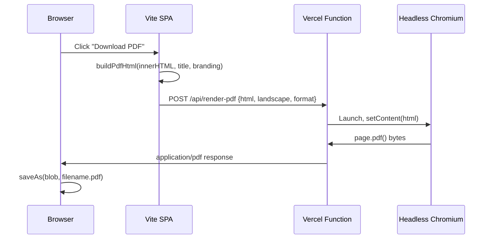

# Serverless PDF Rendering via Headless Chromium

## Current state

- **Framework:** Vite + React SPA deployed on Vercel (static hosting)
- **PDF generation:** `pdfmake` produces PDF bytes client-side, with a fallback to `openHtmlForPrint` (browser print dialog) on failure
- **Themed HTML already exists:** `[src/lib/report-export.ts](src/lib/report-export.ts)` has `buildPdfHtml()` which generates a complete standalone HTML document with Zalando Sans fonts, rounded table corners, theme colors, and landscape A4 `@page` rules
- **No existing Vercel serverless functions** -- the `api/` path is already excluded from the SPA catch-all rewrite in `vercel.json`, so new functions in `api/` will route correctly
- **Backend:** Supabase Edge Functions (Deno-based, cannot run headless Chrome)

## Architecture



## Dependencies to add

- `**puppeteer-core**` -- Puppeteer without bundled Chromium (~2 MB)
- `**@sparticuz/chromium**` -- Chromium binary optimized for serverless/Lambda environments (~50 MB compressed)

**Important:** Vercel Hobby plan limits serverless functions to 50 MB compressed. `@sparticuz/chromium` alone is ~50 MB, so this effectively requires **Vercel Pro** (250 MB limit). If on Hobby, we can use `@sparticuz/chromium-min` instead, which downloads the binary from a CDN at runtime (adds ~2-3s cold start latency but fits within size limits).

## Files to create

### 1. `api/render-pdf.ts` -- Vercel serverless function

Accepts a POST with `{ html: string, landscape?: boolean, format?: string }`. Launches Chromium, loads the HTML via `page.setContent()`, calls `page.pdf()` with landscape A4 settings, and returns the PDF bytes with `Content-Type: application/pdf`.

Key implementation details:

- Use `@sparticuz/chromium` to get the executable path
- Set `page.setContent(html, { waitUntil: 'networkidle0' })` so Google Fonts finish loading before render
- `page.pdf({ format: 'A4', landscape: true, printBackground: true })` -- `printBackground: true` is critical for theme colors and fills
- Add a reasonable timeout (25s) and error handling
- CORS headers for the SPA origin

### 2. `src/lib/pdf-render-client.ts` -- client-side helper

```typescript
export async function renderPdfViaServer(
  html: string,
  opts?: { landscape?: boolean; format?: string },
): Promise<Blob> {
  const res = await fetch("/api/render-pdf", {
    method: "POST",
    headers: { "Content-Type": "application/json" },
    body: JSON.stringify({ html, ...opts }),
  });
  if (!res.ok) throw new Error(`PDF render failed: ${res.status}`);
  return res.blob();
}
```

## Files to modify

### 3. Call sites (4 files) -- replace pdfmake with server render

Each call site currently does:

```typescript
try {
  const { generateMarkdownReportPdfBlob } = await import("@/lib/assessment-report-pdfmake");
  const blob = await generateMarkdownReportPdfBlob(markdown, opts);
  saveAs(blob, filename);
} catch {
  // fallback to print dialog
}
```

Change to:

```typescript
try {
  const html = buildPdfHtml(innerHTML, title, branding, { theme });
  const { renderPdfViaServer } = await import("@/lib/pdf-render-client");
  const blob = await renderPdfViaServer(html, { landscape: true });
  saveAs(blob, filename);
} catch {
  // fallback to pdfmake, then print dialog
}
```

Files:

- `[src/components/DocumentPreview.tsx](src/components/DocumentPreview.tsx)` -- `handlePdf`
- `[src/pages/SharedReport.tsx](src/pages/SharedReport.tsx)` -- `handlePdf`
- `[src/pages/SavedReportViewer.tsx](src/pages/SavedReportViewer.tsx)` -- PDF handler
- `[src/pages/ClientPortal.tsx](src/pages/ClientPortal.tsx)` -- `handleDownloadPdf`

**Fallback chain:** Server render (primary) -> pdfmake (secondary) -> print dialog (last resort). This ensures PDF downloads still work if the serverless function is unavailable.

### 4. `vercel.json` -- function configuration

Add a `functions` block to give the PDF renderer enough memory and timeout:

```json
"functions": {
  "api/render-pdf.ts": {
    "memory": 1024,
    "maxDuration": 30
  }
}
```

### 5. Changelog updates

- `[src/pages/ChangelogPage.tsx](src/pages/ChangelogPage.tsx)` -- add entry for improved PDF rendering
- `[src/data/platform-update-highlights.ts](src/data/platform-update-highlights.ts)` -- update highlights

## Considerations

- **Cold starts:** First invocation after idle may take 3-5s while Chromium binary loads. Subsequent requests reuse the warm instance. Consider showing a loading spinner/toast during PDF generation.
- **Google Fonts loading:** `waitUntil: 'networkidle0'` ensures Zalando Sans finishes loading from Google Fonts CDN before rendering. If this is slow, we can embed fonts inline as base64 `@font-face` in the HTML.
- **Request size:** The HTML payload (including base64 logos) should be well under Vercel's 4.5 MB request body limit for typical reports.
- **SE Health Check PDF:** Uses a separate pdfmake pipeline (`se-health-check-pdfmake-v2`). Not converted in this plan -- can be done as follow-up work.
- **InsuranceReadiness PDF:** Currently uses `printHtmlInHiddenIframe`. Could also be converted but is lower priority.
