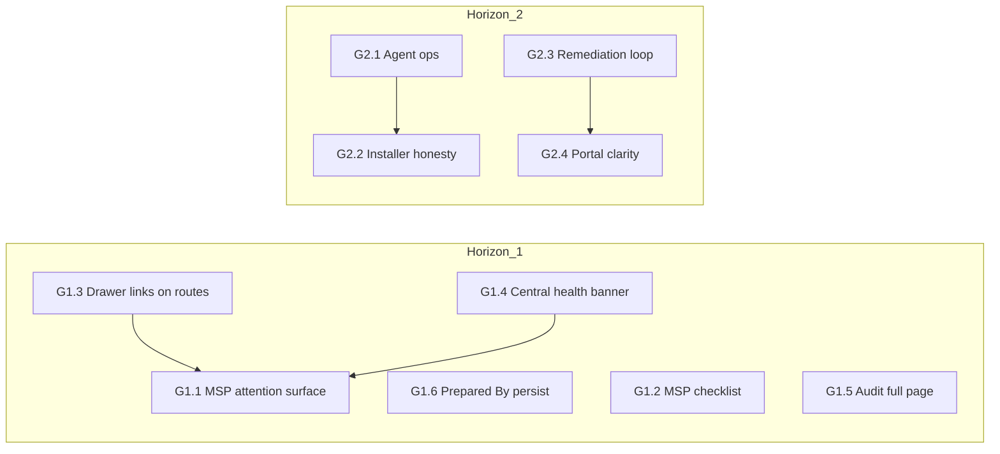

# Sophos FireComply — gaps and improvements roadmap

**Purpose:** Turn [sophos-firewall-msp-product-inventory.md](./sophos-firewall-msp-product-inventory.md) into **actionable planning**: phased work, dependencies, acceptance criteria, and engineering hints.  
**Audience:** PM, engineering lead, partner success.  
**Not:** committed delivery dates — adjust per team capacity.

**Full epic checklist (all G1.1–G1.6, G2.x, G3.x + X1–X4 in one view):** [sophos-firewall-master-execution.md](./sophos-firewall-master-execution.md).

---

## How to read this doc

- **Horizon 1** — Highest MSP/partner impact, mostly composes existing data/UI.
- **Horizon 2** — New integrations or schema; medium risk.
- **Horizon 3** — Strategic or heavy platform (PSA depth, trust centre, self-host).

Each item: **Gap** → **Why it matters** → **Today** → **Target** → **Dependencies** → **Acceptance criteria** → **Where in codebase** (when known).

---

## Epic status (shipped vs remaining)

Quick checklist; file anchors live in [sophos-firewall-master-execution.md](./sophos-firewall-master-execution.md).

**Horizon 1**

- [x] G1.1 MSP attention / command surface
- [x] G1.2 First-run MSP checklist
- [x] G1.3 Workspace settings strip on Fleet / Customers / Insights
- [x] G1.4 Central connection health banner
- [x] G1.5 Audit full-screen `/audit` + export
- [x] G1.6 Prepared By / report footer persistence (`report_template`)

**Horizon 2**

- [x] G2.1 Agent operations (version, fleet health signals)
- [x] G2.2 Installer / deploy matrix + honest CTAs
- [x] G2.3 Remediation loop (playbook links + `remediation_status`)
- [x] G2.4 Portal consultant vs customer tabs + live link
- [x] G2.5 Regulatory digest surfaced in settings
- [x] G2.6 Data lifecycle copy in drawer

**Horizon 3**

- [x] G3.3 Trust centre `/trust`
- [x] G3.4 Supported SFOS versions doc + in-app link
- [x] G3.5 Baseline self-host **runbook** only ([SELF-HOSTED.md](../SELF-HOSTED.md))
- [ ] G3.5 Docker / Helm in-repo (deferred until on-prem customer need)
- **G3.1** (depth ongoing — see section below)
  - [x] ConnectWise Cloud + Manage ticket MVP (idempotency, audit)
  - [x] Persisted **customer ↔ Manage company** mapping (`psa_customer_company_map` + settings UI)
  - [x] **Autotask PSA (Datto)** MVP (credentials, mapping, tickets from findings)
  - [ ] Auto-ticket on assessment complete; Halo (or third PSA)
- **G3.2** (scopes ongoing — see section below)
  - [x] Issue / revoke UI + Edge paths; `api:read` → `GET /api/firewalls`; `api:read:assessments` → `GET /api/assessments`
  - [ ] Further issuable scopes / routes as automation needs grow

**Cross-cutting**

- [x] X4 Changelog `/changelog`
- [ ] X1, X2, X3 (ongoing — role toasts, telemetry ingest, E2E breadth)

---

## Horizon 1 — Quick composability (weeks-scale epics)

### G1.1 MSP attention / command surface

| Field             | Detail                                                                                                                                                                                                                                                                                                                                                        |
| ----------------- | ------------------------------------------------------------------------------------------------------------------------------------------------------------------------------------------------------------------------------------------------------------------------------------------------------------------------------------------------------------- |
| **Inventory ref** | §7 MSP multi-customer                                                                                                                                                                                                                                                                                                                                         |
| **Why**           | MSPs need one place answering: “What needs me today?” without opening Insights, Fleet, Customers, and the drawer separately.                                                                                                                                                                                                                                  |
| **Today**         | Portfolio Insights, Fleet, Customers, drawer dashboard widgets each hold slices of signal.                                                                                                                                                                                                                                                                    |
| **Target**        | A **single route or above-the-fold section** (e.g. `/` hero when signed in, or `/home`) listing: customers with **stale assessments** (>N days), **offline / error agents**, **lowest scores**, optional **critical finding count** when data exists. Each row deep-links to Assess (`/?customer=…`), Fleet, Customers, or `/?panel=settings&section=agents`. |
| **Dependencies**  | None blocking; reuse `assessments`, `agents`, `agent_submissions`, existing `resolveCustomerName` patterns.                                                                                                                                                                                                                                                   |
| **Acceptance**    | (1) Configurable or fixed staleness threshold documented. (2) Empty state when org healthy. (3) No duplicate full page of Fleet — **summary + links** only.                                                                                                                                                                                                   |
| **Code hints**    | New thin page or `Index` banner component; queries similar to [PortfolioInsights.tsx](../../src/pages/PortfolioInsights.tsx), [FleetCommand.tsx](../../src/pages/FleetCommand.tsx).                                                                                                                                                                           |

### G1.2 First-run MSP checklist

| Field             | Detail                                                                                                                                                                                             |
| ----------------- | -------------------------------------------------------------------------------------------------------------------------------------------------------------------------------------------------- |
| **Inventory ref** | §3 Core assessment                                                                                                                                                                                 |
| **Why**           | Reduces TTFV (time to first value) and support tickets (“where do I connect Central?”).                                                                                                            |
| **Today**         | Setup wizard, scattered deep links on ApiHub.                                                                                                                                                      |
| **Target**        | Dismissible checklist on Assess (org admins): Central connected · first agent registered · first assessment saved · portal slug set. Uses **`buildManagePanelSearch`** / org button for each step. |
| **Dependencies**  | Optional: persist “dismissed” per user or org in `portal_config` JSON or new column — or localStorage for v1.                                                                                      |
| **Acceptance**    | Each step has **one primary CTA**; respects viewer role (hide admin steps).                                                                                                                        |
| **Code hints**    | [Index.tsx](../../src/pages/Index.tsx), [workspace-deeplink.ts](../../src/lib/workspace-deeplink.ts), [CentralIntegration.tsx](../../src/components/CentralIntegration.tsx).                       |

### G1.3 Discoverability: drawer links from Fleet / Customers / Insights

| Field             | Detail                                                                                                                                    |
| ----------------- | ----------------------------------------------------------------------------------------------------------------------------------------- | ------ | ---------------------- |
| **Inventory ref** | §4 Management drawer                                                                                                                      |
| **Why**           | Drawer only mounts on Assess; users on other routes still need “open Central settings” without memorising URLs.                           |
| **Today**         | ApiHub has `WorkspacePanelLink`; other nav pages may not.                                                                                 |
| **Target**        | Short **“Workspace settings”** link strip or footer on Fleet, Customers, Portfolio Insights pointing to `/?panel=settings&section=central | agents | webhooks` as relevant. |
| **Dependencies**  | None.                                                                                                                                     |
| **Acceptance**    | Same query contract as [workspace-deeplink.ts](../../src/lib/workspace-deeplink.ts); no second param scheme.                              |
| **Code hints**    | Extract small **shared component** from ApiHub or import helper only in each page header.                                                 |

### G1.4 Central connection health (single story)

| Field             | Detail                                                                                                                                                                      |
| ----------------- | --------------------------------------------------------------------------------------------------------------------------------------------------------------------------- |
| **Inventory ref** | §5 Sophos Central                                                                                                                                                           |
| **Why**           | Partners blame “wrong scores” when sync is stale; one visible **last sync / error** story reduces churn.                                                                    |
| **Today**         | Header dot, popover refresh; errors sometimes only in console.                                                                                                              |
| **Target**        | **Banner or inline status** on Assess + Fleet when `last_synced_at` older than threshold OR last Central call failed: message + link to `/?panel=settings&section=central`. |
| **Dependencies**  | Reliable error propagation from [sophos-central](../../supabase/functions/sophos-central/index.ts) / client status API.                                                     |
| **Acceptance**    | Copy distinguishes **disconnected** vs **stale** vs **error**.                                                                                                              |
| **Code hints**    | [AppHeader.tsx](../../src/components/AppHeader.tsx) CentralStatusDot; [getCentralStatus](../../src/lib/sophos-central.ts).                                                  |

### G1.5 Audit log — full-screen + export (MVP)

| Field             | Detail                                                                                                                         |
| ----------------- | ------------------------------------------------------------------------------------------------------------------------------ |
| **Inventory ref** | §11 API / observability                                                                                                        |
| **Why**           | Compliance buyers won’t use a drawer accordion for evidence.                                                                   |
| **Today**         | [AuditLog.tsx](../../src/components/AuditLog.tsx) in drawer with CSV/JSON export (verify).                                     |
| **Target**        | Route **`/audit`** (or `/activity`) that **reuses** `loadAuditLog` + same filters/export; link from drawer “Open full screen”. |
| **Dependencies**  | RLS unchanged; auth same as rest of app.                                                                                       |
| **Acceptance**    | Feature parity with drawer audit for v1; responsive table.                                                                     |
| **Code hints**    | [audit.ts](../../src/lib/audit.ts), new page + nav (optional: admin-only).                                                     |

### G1.6 Persist “Prepared By” and report footer (org defaults)

| Field             | Detail                                                                                                                                                                                                                                                                                                                                                           |
| ----------------- | ---------------------------------------------------------------------------------------------------------------------------------------------------------------------------------------------------------------------------------------------------------------------------------------------------------------------------------------------------------------- |
| **Inventory ref** | §3 Core assessment / branding                                                                                                                                                                                                                                                                                                                                    |
| **Why**           | First-time setup ([SetupWizard](../../src/components/SetupWizard.tsx)) collects **Prepared By** and **Report Footer Text** for report attribution, but users re-enter them every session because persistence only kicks in after reports exist ([use-session-persistence](../../src/hooks/use-session-persistence.ts) auto-save requires reports with markdown). |
| **Today**         | [BrandingData.preparedBy](../../src/components/BrandingSetup.tsx) / `footerText` in memory; `company_logo` already merges into `organisations.report_template` ([use-company-logo](../../src/hooks/use-company-logo.ts)).                                                                                                                                        |
| **Target**        | For signed-in org users: **read** `prepared_by` + `report_footer_text` (or agreed key names) from `organisations.report_template` on load into `branding`; **write** on blur or debounced change (same merge pattern as logo). Optional: **guest** localStorage key for Prepared By only. Complements G1.2 checklist step “branding”.                            |
| **Dependencies**  | None blocking. **Care:** [ReportTemplateSettings](../../src/components/ReportTemplateSettings.tsx) saves whole `report_template` JSON — merges must preserve branding keys (or split advanced JSON from branding fields).                                                                                                                                        |
| **Acceptance**    | (1) After saving once, reopening setup wizard / new browser session shows saved Prepared By (and footer if included). (2) No regression to report export ([report-export](../../src/lib/report-export.ts)). (3) Viewers: read-only use of org default; editors can update if `canManageTeam`.                                                                    |
| **Code hints**    | [Index.tsx](../../src/pages/Index.tsx) branding init; [SetupWizard](../../src/components/SetupWizard.tsx); [BrandingSetup](../../src/components/BrandingSetup.tsx).                                                                                                                                                                                              |

---

## Horizon 2 — Product depth (month-scale epics)

### G2.1 Agent operations dashboard

| Field             | Detail                                                                                                                                                                                                    |
| ----------------- | --------------------------------------------------------------------------------------------------------------------------------------------------------------------------------------------------------- |
| **Inventory ref** | §6 Connector agents                                                                                                                                                                                       |
| **Why**           | MSPs run dozens of agents; table + per-agent sheet is not enough for **fleet health**.                                                                                                                    |
| **Today**         | `agents.error_message`, `last_seen_at`, submission counts; ApiHub sheet.                                                                                                                                  |
| **Target**        | **Agent version** field (if not present: add to agent heartbeat payload + column), **failure rate** (last 7d), **last N errors** aggregated. Optional **“update available”** when you ship semver in API. |
| **Dependencies**  | Connector release process to send version; migration for `agent_version` if needed.                                                                                                                       |
| **Acceptance**    | Fleet view filters: offline, error, outdated version.                                                                                                                                                     |
| **Code hints**    | [api-agent](../../supabase/functions/api-agent/index.ts), [agents](../../src/integrations/supabase/types.ts) table, [AgentFleetPanel](../../src/components/AgentFleetPanel.tsx).                          |

### G2.2 Installer / update distribution (honest UX)

| Field             | Detail                                                                                                                              |
| ----------------- | ----------------------------------------------------------------------------------------------------------------------------------- |
| **Inventory ref** | §6                                                                                                                                  |
| **Why**           | Placeholder download buttons erode trust.                                                                                           |
| **Today**         | ApiHub “Deploy” buttons may not point to real artefacts.                                                                            |
| **Target**        | Either **real URLs** (releases bucket / GitHub) or **“Contact for installer”** until GA; version matrix (Linux ARM/x64) documented. |
| **Dependencies**  | Release pipeline owning binaries.                                                                                                   |
| **Acceptance**    | No dead primary CTA; checksum or signing note if public download.                                                                   |

### G2.3 Remediation: finding → playbook + `remediation_status`

| Field             | Detail                                                                                                                                                                                                                                                                                                 |
| ----------------- | ------------------------------------------------------------------------------------------------------------------------------------------------------------------------------------------------------------------------------------------------------------------------------------------------------ |
| **Inventory ref** | §9 Compliance and remediation                                                                                                                                                                                                                                                                          |
| **Why**           | Closes the loop from **risk** to **tracked fix** per customer.                                                                                                                                                                                                                                         |
| **Today**         | `remediation_status` table exists; playbook library is separate route with `localStorage` completion.                                                                                                                                                                                                  |
| **Target**        | (1) Map **finding title** (or check id) → playbook id. (2) CTA on finding row: **Open playbook** (internal anchor or `/playbooks?highlight=`). (3) Optional **Mark done** → insert `remediation_status` keyed by org + customer + playbook_id. (4) Playbook library reads server state when signed in. |
| **Dependencies**  | Stable playbook ids (`BEST_PRACTICE_CHECKS[].id`); RLS policies on `remediation_status`.                                                                                                                                                                                                               |
| **Acceptance**    | Completing on one device reflects in library for same org user; document conflict rules (last write wins).                                                                                                                                                                                             |
| **Code hints**    | [auto-remediate.ts](../../src/lib/auto-remediate.ts), [PlaybookLibrary.tsx](../../src/pages/PlaybookLibrary.tsx), [sophos-licence](../../src/lib/sophos-licence.ts) checks.                                                                                                                            |

### G2.4 Portal: client vs consultant clarity

| Field             | Detail                                                                                                                                    |
| ----------------- | ----------------------------------------------------------------------------------------------------------------------------------------- |
| **Inventory ref** | §8 Reporting and portal                                                                                                                   |
| **Why**           | Reduces misconfigured portals and wrong expectations.                                                                                     |
| **Today**         | Client View dialog in drawer; portal configurator.                                                                                        |
| **Target**        | **Side-by-side preview** or labelled tabs “What customer sees” / “What you edit”; link to live `/portal/:slug` from configurator.         |
| **Dependencies**  | None technical blocking.                                                                                                                  |
| **Acceptance**    | PM sign-off on copy; no PII in preview if empty customer.                                                                                 |
| **Code hints**    | [PortalConfigurator.tsx](../../src/components/PortalConfigurator.tsx), [ClientPortalView.tsx](../../src/components/ClientPortalView.tsx). |

### G2.5 Regulatory scanner — user-visible value

| Field             | Detail                                                                                                                  |
| ----------------- | ----------------------------------------------------------------------------------------------------------------------- |
| **Inventory ref** | §9                                                                                                                      |
| **Why**           | [regulatory-scanner](../../supabase/functions/regulatory-scanner/index.ts) exists; invisible features don’t sell.       |
| **Target**        | Settings section or Compliance tab: **last run**, **summary**, link to diffs or email digest; optional cron wiring doc. |
| **Dependencies**  | Product decision on what to show (headlines only vs full text).                                                         |

### G2.6 Saved reports retention and lifecycle

| Field             | Detail                                                                                                                    |
| ----------------- | ------------------------------------------------------------------------------------------------------------------------- |
| **Inventory ref** | §8                                                                                                                        |
| **Why**           | Enterprise asks “how long do you keep configs?”                                                                           |
| **Today**         | `submission_retention_days` on org; plans in `docs/plans/retention_*`.                                                    |
| **Target**        | In-app **data lifecycle** copy + admin control alignment with actual cron/delete jobs; customer-facing DATA-PRIVACY link. |
| **Dependencies**  | Backend jobs must match UI numbers.                                                                                       |

---

## Horizon 3 — Strategic platform

### G3.1 PSA integration (first vendor)

| Field             | Detail                                                                                                                                                                                                           |
| ----------------- | ---------------------------------------------------------------------------------------------------------------------------------------------------------------------------------------------------------------- |
| **Inventory ref** | §7                                                                                                                                                                                                               |
| **Why**           | Webhooks are not tickets; MSPs live in PSA boards.                                                                                                                                                               |
| **Target**        | **One** deep integration (e.g. ConnectWise or Halo): OAuth or API key in org settings, **create ticket** from critical finding or assessment complete, **customer mapping** (FireComply customer ↔ PSA company). |
| **Dependencies**  | Vendor sandbox, legal, pricing.                                                                                                                                                                                  |
| **Acceptance**    | Idempotent ticket creation; audit log entry; failure alerts.                                                                                                                                                     |

**Shipped (2026-03):**

- [x] ConnectWise **Partner Cloud** credentials + token test + `whoami`
- [x] ConnectWise **Manage** credentials (per org), **create service ticket** from finding (bulk view), **idempotency** store, **audit** entry
- [x] Persisted **customer ↔ Manage company** mapping (table + PSA settings + ticket dialog / resolved customer key from Assess)
- [x] **Autotask PSA (Datto)** — credentials, customer ↔ company mapping, company query, idempotent tickets from findings, audit (`autotask_psa_credentials`, `provider = autotask`)
- [ ] **Auto-ticket** on assessment complete; **Halo** (or third PSA) pattern

### G3.2 Scoped API keys (org service accounts)

| Field             | Detail                                                                                                           |
| ----------------- | ---------------------------------------------------------------------------------------------------------------- |
| **Inventory ref** | §11                                                                                                              |
| **Why**           | MSP automation without sharing user JWTs.                                                                        |
| **Target**        | Table `api_keys` (hash, prefix, org_id, scopes, created_by); Edge validation path; rotate/revoke UI in settings. |
| **Dependencies**  | Security review; rate limits.                                                                                    |

**Shipped (2026-03):**

- [x] `org_service_api_keys` (hash, prefix, scopes, labels); Edge **`/service-key/ping`**, **`issue`**, **`revoke`**
- [x] Service-key auth on **`GET /api/firewalls`** (`api:read`) and **`GET /api/assessments`** (`api:read:assessments`)
- [x] **OrgServiceKeysSettings** UI (create with one-time secret, scope checkboxes, revoke)
- [ ] Further scopes/routes (see matrix in `supabase/functions/api/index.ts`)
- [ ] Rate limits (if not already covered elsewhere)

### G3.3 Trust centre / subprocessors page

| Field             | Detail                                                                                                                       |
| ----------------- | ---------------------------------------------------------------------------------------------------------------------------- |
| **Inventory ref** | §12                                                                                                                          |
| **Why**           | Procurement and Sophos partner security questionnaires.                                                                      |
| **Target**        | Public or auth-light `/trust` with subprocessors, retention summary, link to [DATA-PRIVACY.md](../DATA-PRIVACY.md), contact. |
| **Dependencies**  | Legal review of list.                                                                                                        |

### G3.4 Parser version matrix + support statement

| Field             | Detail                                                                 |
| ----------------- | ---------------------------------------------------------------------- |
| **Inventory ref** | §3                                                                     |
| **Why**           | Sets expectations for SFOS versions and export formats.                |
| **Target**        | Doc page + in-app “Supported versions” linked from upload empty state. |
| **Dependencies**  | QA matrix from real exports.                                           |

### G3.5 Self-hosted / single-tenant deployment (optional)

| Field             | Detail                                                                |
| ----------------- | --------------------------------------------------------------------- |
| **Inventory ref** | PRODUCT-ASSESSMENT                                                    |
| **Why**           | Some MSPs and regions require data residency not met by shared cloud. |
| **Target**        | Runbook + docker/helm; feature flags for AI keys. Large effort.       |

**Status:**

- [x] Starting **runbook** ([SELF-HOSTED.md](../SELF-HOSTED.md))
- [ ] **Docker / Helm** in-repo (deferred until a customer requires on-prem images)

---

## Cross-cutting improvements (any horizon)

| ID     | Theme                      | Notes                                                                                                           |
| ------ | -------------------------- | --------------------------------------------------------------------------------------------------------------- |
| **X1** | **Role-aware copy**        | When deep link hits `canManageTeam`-only section, toast: “Ask an org admin…” (pattern started in inventory §4). |
| **X2** | **Telemetry**              | Funnel: checklist completed, Central connect, first agent, first save — for PM iteration.                       |
| **X3** | **E2E tests**              | Critical paths: save report, open portal, agent submission (Playwright against staging).                        |
| **X4** | **Changelog / What’s new** | In-app modal or `/changelog` linked from header; reduces “is this demo data?” confusion.                        |

---

## Suggested sequencing (dependency-aware)

- **Parallelise:** G1.5 (audit page) with G1.2 (checklist) and **G1.6** (branding persist) — different files.
- **Before G1.1:** G1.3 + G1.4 make the attention surface links and Central story credible. **G1.6** is independent (small win for onboarding).
- **G2.1** before marketing **agent fleet** heavily.

---

## Effort rough sizing (T-shirt)

| ID   | S   | M   | L   | XL  |
| ---- | --- | --- | --- | --- |
| G1.1 |     |     | ✓   |     |
| G1.2 | ✓   |     |     |     |
| G1.3 | ✓   |     |     |     |
| G1.4 | ✓   |     |     |     |
| G1.5 |     | ✓   |     |     |
| G1.6 | ✓   |     |     |     |
| G2.1 |     |     | ✓   |     |
| G2.2 | ✓   |     |     |     |
| G2.3 |     |     | ✓   |     |
| G2.4 |     | ✓   |     |     |
| G2.5 |     | ✓   |     |     |
| G2.6 |     | ✓   |     |     |
| G3.1 |     |     |     | ✓   |
| G3.2 |     |     | ✓   |     |
| G3.3 | ✓   |     |     |     |
| G3.4 | ✓   |     |     |     |
| G3.5 |     |     |     | ✓   |

---

## Maintenance

- When an item ships, update the **Epic status** checklist at the top of this file and keep [sophos-firewall-master-execution.md](./sophos-firewall-master-execution.md) aligned.
- Revisit quarterly against [PRODUCT-ASSESSMENT.md](../PRODUCT-ASSESSMENT.md) and partner feedback.

_Created: 2026-03-29. Epic checklist updated: 2026-03-29._
