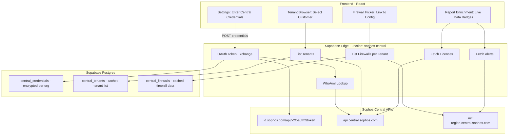

# Sophos Central API Integration

## Research Summary

The Sophos Central API is well-documented and provides everything we need. Key findings:

### Available API Endpoints

- **Auth**: `POST https://id.sophos.com/api/v2/oauth2/token` (client_credentials grant, returns JWT valid for 1 hour)
- **WhoAmI**: `GET https://api.central.sophos.com/whoami/v1` (returns partner ID, type, global apiHost)
- **List Tenants**: `GET https://api.central.sophos.com/partner/v1/tenants` (paginated, returns tenant name, id, dataRegion, apiHost, billingType)
- **List Firewalls**: `GET https://api-{region}.central.sophos.com/firewall/v1/firewalls` (per-tenant, returns serialNumber, hostname, firmwareVersion, model, HA cluster info, status, externalIPs, geoLocation)
- **Firewall Groups**: `GET https://api-{region}.central.sophos.com/firewall/v1/firewall-groups` (per-tenant, returns group id, name, assigned firewalls)
- **Alerts**: `GET https://api-{region}.central.sophos.com/common/v1/alerts` (per-tenant, security/connectivity/health alerts)
- **Licenses**: `GET https://api.central.sophos.com/licenses/v1/licenses` (per-tenant, returns licenseIdentifier, startDate, endDate, product.code, type)
- **MDR Threat Feed**: `GET https://api-{region}.central.sophos.com/firewall/v1/mdr-threat-feed` (per-tenant, active threat indicators)
- **Indicators**: `GET https://api-{region}.central.sophos.com/firewall/v1/indicators` (per-tenant, IOCs and threat intelligence)

### Firewall API Response (key fields per firewall)

```json
{
  "serialNumber": "C01001JYCGB4J30",
  "hostname": "FW-1",
  "name": "fw-label",
  "firmwareVersion": "SF01V_SO01_19.0.0.294",
  "model": "SFVUNL_SO01_SFOS 19.0.0 GA-Build294",
  "status": { "connected": true, "managing": "approvedByCustomer", "suspended": false },
  "cluster": { "mode": "activeActive", "status": "primary", "peers": [...] },
  "externalIpv4Addresses": ["111.93.156.226"],
  "geoLocation": { "latitude": "20.64", "longitude": "22.43" }
}
```

### Constraints

- **CORS**: Browser cannot call Sophos APIs directly. All calls must go through a backend proxy (Supabase Edge Function)
- **Rate limits**: 10/sec, 100/min, 1000/hr, 200k/day per credential set
- **Token lifetime**: 1 hour. Edge function must handle refresh
- **Credentials**: client_id + client_secret pair, created in Central Partner dashboard. Must be stored encrypted server-side

---

## Architecture




---

## Three User Personas

The Sophos Central WhoAmI API returns `idType` which can be `"partner"`, `"organization"`, or `"tenant"`. This determines the flow:

### 1. Partner/MSP (persistent link, `idType: "partner"`)

- Enters Sophos Central Partner API Client ID + Client Secret in Settings
- Credentials stored encrypted in `central_credentials` (org-scoped)
- On connect: WhoAmI confirms partner type, tenants are synced and cached
- Tenants auto-populate the Customer Name dropdown (matching against existing saved reports)
- Selecting a tenant shows its firewalls; firewalls can be linked to uploaded config files
- Reports are enriched with live firmware version, licence expiry, connectivity status, alerts

### 2. Single Customer/Tenant (persistent or one-off, `idType: "tenant"`)

- Customer creates API credentials in their own Sophos Central Admin dashboard
- Enters Client ID + Client Secret (can persist if logged in, or session-only for guest)
- WhoAmI returns `idType: "tenant"` with their tenant ID and dataRegion directly
- No tenant listing needed — goes straight to firewall discovery for their own tenant
- Same firewall linking and report enrichment as partners, just for their own estate

### 3. Guest (no Central link)

- Uses the tool exactly as today with just the HTML export
- No Central integration, no enrichment — purely config-based analysis

---

## Config-to-Firewall Linking (Layered Strategy)

After examining the actual HTML export (`Sophos Wall V2 report.html`), the findings are:

- **Serial number is NOT in the HTML export** — not even for HA firewalls. The HA section contains `NodeName`, `ClusterID`, `DedicatedLink`, `KeepAlive` etc. but no serial numbers. Serials are only visible in the Sophos Central UI.
- **Hostname IS in the HTML export** — Found under `AdminSettings > Hostname Settings > Host Name` (e.g., `firewall.salesengineers.uk`). This is already parsed by `analyseAdminSettings`.
- **No other device identifier** (model, serial) appears in the export.

### Matching priority:

1. **Auto-match by hostname** — Extract the `Host Name` from the Admin Settings section of the HTML export and match against Central's `hostname` field. Auto-suggest if a match is found.
2. **Manual serial input** — User can paste the serial number (visible on the physical appliance label or in the Sophos Central dashboard). System matches it against the Central firewalls cache.
3. **Manual dropdown selection** — Always available as fallback. Shows all Central-discovered firewalls for the selected tenant (hostname, serial, model, firmware, connected status). User picks which one maps to the uploaded config.

### Important:

- Hostname matching will be the primary automatic method since it's the only identifier in the export
- The serial number is printed on the physical appliance and always visible in Sophos Central, so MSP users can easily find it for manual entry
- Once linked, the association is persisted so it doesn't need to be repeated for future assessments of the same firewall

---

## Implementation Phases

### Phase 1: Backend Proxy + Credential Storage

- New Supabase Edge Function `sophos-central` with modes: `auth`, `whoami`, `tenants`, `firewalls`, `firewall-groups`, `alerts`, `licenses`, `mdr-threat-feed`
- New migration `004_central_integration.sql` with tables:
  - `central_credentials` (org_id, encrypted_client_id, encrypted_client_secret, partner_id, partner_type, connected_at, last_synced_at)
  - `central_tenants` (org_id, central_tenant_id, name, data_region, api_host, billing_type, synced_at)
  - `central_firewalls` (org_id, central_tenant_id, firewall_id, serial_number, hostname, name, firmware_version, model, status_json, cluster_json, synced_at)
- Credentials encrypted at rest using Supabase Vault or application-level AES encryption via a server-side secret

### Phase 2: Settings UI + Connection Flow + Documentation

- New `CentralIntegration` component in Settings area
- Input fields for Client ID + Client Secret
- "Connect" button that calls the edge function to validate credentials (auth + whoami)
- Shows connection status (partner name or tenant name, connected/disconnected)
- "Sync Tenants" button to pull tenant list (partner only)
- "Disconnect" button to remove credentials

**In-app guided setup** built into the `CentralIntegration` component:

- Step-by-step accordion/wizard showing how to create API credentials:
  - Step 1: Sign in to Sophos Central (Partner or Admin)
  - Step 2: Navigate to Settings & Policies > API Credentials
  - Step 3: Click "Add Credential", name it (e.g., "FireComply"), select role (Service Principal Read-Only is sufficient)
  - Step 4: Copy the Client ID and Client Secret (secret only shown once)
  - Step 5: Paste them into FireComply and click Connect
- Contextual help badges explaining what each role allows
- Link to Sophos official documentation
- Inline note: "Your credentials are encrypted and stored securely. FireComply only needs read-only access."
- Visual indicator of whether credentials are Partner-level or Tenant-level, with explanation of the difference

**Connection status indicator** in `AppHeader`:

- Green dot + "Central Connected" when linked and synced within the last 15 minutes
- Amber dot + "Stale Data" when last sync > 15 minutes ago
- Red dot + "Disconnected" when no credentials or auth has failed
- Clicking the indicator opens a popover with: last sync timestamp, partner/tenant name, manual "Refresh" button, link to settings
- Data freshness timestamp shown as relative time (e.g., "Synced 3 minutes ago")

**Reference documentation** — `docs/sophos-central-setup.md`:

- Prerequisites (Sophos Central account, Super Admin or Admin role)
- Partner vs. Tenant credential differences
- Step-by-step with annotated screenshots placeholders
- Troubleshooting (common errors: 401 invalid credentials, 403 insufficient role, rate limits)
- Security notes (how credentials are stored, what data is accessed)
- FAQ (Can I use read-only? What if I rotate my credentials? How do I disconnect?)

### Phase 3: Tenant Browser + Firewall Linking

- For partners (`idType: "partner"`): integrate tenant list into the Customer Name dropdown in `BrandingSetup.tsx`
- For single tenants (`idType: "tenant"`): skip tenant listing, go straight to firewall discovery
- When a Central-linked customer/tenant is selected, show their firewalls
- Firewall picker shows: hostname, serial, firmware, model, connected status, HA info
- Layered linking strategy (serial number is NOT in the HTML export):
  1. Auto-match by hostname (extracted from Admin Settings section of the export)
  2. Manual serial paste input (serial visible on appliance label or in Central UI)
  3. Manual dropdown selection (always available)
- Persist the config-to-firewall link so it's remembered for future assessments

**Firewall groups support:**

- Fetch groups from `GET /firewall/v1/firewall-groups` per tenant
- Show group name as a label/badge on each firewall in the picker (e.g., "London Office", "Data Centre")
- Allow filtering the firewall dropdown by group
- Ungrouped firewalls shown under a virtual "Ungrouped" label

### Phase 4: Report Enrichment + Dashboards

- When a firewall is linked, pull and display:
  - Firmware version (with latest version comparison)
  - Licence type + expiry date (with days remaining)
  - Active alerts (security, health, connectivity)
  - HA peer status from Central (live, vs. static from export)
  - Connection status to Central
- Show as enrichment badges in EstateOverview and in generated reports
- Add a "Central Status" section to the generated AI reports

**MDR Threat Feed / Indicators enrichment:**

- Fetch from `GET /firewall/v1/mdr-threat-feed` and `GET /firewall/v1/indicators` per tenant
- If active threat indicators exist, surface them as critical findings
- Show threat feed status in the report (enabled/disabled, last updated)
- Cross-reference threat indicators with firewall rules to check if blocking rules exist

**Licence expiry warning widget** on the Multi-Tenant Dashboard:

- Aggregate licence data across all tenants
- Traffic-light cards: green (>90 days), amber (30-90 days), red (<30 days / expired)
- Sortable table showing: customer name, licence type (e.g., Xstream Protection), expiry date, days remaining
- Filter options: show all / expiring soon / expired only
- Optional: export expiring licences to CSV for renewal tracking

### Phase 5: Live Dashboard (future)

- Auto-refresh firewall status on a timer
- Alert notifications when a managed firewall goes offline or has critical alerts
- Push notifications for licence expirations

---

## Security Considerations

- API credentials (client_secret) must **never** be exposed to the browser. All Sophos API calls go through the edge function
- Credentials stored encrypted in Postgres (Supabase Vault `pgsodium` or AES-256-GCM with a server-side `CENTRAL_ENCRYPTION_KEY` env var)
- Edge function validates the calling user's org membership before using that org's credentials
- Rate limiting respected: edge function implements backoff and caching
- Tenant data cached for 15 minutes to avoid excessive API calls

---

## Files to Create/Modify

**New files:**

- `supabase/functions/sophos-central/index.ts` — Edge function proxy
- `supabase/migrations/004_central_integration.sql` — New tables
- `src/lib/sophos-central.ts` — Client-side API wrapper
- `src/components/CentralIntegration.tsx` — Settings/connection UI with in-app guided setup
- `src/hooks/use-central.ts` — React hook for Central state
- `docs/sophos-central-setup.md` — Reference guide for linking Sophos Central API

**Modified files:**

- `src/lib/analyse-config.ts` — Extract serial number from HTML export
- `src/components/BrandingSetup.tsx` — Integrate Central tenants into customer dropdown
- `src/components/EstateOverview.tsx` — Show live Central data badges
- `src/pages/Index.tsx` — Wire up Central integration section
- `src/integrations/supabase/types.ts` — Add new table types

