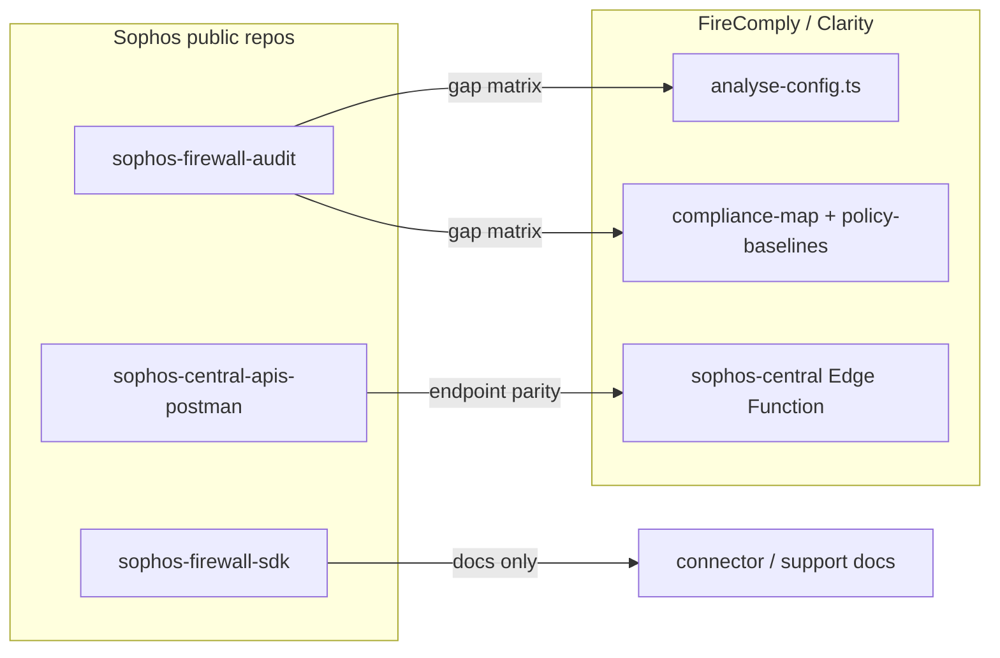

# Plan: Benefit from selected Sophos GitHub repos

## Context in this codebase

- **Findings and posture** are produced in `[src/lib/analyse-config.ts](src/lib/analyse-config.ts)` and consumed by compliance UI logic in `[src/lib/compliance-map.ts](src/lib/compliance-map.ts)` and baselines in `[src/lib/policy-baselines.ts](src/lib/policy-baselines.ts)` (e.g. template `sophos-best-practice`).
- **Sophos Central** is implemented server-side in `[supabase/functions/sophos-central/index.ts](supabase/functions/sophos-central/index.ts)` (paths already include e.g. `organization/v1/tenants`, `firewall/v1/firewalls`, `firewall/v1/firewall-groups`, `common/v1/alerts`, `licenses/v1/licenses`, `firewall/v1/mdr-threat-feed`).
- The **connector** already uses the **firewall XML/API** path separately (`firecomply-connector`); the Python SDK is parallel, not a drop-in.

---

## 1. `sophos/sophos-firewall-audit` — baseline and finding parity (highest product value)

**Goal:** Reduce blind spots vs Sophos’s own “XG baseline” story and strengthen defensibility of reports.

**Approach (no Python dependency):**

1. **Inventory their model** — Read upstream README and how checks are organized (categories, pass/fail, config inputs). Optionally skim `[sophos/firewall-audit](https://github.com/sophos/firewall-audit)` if it clarifies older naming.
2. **Build an internal gap matrix** (doc or spreadsheet in-repo under e.g. `docs/`): rows = upstream checks; columns = “covered by `analyse-config`”, “covered by compliance-map regex”, “covered by `policy-baselines`”, “gap / partial”.
3. **Prioritize gaps** — For each gap, decide:
  - **A.** Add a deterministic check in `[src/lib/analyse-config.ts](src/lib/analyse-config.ts)` (preferred when structure is in `ExtractedSections`), or
  - **B.** Extend a baseline requirement in `[src/lib/policy-baselines.ts](src/lib/policy-baselines.ts)`, or
  - **C.** Map to an existing control in `[src/lib/compliance-map.ts](src/lib/compliance-map.ts)` via `FINDING_TO_CONTROL` / `SHARED_CONTROLS`.
4. **Optional branded template** — If parity is strong, add a baseline template (e.g. “Sophos-published audit alignment”) next to `Sophos Best Practice` in `[src/lib/policy-baselines.ts](src/lib/policy-baselines.ts)`, with clear wording that it’s **inspired by** public Sophos material, not an official certification.

**Out of scope unless you explicitly want it:** Running or embedding their Python tooling in CI.

---

## 2. `sophos/sophos-central-apis-postman` — API coverage and regression safety

**Goal:** Ensure Central integration matches documented partner/tenant flows and discover **useful** endpoints you do not call yet.

**Approach:**

1. Import the Postman collection in a dev workspace; filter requests relevant to **partner vs tenant** (matches your `whoami` / `partner_type` branching in `[supabase/functions/sophos-central/index.ts](supabase/functions/sophos-central/index.ts)`).
2. **Parity checklist:** For each request your app relies on, confirm method, path, required headers (`X-Tenant-ID`, `X-Partner-ID`), and pagination — compare to current `fetch` URLs in the Edge Function.
3. **Short backlog of candidates** (evaluate product fit before coding), e.g. richer firewall metadata, endpoints that complement licences/alerts already partially used — only implement where the UI or reports have a clear consumer.
4. **Optional:** Add a short `docs/sophos-central-api-notes.md` listing “implemented vs Postman-only” so future changes don’t drift from `developer.sophos.com`.

**Out of scope:** Replacing your Edge proxy with client-side Central calls (security regression).

---

## 3. `sophos/sophos-firewall-sdk` — reference for connector and future features

**Goal:** Faster answers when debugging “what does the Firewall API return?” without adopting Python in the TS/Electron stack.

**Approach:**

1. Use the SDK repo as **documentation**: module layout, example calls, and error handling patterns.
2. When extending `[firecomply-connector](firecomply-connector)` (e.g. new export fields), cross-check naming and endpoints against the SDK README/source.
3. **Do not** plan a direct code dependency; if you ever wanted shared logic, the path would be **re-specify in TypeScript** using the same API contracts, not `subprocess` Python.

---

## 4. What we are *not* planning from the org (unless priorities change)

- **SIEM integration repo** — Only if you add “export to SIEM” as a product feature.
- **MSP PowerShell scripts** — Useful for MSP console ops, not core config assessment UX.
- **Sophos Factory / LLM toolkit** — Unrelated to current FireComply assessment loop unless you build a separate ML pipeline.

---

## Suggested order of execution

1. Postman parity pass (small, validates current production path).
2. Firewall-audit gap matrix + 2–3 high-impact new checks or baseline tweaks.
3. Keep firewall-sdk as ongoing reference when touching connector API code.

## Success criteria

- Written **gap matrix** for `sophos-firewall-audit` vs your checks.  
- **Postman parity doc** (or annotated list) for Central routes you use.  
- At least **one concrete improvement** merged from the audit review (new finding, baseline tweak, or control mapping)—unless the review concludes parity is already sufficient (document that outcome).

