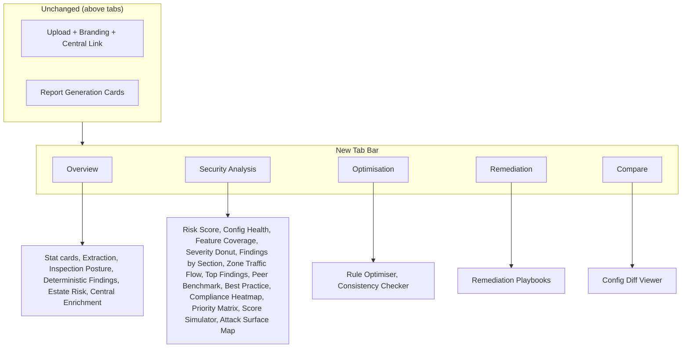

# Tabbed Analysis Layout

## Current State

Everything below the "Detailed Security Analysis" divider in `[src/pages/Index.tsx](src/pages/Index.tsx)` is a vertical stack of 5 `CollapsibleSection` accordions containing ~18 heavy components. This makes the page very long and slow to navigate.

## Proposed Change

Replace the divider + collapsible sections with a **tab bar** using the existing shadcn `Tabs` component from `[src/components/ui/tabs.tsx](src/components/ui/tabs.tsx)`. The upload/branding/linking/report-generation area above stays untouched. The tab bar appears once files are loaded, right where the divider currently sits.

### Tab definitions

- **Overview** (default, always shown) -- `EstateOverview` stat cards, extraction coverage, inspection posture, section-grouped deterministic findings, estate risk comparison, Central enrichment. This is the current "Initial Findings & Estate Overview" CollapsibleSection content.
- **Security Analysis** (always shown) -- All 13 components from the current "Security Risk Score, Compliance & Benchmark" CollapsibleSection: RiskScoreDashboard, RuleHealthOverview, SecurityFeatureCoverage, SeverityBreakdown, FindingsBySection, ZoneTrafficFlow, TopFindings, PeerBenchmark, SophosBestPractice, ComplianceHeatmap, PriorityMatrix, ScoreSimulator, AttackSurfaceMap.
- **Optimisation** (always shown) -- RuleOptimiser + ConsistencyChecker (if 2+ files).
- **Remediation** (shown only if `totalFindings > 0`) -- RemediationPlaybooks.
- **Compare** (shown only if 2+ files) -- Config diff selector + diff viewer.

### Tab bar design

- Horizontal row of tab buttons, each with a Lucide icon + label
- Subtle border-bottom highlight on active tab (Sophos blue `#2006F7`)
- Badges on relevant tabs: finding count on Overview, risk grade on Security Analysis
- Slightly sticky (`sticky top-0 z-20`) so it remains visible while scrolling through a tab's content
- Clean transition between tabs -- only the active tab's content is rendered (via `TabsContent`)

### Approach: shadcn Tabs (not React Router)

Using in-page tabs rather than URL routes because:

- All state (files, analysisResults, branding) lives in `InnerApp` -- no need for a state management layer
- Lazy-loaded components already handle code-splitting
- Simpler implementation, same UX benefit

### Implementation

The main change is in `[src/pages/Index.tsx](src/pages/Index.tsx)`. The `CollapsibleSection` component stays (it's still used within tabs for nested collapsibles like Rule Optimisation content), but the top-level sections become tab panels.

- Remove the "Detailed Security Analysis" divider
- Remove the 5 top-level `CollapsibleSection` wrappers
- Add a `Tabs` / `TabsList` / `TabsTrigger` / `TabsContent` structure from shadcn
- Move each section's content into its corresponding `TabsContent`
- Add tab icons and optional badges
- Make the tab bar sticky with appropriate styling

