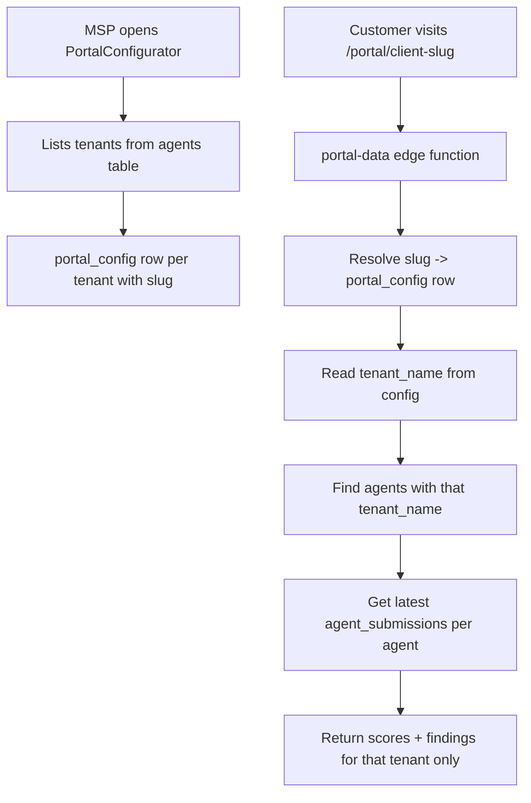

# Tenant-Scoped Client Portal

## Problem

The portal is currently org-scoped — `/portal/{slug}` shows ALL tenants' data mixed together. Each MSP customer (Sophos Central tenant) needs their own portal link showing only their firewalls.

## Data Flow

## Changes

### 1. Database migration — add `tenant_name` to `portal_config`

Create [supabase/migrations/20250316000001_portal_tenant.sql](supabase/migrations/20250316000001_portal_tenant.sql):

- Add `tenant_name text` column to `portal_config` (nullable — null means org-wide default/template)
- Add unique constraint on `(org_id, tenant_name)` to prevent duplicates
- Drop the existing unique constraint on `slug` if it's org-scoped only, and re-add as globally unique

Using `tenant_name` (not `tenant_id`) because that's how agents are grouped — `agents.tenant_name` is what the fleet panel uses for grouping, and it's already populated by the connector.

### 2. Rewrite `portal-data` edge function

[supabase/functions/portal-data/index.ts](supabase/functions/portal-data/index.ts):

- When slug resolves to a config with `tenant_name` set:
  - Find all agents in that org where `agents.tenant_name` matches
  - Fetch the latest `agent_submissions` for those agents
  - Build score history from submissions (not `score_history` table)
  - Extract findings from the latest submission's `findings_summary`
- When `tenant_name` is null (org-wide), keep current behaviour as fallback
- Return `tenantName` in the response for display

### 3. Rewrite `PortalConfigurator` to be tenant-aware

[src/components/PortalConfigurator.tsx](src/components/PortalConfigurator.tsx):

- On load, fetch distinct `tenant_name` values from `agents` table for the org
- Show a **tenant picker** at the top — list of tenants, each with its own portal config
- When a tenant is selected, load/create the `portal_config` row for that `(org_id, tenant_name)`
- The slug input auto-suggests a slug from the tenant name (e.g. "Acme Corp" -> `acme-corp`)
- Branding fields (logo, accent colour, company name, etc.) default to the org-wide config but can be overridden per tenant
- Show the portal link for each tenant with a copy button
- Show a summary table/list of all tenants and their portal slugs at the top

### 4. Update `ClientPortal.tsx` display

[src/pages/ClientPortal.tsx](src/pages/ClientPortal.tsx):

- Use `tenantName` from the edge function response as the customer name
- Show per-firewall breakdown if the tenant has multiple agents (firewall name, score, last seen)
- No structural changes needed — it already renders from the edge function response

### 5. Update Supabase types

[src/integrations/supabase/types.ts](src/integrations/supabase/types.ts):

- Add `tenant_name: string | null` to the `portal_config` type definitions (Row, Insert, Update)

## Key Files

- **Migration**: New file in `supabase/migrations/`
- **Edge function**: [supabase/functions/portal-data/index.ts](supabase/functions/portal-data/index.ts) — tenant-filtered data queries
- **Configurator**: [src/components/PortalConfigurator.tsx](src/components/PortalConfigurator.tsx) — tenant picker + per-tenant config
- **Portal page**: [src/pages/ClientPortal.tsx](src/pages/ClientPortal.tsx) — minor display updates
- **Types**: [src/integrations/supabase/types.ts](src/integrations/supabase/types.ts) — add tenant_name field
