# Tier 2 engineering backlog — execution plan

> Phased implementation order for the items listed under **TIER 2** in [docs/REVIEW.md](../REVIEW.md). QA checklist: [docs/TEST-PLAN-TIER2-BACKLOG.md](../TEST-PLAN-TIER2-BACKLOG.md).

## Current baseline (important)

- **`strictNullChecks`:** [`tsconfig.app.json`](../../tsconfig.app.json) already has `strictNullChecks: true`, `noUnusedLocals: true`, and `noUnusedParameters: true` for `src/`, but **`strict: false`** and **`noImplicitAny: false`**. Root [`tsconfig.json`](../../tsconfig.json) still sets `strictNullChecks: false` and `files: []` with **project references only** (no `composite`). CI runs `npx tsc --noEmit` ([`.github/workflows/deploy.yml`](../../.github/workflows/deploy.yml)) — **confirm whether this actually typechecks `src/`**; if not, fix the command (e.g. `tsc -p tsconfig.app.json --noEmit` and/or `tsc -p tsconfig.node.json --noEmit`) before expanding strictness.
- **escapeHtml / safeError:** Already in [`supabase/functions/_shared/email.ts`](../../supabase/functions/_shared/email.ts) and [`supabase/functions/_shared/db.ts`](../../supabase/functions/_shared/db.ts) — **no work** beyond ticking the checklist.
- **Toasts:** Sonner is dominant; shadcn **`useToast`** remains in [`src/App.tsx`](../../src/App.tsx) (dual `Toaster`), [`ManagementDrawer.tsx`](../../src/components/ManagementDrawer.tsx), [`PortalConfigurator.tsx`](../../src/components/PortalConfigurator.tsx), [`ClientPortal.tsx`](../../src/pages/ClientPortal.tsx), [`use-report-generation.ts`](../../src/hooks/use-report-generation.ts).
- **N+1 targets (confirmed locations):**
  - [`send-scheduled-reports/index.ts`](../../supabase/functions/send-scheduled-reports/index.ts) — `for (const report of dueReports)` then per-report `agent_submissions` query (~296+).
  - [`api/routes/health-checks.ts`](../../supabase/functions/api/routes/health-checks.ts) — `for (const row of due)` with per-row `se_profiles` select (~119–124).
  - [`regulatory-scanner/index.ts`](../../supabase/functions/regulatory-scanner/index.ts) — per-row `upsert` in a loop (~306–317); batch single `upsert(rows)` with `onConflict`.
- **Frontend N+1:** [`AgentFleetPanel.tsx`](../../src/components/AgentFleetPanel.tsx) (`loadSubmission` per agent ~517–528); mirror pattern in [`AgentManager.tsx`](../../src/components/AgentManager.tsx) — batch with `.in("agent_id", ids)` then map client-side.
- **Polling:** `setInterval` in [`AgentFleetPanel.tsx`](../../src/components/AgentFleetPanel.tsx) (~580) and [`AgentManager.tsx`](../../src/components/AgentManager.tsx) (~498) — move into `useEffect` with guaranteed cleanup.
- **HMAC secret:** [`supabase/functions/_shared/crypto.ts`](../../supabase/functions/_shared/crypto.ts) uses `SUPABASE_SERVICE_ROLE_KEY` as `HASH_SECRET` — decouple with a dedicated env (e.g. `API_KEY_HMAC_SECRET`) and **document rotation**; keep time-limited fallback to current behaviour for existing keys if needed.
- **`useMutation`:** **Zero** current usages of `useMutation` in `src/` — adoption is a wide refactor; pairs naturally with an `apiClient` / query-key discipline ([Finding 1.5](../REVIEW.md) in REVIEW).

```mermaid
flowchart LR
  subgraph phase1 [Phase 1]
    TSC[Fix CI tsc scope]
    ESLint[ESLint unused warn]
  end
  subgraph phase2 [Phase 2]
    Toast[Sonner only]
    Poll[Polling cleanup]
    Types[Regen Supabase types]
    HMAC[HMAC env var]
    CL[CHANGELOG.md]
  end
  subgraph phase3 [Phase 3]
    N1E[Edge N+1 batch]
    N1F[Frontend N+1 batch]
  end
  subgraph phase4 [Phase 4]
    UI[LoadingState SafeHtml EmptyState]
  end
  subgraph phase5 [Phase 5]
    Strict[strict / noImplicitAny ramp]
    Mut[useMutation writes]
  end
  subgraph phase6 [Phase 6]
    Zod[Zod on routes]
    APIDoc[API documentation]
    Log[Structured JSON logs]
  end
  subgraph phase7 [Phase 7]
    DenoIT[Deno auth integration tests]
    PW[Playwright journeys]
    Axe[axe-playwright]
  end
  phase1 --> phase2
  phase2 --> phase3
  phase3 --> phase4
  phase4 --> phase5
  phase5 --> phase6
  phase6 --> phase7
```

---

## Phase 1 — TypeScript / ESLint truth (0.5–2 days)

1. **Verify and fix CI typecheck** so `src/` is definitely checked (see baseline above).
2. **Strictness roadmap (the real “1–2 week” body of work):** After CI is trustworthy, enable remaining flags incrementally on [`tsconfig.app.json`](../../tsconfig.app.json): prefer **`strict: true`** in one branch with a burn-down of errors, _or_ staged **`noImplicitAny`** then **`strictBindCallApply`** / **`strictFunctionTypes`** if a single flag flip is too large.
3. **ESLint:** Set `@typescript-eslint/no-unused-vars` to `"warn"` in [`eslint.config.js`](../../eslint.config.js) with `argsIgnorePattern: "^_"` / `varsIgnorePattern` to avoid noise; align with TS `noUnusedLocals` so one source of truth wins (often: TS strict for locals, ESLint for catches).

---

## Phase 2 — Quick wins (1 day total; can parallelise)

| Item            | Action                                                                                                                                                                                                                             |
| --------------- | ---------------------------------------------------------------------------------------------------------------------------------------------------------------------------------------------------------------------------------- |
| Single toast    | Remove shadcn [`Toaster`](../../src/components/ui/toaster.tsx) from [`App.tsx`](../../src/App.tsx); migrate the four `useToast` call sites to `sonner`; delete or shrink [`use-toast.ts`](../../src/hooks/use-toast.ts) if unused. |
| Polling cleanup | Refactor interval logic in AgentFleetPanel / AgentManager to `useEffect` + cleanup; store interval id in a ref.                                                                                                                    |
| `types.ts`      | Add `package.json` script: `supabase gen types typescript --project-id <id> > src/integrations/supabase/types.ts` (document project id / local alternative); run once and commit.                                                  |
| HMAC env        | Read secret from `Deno.env.get("API_KEY_HMAC_SECRET") ?? Deno.env.get("SUPABASE_SERVICE_ROLE_KEY")` (or similar), document in self-host / Supabase secrets.                                                                        |
| CHANGELOG.md    | Add Keep a Changelog–style root file; point in-app [`ChangelogPage`](../../src/pages/ChangelogPage.tsx) or docs to it if you want a single source of truth.                                                                        |

---

## Phase 3 — N+1 batching (1–2 days)

- **send-scheduled-reports:** Collect org/agent keys from `dueReports`, one or few queries for `agent_submissions` (e.g. `.in("org_id", ...)` with latest-per-org logic in memory), then iterate in memory.
- **health-checks:** One `se_profiles` query with `.in("id", seUserIds)` built from `due` rows; map by id for the email loop.
- **regulatory-scanner:** Build array of rows from `relevant`, single `upsert(rows, { onConflict: "source,title" })` (respect Postgres payload limits; chunk if needed).
- **AgentFleetPanel / AgentManager:** On expand-or-load, fetch all submissions for visible agent IDs in one query; hydrate a map.

---

## Phase 4 — UI primitives (1 day)

- **`<LoadingState />`:** Single component (`skeleton` | `spinner` | `inline`) — replace scattered patterns called out in REVIEW (optional: do high-traffic screens first).
- **`<SafeHtml />`:** Thin wrapper around DOMPurify for [`DocumentPreview`](../../src/components/DocumentPreview.tsx) / [`SharedReport`](../../src/pages/SharedReport.tsx) / [`AIChatPanel`](../../src/components/AIChatPanel.tsx) etc.; **exclude** [`chart.tsx`](../../src/components/ui/chart.tsx) if it injects CSS, not user HTML.
- **`EmptyState`:** [`EmptyState.tsx`](../../src/components/EmptyState.tsx) is test-only today — wire into empty list/table states (Team dashboard, agent lists, playbook lists, etc.) in a second pass if scope explodes.

---

## Phase 5 — `useMutation` (2–4 days)

- Inventory Supabase writes (`.insert` / `.update` / `.delete` / `.upsert`) in hooks and pages.
- Introduce TanStack `useMutation` per domain or per feature with explicit `onSuccess` invalidation (`queryClient.invalidateQueries`).
- **Dependency:** Works best after reliable typecheck and optionally after `types.ts` regeneration.

---

## Phase 6 — Edge validation, docs, logging (4–6 days)

- **Zod:** Start with high-risk routes in [`supabase/functions/api/`](../../supabase/functions/api/) (auth headers, JSON bodies); expand; `zod` is already in [`package.json`](../../package.json) but unused — consider **Deno-imported zod** for edge consistency.
- **API documentation:** Either generate OpenAPI from route modules or manually extend [`ApiDocumentation.tsx`](../../src/components/ApiDocumentation.tsx) until generation exists.
- **Structured JSON logging:** Small logger helper in `_shared` (level, function name, `requestId`, duration); replace ad-hoc `console.log` in hot functions first (`api`, `parse-config`, `send-scheduled-reports`).

---

## Phase 7 — Tests (1.5–2 weeks, parallel where possible)

- **Deno auth middleware tests:** New tests under `supabase/functions/_shared/` (or `api/_tests/`) mocking `Request` / Supabase client for [`authenticateAgent`](../../supabase/functions/_shared/auth.ts), `authenticateSE`, `getOrgMembership` — expand from crypto/email/db unit tests.
- **Playwright:** Add specs for guest upload → analysis visible (may need demo config / `data-testid` hooks), auth-gated hub smoke (test user env), SE health-check shell; grow from current [`e2e/smoke.spec.ts`](../../e2e/smoke.spec.ts) toward 10–15 scenarios.
- **@axe-core/playwright:** Add accessibility scan step on `/`, `/changelog`, `/trust`, and one post-login surface (if test user available).

---

## Suggested sequencing rationale

- **Fix CI + strict flags first** so refactors don’t fight invisible errors.
- **Toast / polling / types / HMAC / CHANGELOG** are isolated and safe to land early.
- **N+1** is high ROI and low coupling.
- **LoadingState / SafeHtml / EmptyState** reduce churn before large `useMutation` refactors.
- **Zod + API docs + logging** benefit from stable route structure after mutations settle.
- **Deno + Playwright + axe** validate behaviour without blocking product refactors if run in parallel after critical paths stabilise.

---

## Out of scope / explicit skips

- **“Create escapeHtml and safeError”** — already shipped; mark complete in tracking only.
