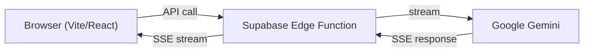
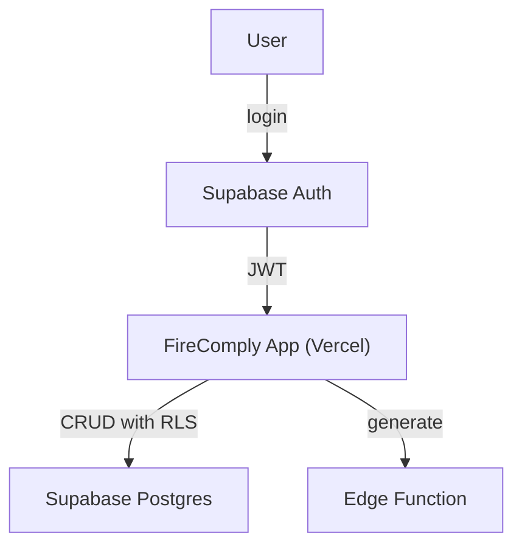

# Vercel + Supabase Infrastructure Plan

## Current architecture

You already have **Supabase** with auth configured and an empty database schema. **Vercel** can host the frontend and connect to the same Supabase backend. Here is what each remaining item needs and what covers it:

---

## What Vercel gives you

- **Frontend hosting** — deploy the Vite/React app with automatic builds from your GitHub repo (`joseph15562/sophos-clarity`)
- **Preview deployments** — every PR gets a preview URL for testing
- **CI/CD** — build + type-check on every push (catches parser regressions)
- **Environment variables** — store your `VITE_SUPABASE_URL` and `VITE_SUPABASE_PUBLISHABLE_KEY` securely
- **Custom domain** — point `firecomply.yourdomain.com` at it

Vercel does NOT give you a backend database, auth, or API — that stays with **Supabase** which you already have.

---

## Remaining items mapped to infrastructure

### 6.1 Parser fixture testing

- **What:** automated tests that parse real Sophos HTML exports and verify output
- **Infrastructure:** None needed beyond what you have. Vitest is already installed (`npm test` works)
- **Vercel helps:** build step runs `tsc` — add `npm test` to catch regressions on every push
- **You provide:** 2-3 real Sophos export HTML files from different firmware versions, dropped into `test/fixtures/`
- **I build:** test harness with snapshot tests for section counts, rule counts, column validation

### 6.6 Code refactoring

- **What:** split `Index.tsx` (currently ~700 lines) into smaller hooks/components
- **Infrastructure:** None needed — pure code work
- **Vercel helps:** not directly, but preview deploys let you verify nothing breaks

### 6.7 Auth/tenancy

- **What:** user login, customer/project isolation, report access control
- **Infrastructure:** **Supabase Auth** (already configured in your client) + **Supabase Postgres** tables
- **Vercel helps:** hosts the frontend that talks to Supabase Auth

- **Tables needed:** `projects`, `reports`, `uploaded_configs`
- **Row Level Security (RLS):** each user only sees their own data
- **Effort:** medium — needs login UI, database schema, RLS policies

### 8.1 Config diffing

- **What:** upload two versions of the same firewall config, show what changed
- **Infrastructure:** **Supabase Postgres** to store parsed config snapshots over time
- **Vercel helps:** hosts the diff UI
- **Effort:** medium — needs a config storage model and a diff algorithm on extracted sections

### 8.3 Admin audit logs

- **What:** ingest Sophos admin/config change logs, attach to reports
- **Infrastructure:** new file upload type + Supabase storage
- **Vercel helps:** not specifically
- **Effort:** medium — needs a new parser for audit log format (different from config exports)

### 8.6 MSP recurring workflows

- **What:** saved customer templates, project history, one-click re-runs
- **Infrastructure:** **Supabase Postgres** tables for customers, templates, report history
- **Vercel helps:** hosts the management UI
- **Depends on:** 6.7 (auth/tenancy) being done first

### Phase 5 — Platform/API mode

- **What:** direct Sophos Central API integration, scheduled imports
- **Infrastructure:** **Vercel Cron Jobs** or **Supabase pg_cron** for scheduled tasks, Sophos Central API credentials
- **Effort:** large — future strategic work

---

## Recommended order

1. **Deploy to Vercel** — immediate, takes 5 minutes, gives you a live URL and CI
2. **Parser fixture tests (6.1)** — you provide fixture files, I build the test harness
3. **Code refactoring (6.6)** — clean up before adding persistence
4. **Auth/tenancy (6.7)** — foundation for everything else
5. **MSP workflows (8.6)** — builds on auth
6. **Config diffing (8.1)** — builds on stored configs
7. **Audit logs (8.3)** and **Platform mode (Phase 5)** — later

---

## To deploy to Vercel now

1. Go to [vercel.com/new](https://vercel.com/new)
2. Import `joseph15562/sophos-clarity` from GitHub
3. Framework preset: **Vite**
4. Add environment variables: `VITE_SUPABASE_URL` and `VITE_SUPABASE_PUBLISHABLE_KEY`
5. Deploy — done, you get a live URL

After that, every push to `main` auto-deploys. Want me to proceed with any of the items above?