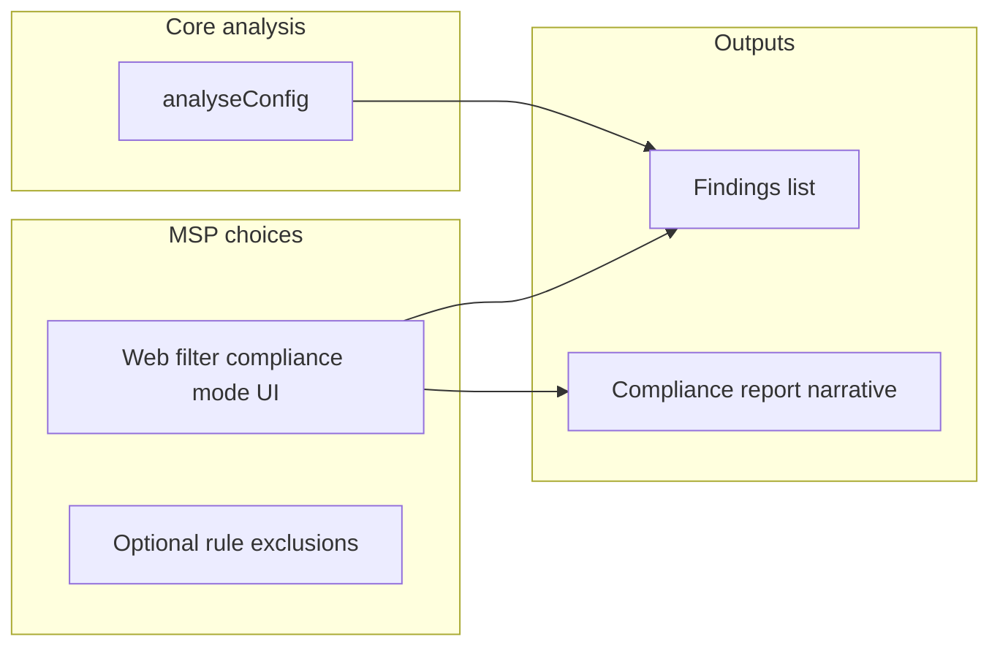

# Web filter compliance: configurable behaviour (general product perspective)

## Plain English summary

### Point 1 — How loud should “missing web filter” be? (you agreed with this)

Some firewall rules send normal web traffic (HTTP/HTTPS) out to the internet. Best practice—and what many compliance frameworks expect—is that those rules have a **web filter policy** attached so inappropriate or risky sites can be blocked or logged in a controlled way.

The app already detects when an **enabled** rule does that but has **no** web policy (or only “none”). Today that shows up as a **strong** finding.

**What we add:** a simple switch for the MSP, per assessment:

- **Strict (default):** unchanged—treats those gaps as serious, same as now.
- **Informational:** the **same rules are still flagged** (the config is not ignored), but the finding is **downgraded** (e.g. to “info”) and the text explains that the MSP chose informational mode—so reports don’t read like a definite regulatory failure when the customer and MSP agreed the scope was narrower.

Nothing is hidden; you only change **severity and wording**, not whether the gap exists.

---

### Point 2 — “Allow all” web policies (more detail)

**What Sophos does:** On a firewall rule you can attach a **web filter policy**. Some policies are real filters (block categories, allow lists, etc.). Others are effectively **“allow everything”**—the traffic still goes through the web-filter *engine*, but every category is allowed, so **no meaningful URL/category restriction** happens.

**What the app does today:** If the export shows **any** policy name on the rule (except empty/none), the app counts that as “has web filtering.” So **“Allow All”** (or similar names) counts as **having** a filter. That means:

- The rule does **not** appear in the “missing web filtering” finding.
- From an **auditor’s** point of view, that can be misleading: it looks like the rule is “covered” even though nothing is actually being restricted.

**Why someone uses Allow All:** Sometimes on purpose—for **logging** or visibility without blocking—or by mistake, or as a temporary state.

**What Phase 2 adds (recommended approach):**

- **Do not** silently change the main “missing web filter” math first (avoids breaking dashboards that count “with web filter” rules).
- **Do** add a **separate** finding when a WAN + web-traffic rule uses a policy that matches known “allow everything” names (e.g. “Allow All”, “Permit All”—exact strings tuned from real Sophos exports).

That finding would say something like: *this rule has a web policy attached, but the policy allows all categories, so there is no real content filtering on that rule.*

**How it interacts with Point 1:** In **strict** mode that Allow-All finding might be **medium** severity; in **informational** mode it could be **info**—same idea as Point 1.

**Edge case:** If the customer truly only wants logging, the MSP can document that; the finding still **educates** that it’s not the same as restrictive filtering for compliance questionnaires.

---

### Point 3 — Excluding specific rules by name (more detail)

**When this matters:** Sometimes everyone agrees a **specific rule** should not require a web filter—for example:

- Server update / patch traffic where browsing isn’t happening
- A documented **break-glass** or emergency path
- Traffic that is **out of scope** for a compliance assessment (written in the statement of work)

Point 1 only changes **how loud** the finding is globally for **all** affected rules. Point 3 is for **surgical** exceptions: “don’t count **these named rules** in the missing-web-filter check.”

**How it would work in the product (conceptually):**

1. The app already knows the **names** of firewall rules that go to WAN with web-like services.
2. The UI would list those rule names (or a subset) and let the MSP **mark** ones to exclude—similar to how DPI zone exclusions work today.
3. When building the “missing web filtering” list, those names are **skipped**—so they no longer add to that finding.

**What still happens:** The rest of the analysis is unchanged. Other findings might still mention those rules if relevant. The exclusion only affects **this** compliance-style check unless we later widen it.

**Audit / trust:** Good practice is to show **which rules were excluded** in the finding text or an appendix (“3 rules excluded by MSP configuration: …”) so a reader of the report understands the scope.

**When to build it:** Only after Point 1 (and ideally Point 2) exist—most teams can start with strict/informational + Allow All clarity; rule-level exclusions are for customers who need explicit carve-outs in the report.

---

## Context (current behaviour)

- `[hasWebFilter()](src/lib/analyse-config.ts)` treats any non-empty web policy name (except `none`, `not specified`, etc.) as **having** a web filter. **"Allow All"** therefore counts as "has web filter" and does **not** trigger the WAN "missing web filtering" finding.
- The **KCSIE/DfE-style** finding is generated when enabled WAN + web-capable service rules have **no** web policy (`[wanNoFilter` block](src/lib/analyse-config.ts) ~527–541).
- `[BrandingData](src/components/BrandingSetup.tsx)` already has `environment` (Education, Government, …) for frameworks and benchmarks, but **no** control that changes how web-filter compliance findings are scored.
- `[ScoreSimulator](src/components/ScoreSimulator.tsx)` already removes the missing-web-filter finding when simulating "fix" — pattern for post-processing findings exists.

## Design principle

The app should **not** assume a maintainer’s lab or any single deployment style. Behaviour should be **explicit and customer-agnostic**:

- **Default:** strict / production-appropriate (current behaviour or stronger where agreed).
- **Optional:** MSP chooses per assessment whether web-filter gaps are **regulatory-grade failures** or **informational** (e.g. scoped reviews, non-regulated sites, or assessments where the customer has documented exceptions).

Keep **one deterministic analysis** where possible, then apply **severity and compliance narrative** from a **dedicated control**, not from inferring intent from Environment Type alone.

---

## Recommended phases (you can stop after any phase)

### Phase 1 — Explicit compliance mode (not tied to “lab” environment)

**Goal:** Any tenant can lower or raise how aggressively web-filter gaps surface, without adding a special “Lab” environment type to the product for one use case.

1. Extend `[AnalyseOptions](src/lib/analysis/types.ts)` with:
  - `webFilterComplianceMode?: "strict" | "informational"`
  - **Default:** `strict` when omitted (backward compatible).
2. **UI:** Add a clear control in customer/branding or assessment settings, e.g.:
  - **“Web filter compliance: Strict (default) / Informational”**  
   with helper text: *Informational lowers severity of WAN web-filter gap findings; use when the assessment scope or customer agreement does not treat every gap as a compliance failure.*
3. Persist with session/branding if other assessment toggles do (follow existing patterns in `[BrandingData](src/components/BrandingSetup.tsx)` or a small dedicated field).
4. Wire through `[useFirewallAnalysis](src/hooks/use-firewall-analysis.ts)` / `[Index.tsx](src/pages/Index.tsx)` into `analyseConfig`.
5. In `[analyse-config.ts](src/lib/analyse-config.ts)`, when emitting the “missing web filtering” finding:
  - **strict:** keep current severity and copy.
  - **informational:** same title/evidence; `severity: "info"`; `detail` states that **informational mode** was selected so the gap is visible but not framed as a default regulatory failure.

**Do not** rely on Environment Type (Education, Private Sector, etc.) as the sole switch for this, unless product later decides to **default** the mode from environment with an override — that would be optional sugar, not the primary control.

**Files:** `types.ts`, `BrandingSetup.tsx` (or adjacent settings), `use-firewall-analysis.ts`, `Index.tsx`, `analyse-config.ts`.

---

### Phase 2 — "Allow All" is not meaningful filtering (optional)

**Goal:** Align behaviour with typical auditor expectations for **all** customers.

1. Add `isMeaningfulWebFilterPolicy(wf: string): boolean` — returns false for names matching `/^allow\s*all$/i`, `/^permit\s*all$/i`, or common synonyms (tune from real export strings).
2. Recommend **2b** first: keep `hasWebFilter` as-is for posture counters, add a **separate** finding: *WAN rule(s) use a web policy that allows all categories — no URL/category restriction.* Severity can follow `webFilterComplianceMode` (e.g. medium vs info).

**Files:** `analyse-config.ts`.

---

### Phase 3 — Rule-level exclusions (optional)

**Goal:** Exclude specific firewall **rule names** from the “missing web filter” check when the customer has agreed exceptions (infrastructure, break-glass, etc.).

1. `AnalyseOptions.webFilterExemptRuleNames?: string[]`
2. When building `wanNoFilter`, skip matching `ruleName(row)`.
3. UI: chip/toggle pattern similar to `[DpiExclusionBar](src/components/DpiExclusionBar.tsx)`, fed from detected WAN rule names.

Defer until Phase 1 (and optionally 2) are in place.

---

## Compliance report / AI reports

- If compliance pack uses **serialized findings**, severity changes flow through automatically.
- When `webFilterComplianceMode === "informational"`, optionally add prompt guidance so narratives **do not over-state regulatory failure**; wording should refer to **informational assessment scope**, not “lab.”

**Check:** `[stream-ai.ts](src/lib/stream-ai.ts)` / parse-config payload — extend only if needed beyond finding severity.

---

## Summary

| Phase | Effect (general)                                                                 |
| ----- | -------------------------------------------------------------------------------- |
| 1     | MSP toggles strict vs informational for web-filter gap findings; default strict. |
| 2     | Allow All called out as weak filtering where relevant.                           |
| 3     | Named rules excluded from gap check by agreement.                                |

## Suggested implementation order

Implement **Phase 1** first (explicit `webFilterComplianceMode` + UI). Add **Phase 2b** for Allow All. Add **Phase 3** only if customers need rule-scoped exceptions.