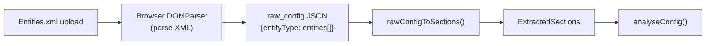

# Add Entities.xml Upload Support

## Architecture

The Sophos firewall API returns XML with a `<Response>` root containing entity elements (e.g. `<FirewallRule>`, `<NATRule>`). The `Entities.xml` export from the firewall combines multiple entity types into a single XML file.

The web app already has `rawConfigToSections()` in [src/lib/raw-config-to-sections.ts](src/lib/raw-config-to-sections.ts) which converts raw JSON config into `ExtractedSections`. The strategy is:

This reuses the entire existing connector pipeline with zero changes to analysis, reports, or widgets.

## Key Changes

### 1. Add `fast-xml-parser` to the web app

The connector already uses `fast-xml-parser` (v4.5.1) for reliable XML parsing with proper attribute handling, array normalization, etc. Add it to the web app's `package.json` rather than reimplementing with browser `DOMParser` (which would need manual array handling, attribute prefixing, etc.).

### 2. Create `src/lib/parse-entities-xml.ts`

A new ~40-line module that:

- Accepts raw XML string content
- Parses with `fast-xml-parser` (same config as the connector)
- Detects entity types from the top-level keys under the root element
- Returns a `Record<string, unknown>` (the `raw_config` format)
- This is essentially a browser version of `buildRawConfig()` from `firecomply-connector/src/firewall/parse-entities.ts`, but working from a single combined XML file rather than per-entity API responses

### 3. Update `FileUpload.tsx`

- Accept `.xml` files alongside `.html`/`.htm` in both the drag-drop filter and browse dialog
- Update the help text from "Accepts .html / .htm" to "Accepts .html / .htm / .xml"

### 4. Update `Index.tsx` — `handleFilesChange`

- Detect XML files (by extension or content sniffing for `<?xml`)
- For XML files: call `parseEntitiesXml(content)` to get `raw_config`, then `rawConfigToSections(rawConfig)` to get `ExtractedSections`
- For HTML files: continue using `extractSections(content)` as today
- Both paths produce a `ParsedFile` with `extractedData: ExtractedSections`

## Files to Modify

- `**package.json**` — add `fast-xml-parser` dependency
- `**src/lib/parse-entities-xml.ts**` — new file: XML string to raw_config converter
- `**src/components/FileUpload.tsx**` — accept `.xml` files, update help text
- `**src/pages/Index.tsx**` — route XML files through the new parser in `handleFilesChange`

